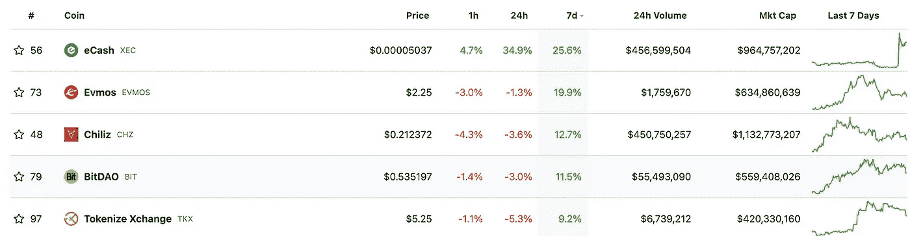

# 🏃‍♂️移动挣钱应用是真的吗？

> 原文：<https://medium.com/coinmonks/%EF%B8%8F-are-move-to-earn-apps-the-real-deal-bc54b0912677?source=collection_archive---------33----------------------->

# 内容(4 分钟阅读):

*   🎙️·维塔利·布特林谈合并的重要性
*   💰FTX 正在下雨
*   📈本周表现最佳的前五名
*   👨‍👩‍👧‍👧Startupy——社区管理的搜索引擎
*   **🏃‍♂️移动挣钱应用是真的吗？**
*   🏖️个人退休帐户，避税帐户
*   📰热门阅读
*   🙏🏻感激…

# 🎙️·维塔利·布特林谈合并的重要性

> ***“如果你真的想有一个世界，在那里我们可以进行区块链交易，而不需要对所有事情都信任集中交易所，那么我们只需要学会如何让区块链变得更便宜。”***
> 
> *-维塔利克·布特林-*

以太坊的联合创始人认为，一旦完成向股权证明的转变，通过使用[汇总](https://www.quicknode.com/guides/infrastructure/introduction-to-ethereum-rollups)交易费用可能会降至 0.002 美元至 0.05 美元——通过合并实现的技术升级允许更大数量的数据被打包到每笔交易中。

在牛市期间，区块链以太坊的交易费用可能会高于某些国家的日工资，使得某些地方无法进行交易。合并将为其他技术奠定基础，使连锁店规模，提高其速度，更可负担。

Yaro on Tech、Blockchain 和 Web3 是一份读者支持的出版物。为了接收新帖子和支持我的工作，考虑成为一个免费或付费用户。

# 💰FTX 正在下雨

据美国消费者新闻与商业频道报道的泄露的财务文件显示，在去年的牛市中，FTX 的收入增长了 1000%，超过了 10 亿美元。

据报道，2021 年，FTX 的总收入从 8900 万美元跃升至 10.2 亿美元，公司利润增加了 3.21 亿美元。

根据该报告，2021 年约有 2.72 亿美元的营业收入贡献给了该公司的资产负债表，高于上年的 1400 万美元。该公司还在熊市期间积极收购尽可能多的 crypto 和区块链公司，以巩固他们在该领域的地位。

> ***此外，据报道，FTX 的创始人兼首席执行官班克曼已经吸收了阿拉米达研究公司的风险投资业务，以应对持续的加密熊市。***

# 📈本周表现最佳的前五名

# [Startupy -](https://beta.startupy.world/membership/?ref=yarocelis)

> *我很高兴地宣布，我已经成为 Startupy 的策展人和成员。一个社区管理的搜索引擎。零 SEO BS。* [***我邀请你加入这个为漫游、研究和思考而设计的知识和见解的令人愉快的图书馆。***](https://beta.startupy.world/membership/?ref=yarocelis)

# 🏃‍♂️移动挣钱应用是真的吗？

最近,**赚钱空间变得越来越热，因为它承诺了我们大多数人都想做的事情。*有偿锻炼。*听起来好得令人难以置信的事情，但有一群开发人员正在开发这些应用程序，并承诺以加密货币提供奖励。**

Stepn 封面图像

*   [**STEPN**](http://stepn.com/) **是一款基于 GPS 的游戏，应用程序会跟踪你的运动和脚步**，类似于你的 Fitbit 所做的事情。要开始跑步，你需要购买一双虚拟运动鞋。是的，在你真正的运动鞋上面。这些是铸造的 NFT，所以你可以在市场上转售它们，并可能获得一些利润来购买一双更好的。每次你运动时，应用程序都会跟踪你的运动，并相应地奖励你。
*   在这个领域还有其他玩家承诺通过支付加密和非功能性锻炼来激励个人锻炼。其中一些是:
*   [**步 app (FITFI)**](https://step.app/)
*   另一个流行的移动赚钱应用程序是 Step 应用程序。游戏内治理令牌 FITFI 的持有者可以在永久下注仍在进行时下注货币并参与抽奖以赢得运动鞋。
*   [**汗币**](http://sweatco.in/)
*   正在兴起的移动赚钱游戏 Sweatcoin 试图通过其平台改善人们的健康。该公司与健康组织的合作伙伴关系，尤其是英国的 NHS，证明了其项目最初专注于人们的需求，而不仅仅是赚钱。
*   
*   **根据用户账户中有多少虚拟硬币，他们被分为一个等级。用户的等级排名和他们通过参加健身挑战可以获得的虚拟货币数量与他们目前拥有的硬币数量成正比。**
*   **[**基因宠物**](http://genopets.me/)**
*   **这是我们的移动赚钱应用列表中最独特的一个。通过角色扮演游戏(RPG)，Genopets 通过奖励用户玩游戏、锻炼和照顾他们的 NFT“宠物”来结合移动赚取和游戏赚取模式。**

> *****结论:*** *移动赚取协议对这个领域来说是相当新的，我们将看到更多的竞争进入这个领域。一旦越来越多的人开始参与，而奖励逐渐减少，我们也会看到支付给用户的奖励会有很大的变化。但总的来说，这个领域有着巨大的市场和潜力。***
> 
> ***由于市场差异和市场规模，Fitbit、Map My Run、Fitso 等常规集中式应用程序已经获得了可观的市场份额和盈利能力，这有助于移动赚取加密应用程序的增长。***

****

**加密货币是这些天每个人都在谈论的东西之一。有各种不同的交易所进行加密交易，但是许多人没有意识到他们在税费上损失了多少。**

**iTrustCapital 允许其客户通过个人退休账户或个人退休帐户投资 crypto，而不必担心税收或费用。**

**IRA 是避税账户，这意味着你所有的加密交易都是免税的，并且可以随着时间的推移免税增长。**

**没有隐藏的费用。[要了解更多信息，请点击此处并开设免费账户。](https://itrustcapital.com/referral100?utm_source=partner&utm_medium=youtube&utm_campaign=partner637&oid=10&affid=637)**

**[分享 Yaro 的技术& WebX 简讯](https://yarocelis.substack.com/?utm_source=substack&utm_medium=email&utm_content=share&action=share)**

# **📰热门阅读**

*   **[**元宇宙狂躁症领先 MTV VMAs，凭借百无聊赖的猿类表演和一个新的奖项类别**](https://coinmarketcap.com/alexandria/article/metaverse-mania-ahead-of-mtv-vmas-with-bored-ape-performance-and-a-new-awards-category)**
*   **[在周五美联储的冲击之后，比特币周一上午保持在 2 万美元以下](https://forkast.news/headlines/bitcoin-below-us20000-friday-fed-shock/)**
*   **[埃塞俄比亚加密提供商现在需要向网络安全机构注册](https://bitcoinist.com/ethiopian-crypto-register-cybersecurity-agency/)**
*   **[比特币、以太坊下跌，传统市场滑入新的一周](https://decrypt.co/108452/bitcoin-ethereum-drop-as-traditional-markets-skid-into-new-week)**
*   **[艾娃实验室否认“共谋”指控雪崩支付律师起诉竞争对手](https://cryptobriefing.com/ava-labs-dismisses-conspiracy-alleging-avalanche-paid-lawyers-sue-competitors/?utm_source=cryptopanic&utm_medium=rss)**
*   **[卡尔达诺的创造者查尔斯·霍金森更新了大瓦西里·哈德福克，公布了新的时间表](https://dailyhodl.com/2022/08/28/cardano-creator-charles-hoskinson-gives-update-on-big-vasil-hardfork-reveals-new-timeline/)**
*   **[顶级密码分析师](https://dailyhodl.com/2022/08/28/steep-corrections-imminent-for-bitcoin-and-ethereum-after-massive-fakeout-in-stock-market-top-crypto-analyst/)在股票市场大规模造假后，比特币和以太坊即将迎来大幅修正**
*   **[为什么互操作性是区块链技术大规模采用的关键](https://cointelegraph.com/news/why-interoperability-is-the-key-to-blockchain-technology-s-mass-adoption)**

> **交易新手？尝试[加密交易机器人](/coinmonks/crypto-trading-bot-c2ffce8acb2a)或[复制交易](/coinmonks/top-10-crypto-copy-trading-platforms-for-beginners-d0c37c7d698c)**