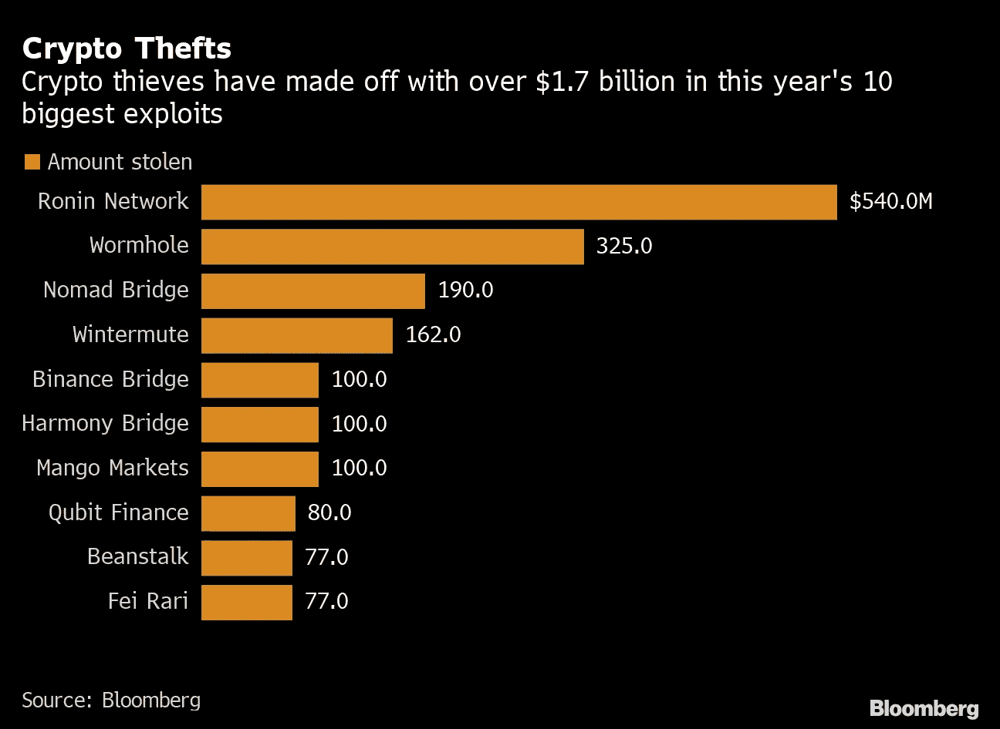
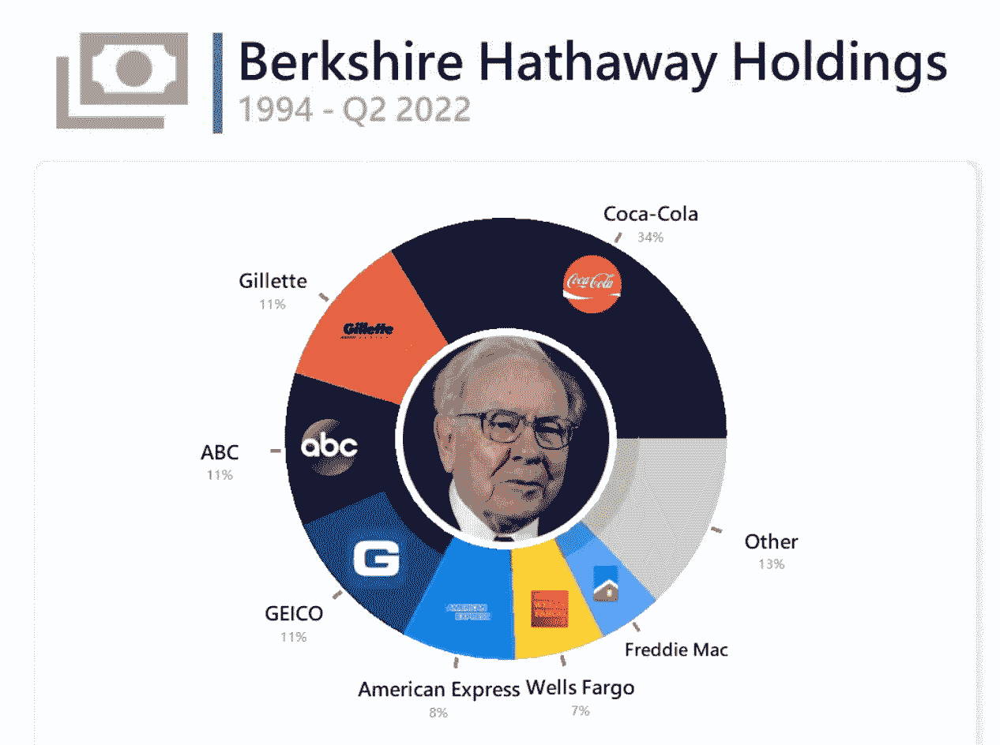
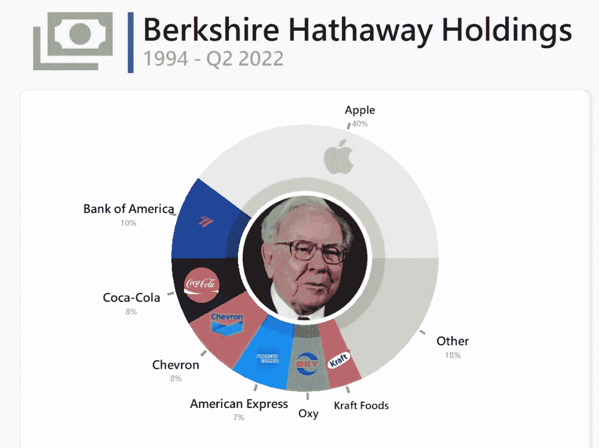

# 🦹‍♂️有史以来黑客活动最多的一个月。

> 原文：<https://medium.com/coinmonks/%EF%B8%8F-the-biggest-month-ever-for-hacking-activity-d73e2a21d425?source=collection_archive---------27----------------------->

# 内容(4 分钟阅读):

*   🦹‍♂️有史以来黑客活动最多的一个月。
*   📚伯克希尔·哈撒韦公司的投资组合告诉我们。
*   ☁️此举将推动 web3 的发展。
*   👨‍👩‍👧‍👧Startupy——社区管理的搜索引擎
*   🏦BNY 梅隆大学提供加密托管 Se
*   📰热门阅读
*   🙏🏻感激…

# 🦹‍♂️有史以来黑客活动最多的一个月。

区块链分析公司 Chainalysis 将 2022 年 10 月称为“黑客活动有史以来最大的一年中最大的一个月。”

最大的黑客攻击发生在 10 月 11 日 Solana 的 DeFi 平台芒果市场，导致价值超过 1 亿美元的[密码](http://ycobitcoin.com/)丢失。黑客现在出来要求 7000 万美元硬币作为归还被盗密码的赏金。

TempleDAO 在芒果市场剥削的同一天被剥削了 200 万美元。

上面我们可以看到今年有多少密码漏洞被利用。

尽管这个月还不到一半，[chain analysis](http://chainalysis.com/)表示，DeFi 协议上的 11 次不同的黑客攻击已经导致数亿人被利用。

> ***每周，社区战略家***[***Emilie Kormienko***](https://emiliekormienko.substack.com/)***都会讨论启动和发展社区的最佳技巧。从入职到参与到激励设计和 web3 工具，了解更多关于社区的信息。***
> 
> [*在这里报名吧！！！*](https://emiliekormienko.substack.com/)

# 📚伯克希尔·哈撒韦公司的投资组合告诉我们

沃伦·巴菲特是世界上最富有和最有影响力的投资者之一，他是一个值得关注的重要市场参与者。这位 92 岁的特立独行者一直在调整伯克希尔·哈撒韦公司的投资组合，以适应时代并实现利润最大化。下面的第一个饼状图显示了伯克希尔·哈撒韦在 1994 年的持股情况，第二个显示了他们在 2022 年的持股情况。

1994 年伯克希尔·哈撒韦控股公司

根据该集团的网站，它直接拥有 62 家不同的公司，包括像 GEICO、Dairy Queen、Kraft Heinz 和 Duracell 这样的大公司，还在苹果、富国银行和可口可乐这样的公司有大量投资。

尽管伯克希尔哈撒韦公司以技术怀疑论者闻名，但他们似乎开始非常认真地看待技术公司及其数据的力量。他们持有苹果 40%的股份，尽管他们真的讨厌加密货币，但这个庞然大物有可能开始在 web3 公司中分配投资。

伯克希尔哈撒韦控股公司。

# ☁️将推动 web3 发展的重大举措

比特币基地和谷歌云已经建立了“长期战略合作伙伴关系”,以使 Web3 生态系统受益。

拥有 1 亿认证用户和 14500 家机构客户的比特币基地，正计划使用谷歌云来建立“高级交换和数据服务”——使其能够大规模处理区块链的数据。作为协议的一部分，比特币基地客户将受益于“机器学习驱动的加密洞察”与此同时，[谷歌云](http://cloud.google.com/)用户将可以选择通过某些加密货币支付服务费用——这可能是一个采用的福音。

早在 1 月份，谷歌云证实，它正在建立一个新的、专门的“数字资产团队，以帮助支撑明天的区块链生态系统”

> ***这为什么重要？*** *— Web3 是必然。我们将迎来下一代技术，更早进入这一领域的公司将首先受益于这些新的技术成果和进步。在这种情况下，谷歌云将能够吞下并分析所有通过他们服务器的 coinbase 数据，并做出更好的产品和服务。谷歌云工程师也将能够从使用 web3 协议的学习经历中受益。*

# [启动时间](https://beta.startupy.world/membership/?ref=yarocelis)

> *我很高兴地宣布，我已经成为 Startupy 的策展人和会员。一个社区管理的搜索引擎。零 SEO BS。* [***我邀请你加入这个为漫游、研究和思考而设计的知识和见解的令人愉快的图书馆。***](https://beta.startupy.world/membership/?ref=yarocelis)

# 🏦BNY 梅隆大学提供加密保管服务

美国最古老的银行，纽约梅隆银行(T21)，已经开始在传统的资产托管服务之外提供加密托管服务。现在，传统的基金经理不必在密码行业寻找其他公司来执行与他们的密码相关的任务。

BNY 梅隆大学宣布计划在 2021 年 2 月提供加密托管服务。2022 年 2 月，BNY 梅隆大学宣布正在使用[chain analysis](http://chainalysis.com/)合规软件。今年秋天早些时候，BNY 获得了金融监管机构提供加密托管服务的批准，并加入了 T2 贝莱德和纳斯达克的加密托管服务业务。

> ***这有什么关系？*** *— Gemini 也提供这项服务，他们保管您的加密货币的年费是* ***40% (40bps)，另外每次取款需要支付 125 美元*** *。*
> 
> 我们仍然不确定 BNY 使用的是什么定价策略，但这项新服务为非加密机构进入这一令人垂涎的领域打开了大门。如上所述，在分散的空间中，黑客攻击变得越来越频繁和有害。这些提供托管服务的集中化、更成熟的机构可能会给老派投资者和大型机构带来一些安慰和信心。

# 📰热门阅读

*   [2030 年加密和区块链生态系统的顶级预测](https://www.cryptohopper.com/blog/7927-the-top-predictions-for-the-crypto-and-blockchain-ecosystem-in-2030?utm_campaign=Newsletter+friday+redesign+%28all+browsers%29+2022-10-14&utm_content=Newsletter+premium+redesign+%28all+browsers%29&utm_medium=email_action&utm_source=customer.io)
*   名人 NFT:内马尔、阿姆、麦当娜和罗根·保罗损失数百万
*   [日本多年秘密黑客背后的朝鲜拉扎勒斯](https://cointelegraph.com/news/north-korea-s-lazarus-behind-years-of-crypto-hacks-in-japan-police)
*   [市场:比特币上涨，以太在十大加密中领先](https://forkast.news/headlines/markets-bitcoin-ether-leads-gains-crypto/)
*   [随着美国通胀率达到 8.2%，比特币会变得更加不稳定吗](https://www.newsbtc.com/news/bitcoin/will-bitcoin-become-more-volatile-as-us-inflation-hits-8-2/)
*   [日本游戏公司寻找 NFT 人才进入市场](https://bitcoinist.com/japanese-firm-hunting-nft-talent-enter-marketplace/)
*   [75%的美国年轻投资者希望通过 Crypto 分散投资组合(美国银行调查)](https://cryptopotato.com/75-of-young-us-investors-want-to-diversify-portfolios-with-crypto-boa-survey/)
*   [马克尔道收入大幅下降，原因如下](https://www.newsbtc.com/news/defi/makerdao-revenue-experiences-a-major-drop-heres-why/)

> 交易新手？试试[密码交易机器人](/coinmonks/crypto-trading-bot-c2ffce8acb2a)或[复制交易](/coinmonks/top-10-crypto-copy-trading-platforms-for-beginners-d0c37c7d698c)