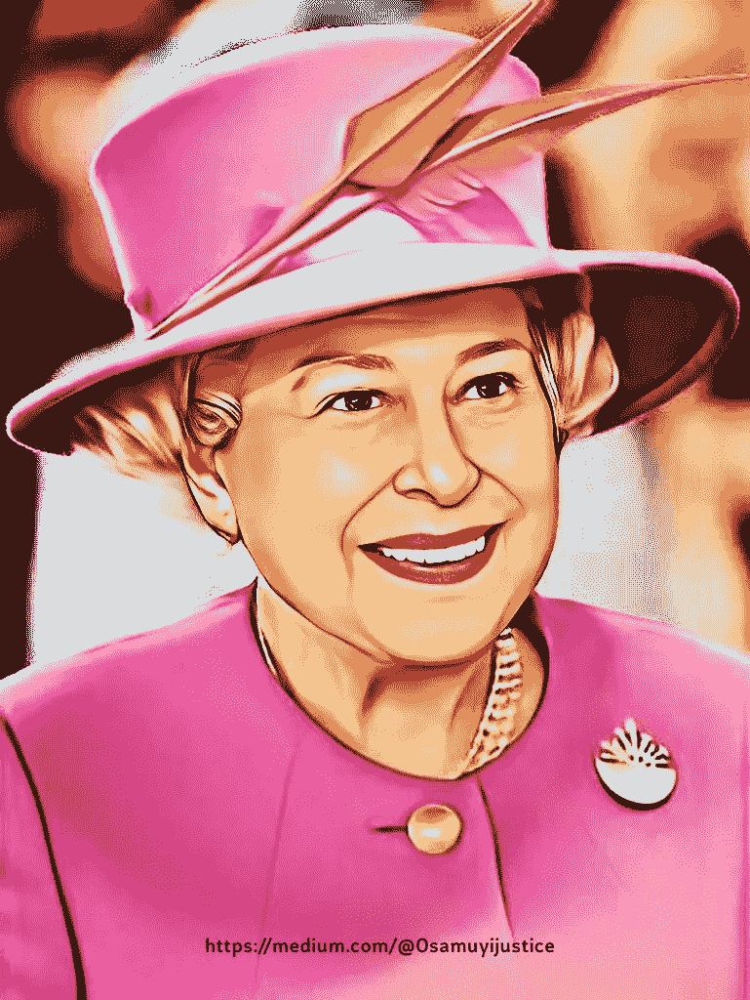

# 𝗖𝗿𝘆𝗽𝘁𝗼 𝗱𝗲𝘃𝘀 𝗺𝗶𝗻𝘁𝗲𝗱 𝗤𝘂𝗲𝗲𝗻 𝗘𝗹𝗶𝘇𝗮𝗯𝗲𝘁𝗵 𝗧𝗼𝗸𝗲𝗻 & 𝗡𝗙𝗧𝘀 𝗔𝗳𝘁𝗲𝗿 𝗛𝗲𝗿 𝗗𝗲𝗮𝘁𝗵!

> 原文：<https://medium.com/coinmonks/-f92681857837?source=collection_archive---------34----------------------->

已故英国女王“伊丽莎白女王”于 2022 年 9 月 8 日去世，享年 96 岁。

一些加密开发者继续前进，在 BSC 链(币安智能链)和区块链以太坊上铸造了已故的伊丽莎白女王令牌& NFTs。

**也读:** [*获得即时加密 2 美元空投*](https://link.medium.com/C6inFqqZ1sb)

几个[开发者创造了不同的 meme 令牌](https://cointelegraph.com/news/crypto-markets-see-flood-of-queen-elizabeth-memecoins-and-nfts)即:伊丽莎白女王伊努，拯救女王，女王，女王岛，伦敦桥倒塌，撕裂伊丽莎白女王和更多可能超过 40 枚硬币。

其中一个迷因令牌的使用率超过了 28，506%，许多密码爱好者疯狂获利，将几十美元变成了数百美元。

Opensea 创造了数百种不可替代的代币，有些交易量超过 1 美元，有些交易量不到 1 美元。

**另请查看:** [*投资加密货币要避免的 4 个最大错误*](/coinmonks/the-4-worst-mistakes-to-avoid-when-investing-in-cryptocurrency-fc70eb6fd3cc)

# 𝘾𝙤𝙣𝙘𝙡𝙪𝙨𝙞𝙤𝙣𝙨

在加密货币中，由于代币供应过剩，meme 币或代币的波动性很大。那些早期购买伊丽莎白女王 meme 代币的人赚了大钱，而那些购买顶级代币的人可能会失去他们的资本。

*加入密码电报群(* [*点击这里！*](https://t.me/cryptoportalTG) *)*

如果你想投资一个项目，而不是在代币已经超过 10%的时候购买，那么成为早期采用者总是明智的。

> 交易新手？尝试[加密交易机器人](/coinmonks/crypto-trading-bot-c2ffce8acb2a)或[复制交易](/coinmonks/top-10-crypto-copy-trading-platforms-for-beginners-d0c37c7d698c)