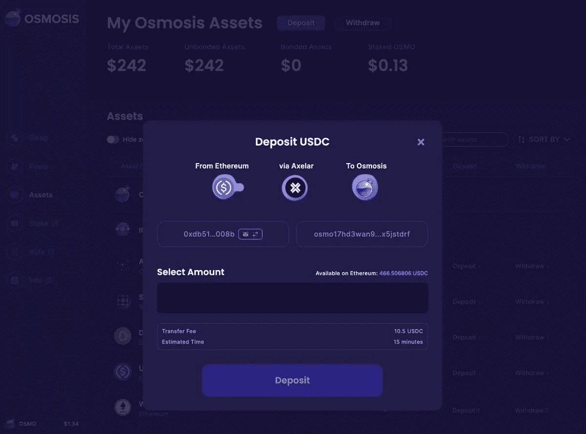

# Web3 用户之旅

> 原文：<https://medium.com/coinmonks/0-to-1-the-web3-user-journey-24dc7bdfb3b6?source=collection_archive---------7----------------------->

Dapps 或分散应用程序通过金融访问、游戏、通信和支付轨道的数字化转型提供了一个新的前沿。用户可以直接与智能合约互动，并利用该技术的力量，通过新的在线可访问性层来解锁自我主权，而不是简单地从一个钱包向另一个钱包发送令牌。这些应用程序与传统在线应用程序的区别在于，dapps 运行在区块链上，而不是集中的服务器上，消除了限制您访问或资金的单一实体。基于区块链的应用是全球社区的未来，但要使用它们，新用户需要大量了解它们如何工作。在这篇文章中，我们将探讨每一步操作链以及如何使用它们…

以下可能看起来很讽刺，每一个艰巨的任务都需要玩一个游戏，但我保证，这正是今天连锁经营所需要的:

第一步:了解 Web3

市场上并不缺少围绕加密的传言；金融新闻的每个部分都报道了象征性的价格波动，NFT 似乎是社交媒体上的所有热潮，围绕中本聪是谁或什么的神秘仍在隐现。但这些只是冰山一角；区块链应用的深度超越了传说、个人资料图片或市场猜测，这可能是全球每月活跃钱包数停滞在 3000 万以下的原因。问题在于，要么是 web3 难以向其余 50 亿互联网用户进行营销，要么是独特的好处没有在吸引新用户的前端表现出来。如果 web3 听不到这个行业正在取得的创新性进展，他们怎么能吸引下一个 10 亿用户呢？像 [DappRadar](https://dappradar.com/) 和 [Dapp](https://www.dapp.com/topics) 这样的平台提供了巨大的途径来浏览构建在链上的顶级平台。

第二步:创建一个钱包

一旦每个新用户找到最感兴趣的 dapp，他们会被提示做的第一件事就是“连接钱包”该过程通过生成私钥来启动，该私钥通过提示用户存储在安全位置(最好是离线)的助记短语来暴露，以避免数字泄密。需要创建一个新的钱包，特别是用户需要操作的每个独特的网络，以太坊的元掩模，索拉纳的幻影，以及宇宙的开普勒。一些非托管钱包，如 [Magic](http://magic.link) 或 [Web3Auth](https://web3auth.io/) ，已经进入聚光灯下，以抽象出一些围绕钱包创建的复杂性，特别是存储你自己的种子短语。对于新用户来说，这是一个很大的进步，因为它允许通过传统的社交或电子邮件登录产生钱包，但好处在于钱包的创建。看看我们的上一篇文章，“钱包的方式”，深入挖掘每种链上钱包的架构。

**第三步:**入口加密

使用 dapp 的下一步是购买区块链的本地令牌。有两种主要的方法可以将密码添加到用户的钱包中:像 [Kado](http://kado.money) 、 [Wyre](http://sendwyre.com) 或 [MoonPay](http://moonpay.com) 这样的入口提供商，或者从集中交易所购买和转移。入口提供商允许用户在钱包内获得必要的令牌。一旦按下“购买加密”按钮，就会弹出一个小工具，提示用户输入他们的信用卡信息或通过 Plaid 连接到他们的银行帐户，然后等待交易处理。下一步是创建一个集中的交易账户，完成 KYC 流程，购买所需的资产，然后通过将他们的钱包地址复制并粘贴到最终目的地来启动提款。

**第四步:**连接到 DEX 并交换

所以现在让我们假设用户的 Keplr 钱包里有$ATOM。如果他们去 Stargaze 平台需要本地$STARS 来购买 NFT 怎么办？用户将不得不去一个协议，或分散的交换，像渗透，以交换他们的美元原子的美元恒星，并通过 IBC 撤回它正确的观星。一些钱包已经使用 DEX APIs 在其钱包界面中提供交换功能，这对于活跃用户来说更加方便，但是也有大多数用户没有意识到的额外费用。对于原生加密用户来说，这非常简单，但对于非原生加密用户来说，他们可能会问为什么这是必要的，从而导致他们完全放弃 web3。

**第五步:**购买 NFT/入股/与智能合约互动

现在获得了本机令牌，钱包支持网络特定的地址，用户重新连接到他们想要与之交互的第一个也是唯一一个 dapp。在前面的步骤之后，用户的第一次点击会导致另一个任务，即在钱包内对消息或交易进行签名。对于一般的 web3 用户来说，这是合理的，但是当涉及到创建一个用户感到有信心的舒适环境时，提示他们启动或签署一个交易，即使没有与他们的实例相关联的价值，也可能会洞察到一些犹豫并让用户放弃。

**第六步:**不要被黑或被骗

在 web2 中，用户只有两次，也许是三次通过[格子](http://plaid.com)登录他们的银行账户；[罗宾汉](http://robinhood.com)、[文莫](http://venmo.com)，可能还有[薄荷](http://mint.com)。看起来很奇怪，用户需要“登录”他们进入的每个网站，用一个与他们所有资产相关的账户——对于那些打算争辩说除非你打算交易，否则你应该使用一次性账户的人来说，只要重读一下就可以了。每周都有某种妥协，因为业界仍在努力解决这项新技术的缺陷；但是，对于普通的 Joe 或 Jane 来说，花费时间和资源来管理自己的安全不利于保留或增加足够的价值来合理化风险。

好了，UX 过山车已经过去了，让我们花点时间来探索一下即将到来的选择:

**和平:第一步**

使用电子邮件或社交登录登录，在链上自由操作，只在购买东西时添加您的传统支付方式，就像用户习惯的那样。

很快…

> 交易新手？试试[加密交易机器人](/coinmonks/crypto-trading-bot-c2ffce8acb2a)或者[复制交易](/coinmonks/top-10-crypto-copy-trading-platforms-for-beginners-d0c37c7d698c)