# 2023 年的 10 本另类读物📚

> 原文：<https://medium.com/coinmonks/10-alternative-books-to-read-for-2023-f01f0a4d9aa9?source=collection_archive---------15----------------------->

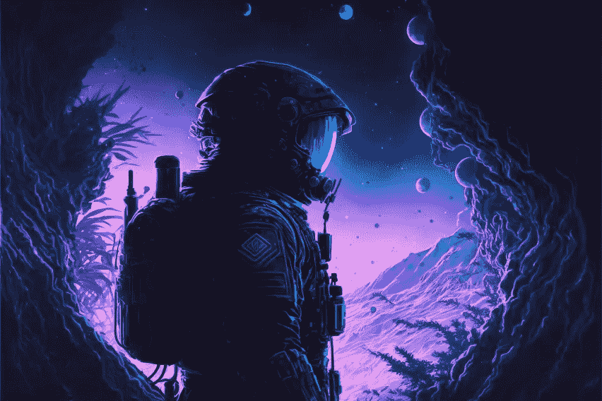

> 如果你在 2023 年 1 月 15 日之前订阅时事通讯，你就有机会赢得来自 WOKEYS NFT 项目的 1/10 免费 NFT，并且你将获得一个免费的 AI 初学者 Guide🦧 ⬇️
> 
> [订阅简讯！](https://multilayeredmarketing.mykajabi.com/)📰

__________________________________________________________________________________________________________________________________

# 1.维克多·弗兰克尔的《人类对意义的探索》

维克多·弗兰克尔所著的《人类寻找意义》一书探讨了他在纳粹集中营的经历，并详述了他对生命无意义的回应。他最终得出结论，人类能够通过忍受痛苦，拥抱他们的最高价值，并致力于比他们自己更大的事情来找到他们生活的意义。

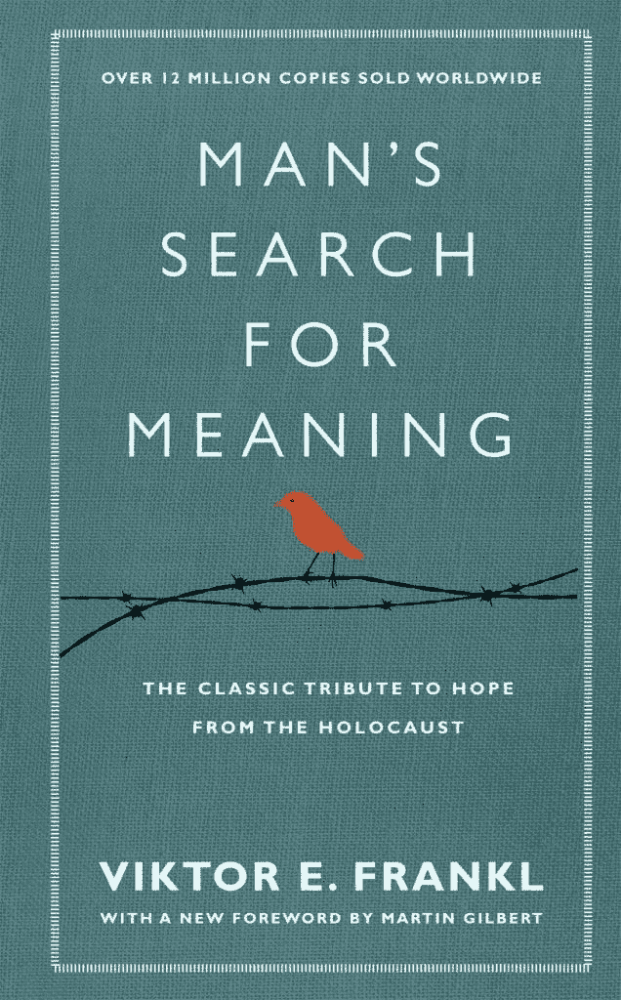

> 从顶级交易者那里复制交易机器人。免费试用。

# 2.《AI 2041》李开复、陈奎凡

这本书谈到了人工智能未来(2041 年)会变成什么样，以及未来几年很可能会变成什么样。我想把这放在我的清单的首位，因为我们已经看到 ChatGPT 在 12 月接管了世界，我们可以预计在未来的一年里会有更多的人工智能成为主流，所以最好是获得这种人工智能消费可能导致什么的样本。

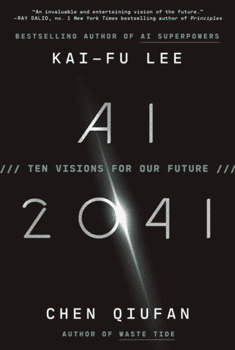

# 3.大卫·艾克的《陷阱》

《陷阱》是大卫·艾克的一本书，他在书中概述了自己对全球政治的看法，以及强大的力量如何威胁着人们的自由。他认为这个世界是由隐藏在阴影中的公司、政府和秘密社团的互联网络运行的，控制和操纵人类…这在我的名单上，因为绵羊现在需要醒来。获得灵性，真理就会随之而来。

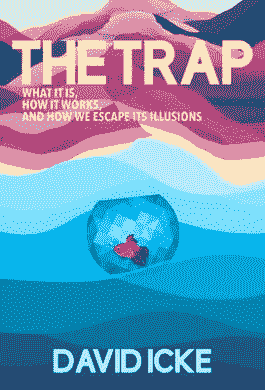

# 4.B.F .斯金纳的《瓦尔登湖二号》

《瓦尔登湖 2》是 B.F .斯金纳的一部小说，讲述了伯里斯教授和他的学生参观由一位名叫弗雷泽的梦想家建立的乌托邦社会，在那里，平等主义的生活方式和独特的社会工程方法专注于最大限度地发挥人类的潜力和幸福。它对如何实现一个更好的社会制度的哲学思考和实验，使它成为乌托邦文学的一个标志性和有影响力的作品。

这本书对于思考生活方式的规范之外的问题，回归到我们现代部落生活的根源，是非常重要的

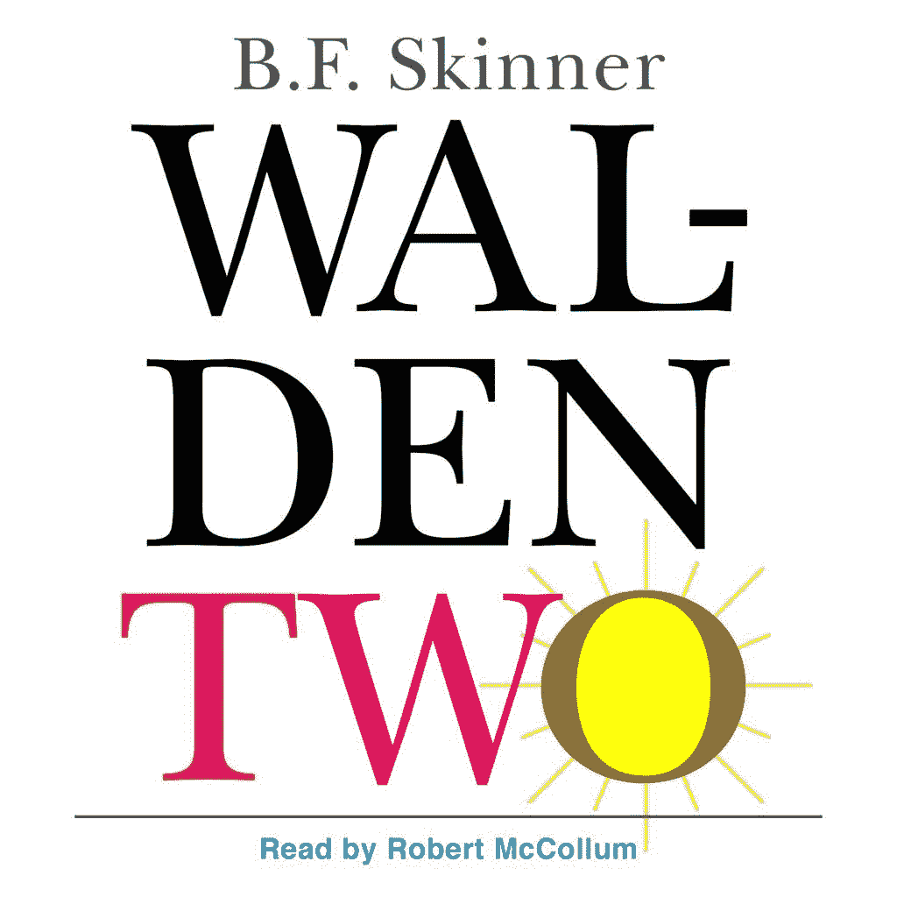

# 5.乔·斯皮恩萨博士的《变得超自然》

Joe Dispensa 博士的《变得超自然》探索了如何利用古代和现代的实践来获得更高层次的意识，从而促进身心健康、精神成长和个人转变。通过他独特的现代科学和古代智慧的融合，Dispensa 博士提供了一个强大的路线图，用于连接一个人的高我，并使用它来获得真正的内在力量。

这本书非常重要，因为它教人们真正知道治愈自己的力量来自内心，始于你的想法和信念。

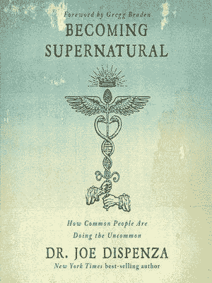

# 6.艾伦·沃茨的《失去理智》

《心不在焉》探索了一些想法，如把握当下，理解我们与宇宙的关系，借鉴东方哲学和宗教来帮助我们洞察生活，找到更大的意义感。它鼓励我们反思，深入思考我们当前的生活，并帮助我们转换视角，让生活少一些压力，多一些目标，多一些快乐。

艾伦·瓦茨无疑是我最喜欢的人，他在他的哲学演讲中倾听和学习自然、宇宙和人类的运作，旨在娱乐和激发自己的思考。

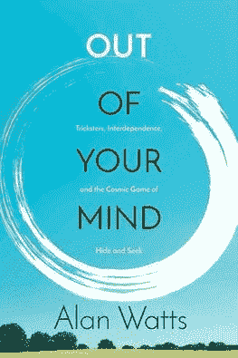

# 7.保罗·柯艾略的《朝圣》

《朝圣》是保罗·柯艾略的一本书，讲述了一个人在探索生命奥秘的过程中，走上自我发现和精神启蒙之路的精神历程。一路上，他学到了关于勇气、毅力的重要课程，以及遵循自己的真理的重要性。

我最喜欢的作家保罗·柯艾略写了这部杰作来帮助那些寻找意义的人。这与寻找你的金子无关，而是一旦你找到了金子，你会做什么。

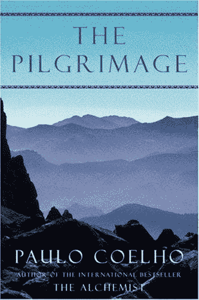

# 8.默里·罗斯巴德的《为了新的自由》

默里·罗斯巴德(Murray N. Rothbard)的宣言《为了新自由》(For a New Liberty)倡导摒弃国家和政府，支持自由放任、基于财产的社会，这种社会基于自我所有权和自愿合作的自由主义原则。他认为，政府唯一合法的权威是保护个人权利，如果不去干涉人们，让他们去追求自己的志愿，社会会变得更好。

这本书是写给那些想质疑国家(政府)权威并向自己证明你不需要统治的人的

# 9.大卫·高金斯的《永不完结》

大卫·高金斯的《永无止境》是一本关于超越身体和精神界限，把自己变成你一直想成为的人的书。这是一个关于永不放弃和征服逆境的强有力的故事。

这个人是一个英雄，回顾他的过去，他所经历的艰难困苦，以及他为成为世界上最坚强的人所克服的痛苦，对我来说是一个巨大的鼓舞

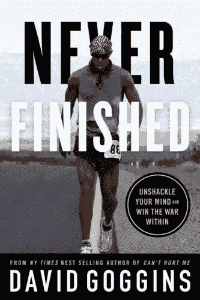

# 10.《透特的绿宝石碑》作者:M. Doreal

M. Doreal 的《透特的翡翠石板》是一部由十二块石板组成的古代文献，致力于亚特兰提斯岛智慧之神透特的哲学和精神教导。它提供了对宇宙力量、过去文明和人类精神提升的洞察。

这本书只给“觉醒”的灵魂和真正寻求智慧的人。因为如果一个较低振动的人读到这，这些话只会越过他/她的头，但对哲学家来说，它应该击中要害。读 100 遍，真正释放这本书的潜力

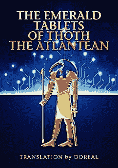

__________________________________________________________________________________________________________________________________

> 1 月 17 日就要来了！！！

_ _ _ _ _ _ _ _ _ _ _ _ _ _ _ _ _ _ _ _ _ _ _ _ _ _ _ _ _ _
_ _ _ _ _ _ _ _ _ _ _ _ _ _ _ _ _ _ _ _ _ _ _ _ _

**时刻小心！！！⚠️**

> *这一点我怎么强调都不为过！保持高度警惕，留意你点击的每一个链接、你做的每一笔交易和你接触的每一个人，因为这个领域骗子很多，即使是最好看的项目也会被撤下。*
> 
> 点击所有链接之前，仔细检查，确保它们是你正在寻找的官方链接。此外，在给自己或他人发送任何有价值的东西之前，要再三检查所有的钱包地址。

[*网站*](https://multilayeredmarketing.mykajabi.com/) [*推特*](https://www.twitter.com/metadadsxyz)[*不和*](https://discord.gg/mchzhDCwhF)[*YouTube*](https://www.youtube.com/channel/UC7pbtSBs9nRJHK6coMhCR8g)[*抖音*](https://www.tiktok.com/@thedudescrypto)[*insta gram*](https://www.instagram.com/metadadsxyz)

> 请将 Polygon Matic 发送到这个 Eth 地址或 Eth Tokens，以支持我和我不断增长的家庭🙏🏼
> 
> ***0xb 53b 3978333 e 11 c 382 ab 619 f 02 f 469 A8 c 70750 af***
> 
> *或*
> 
> ***买点 Merch！*** *[*https://www . red bubble . com/I/sticker/Mick-And-Rory-Adventure-Time-2-by-多层/131503580ejug 5*](https://www.redbubble.com/i/sticker/Mick-And-Rory-Adventure-Time-2-by-MultiLayered/131503580.EJUG5)*
> 
> **_ _ _ _ _ _ _ _ _ _ _ _ _ _ _ _ _ _ _ _ _ _ _ _ _ _ _ _ _ _ _ _ _ _ _ _ _ _ _ _ _ _ _ _ _ _ _ _**

> *如果你在 2023 年 1 月 15 日之前订阅时事通讯，你就有机会赢得来自 WOKEYS NFT 项目的 1/10 免费 NFT，并且你将获得一个免费的 AI 初学者 Guide🦧 ⬇️*
> 
> *[订阅简讯！](https://multilayeredmarketing.mykajabi.com/)📰*

*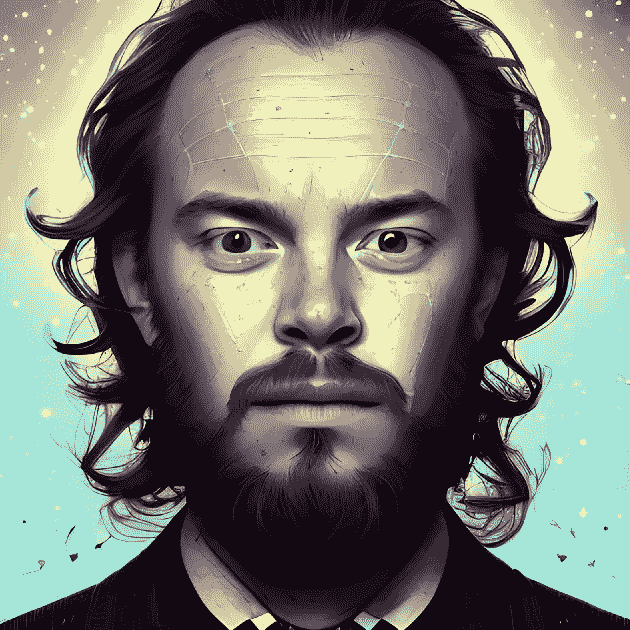*

# *干杯，
泰因泰*

*[LinkTree](https://linktr.ee/multilayeredmarketing)*

***我的其他一些博文:** [十大 Web3 作家](/coinmonks/top-10-web3-writers-ca995689c17f) [web 3 的 5 个败笔](/coinmonks/5-downfalls-of-web3-cd5dc8ade4fd)
[5 + 5 不和谐的战术](/coinmonks/5-tips-for-a-better-discord-nft-crypto-edition-ff9b039d0359)
[Crypto 101:新手指南](/coinmonks/crypto-101-a-beginners-guide-345d440bd163)
[NFT 5 大最佳实践(营销&社区成长)](/coinmonks/top-5-nft-best-practices-marketing-and-community-growth-7025e26eb50c)
[Web3 基础知识](/coinmonks/web3-basics-252121357f33)* 

> **加入 Coinmonks* [*电报频道*](https://t.me/coincodecap) *和* [*Youtube 频道*](https://www.youtube.com/c/coinmonks/videos) *了解加密交易和投资**

# *另外，阅读*

*   *[3 商业评论](/coinmonks/3commas-review-an-excellent-crypto-trading-bot-2020-1313a58bec92) | [Pionex 评论](https://coincodecap.com/pionex-review-exchange-with-crypto-trading-bot) | [Coinrule 评论](/coinmonks/coinrule-review-2021-a-beginner-friendly-crypto-trading-bot-daf0504848ba)*
*   *[莱杰 vs n rave](/coinmonks/ledger-vs-ngrave-zero-7e40f0c1d694)|[莱杰 nano s vs x](/coinmonks/ledger-nano-s-vs-x-battery-hardware-price-storage-59a6663fe3b0) | [币安评论](/coinmonks/binance-review-ee10d3bf3b6e)*
*   *[加密交易机器人](/coinmonks/crypto-trading-bot-c2ffce8acb2a) | [Bingbon 评论](https://coincodecap.com/bingbon-review)*
*   *[Bybit Exchange 审查](/coinmonks/bybit-exchange-review-dbd570019b71) | [Bityard 审查](https://coincodecap.com/bityard-reivew) | [Jet-Bot 审查](https://coincodecap.com/jet-bot-review)*
*   *[3 commas vs crypto hopper](/coinmonks/3commas-vs-pionex-vs-cryptohopper-best-crypto-bot-6a98d2baa203)|[赚取加密利息](/coinmonks/earn-crypto-interest-b10b810fdda3)*