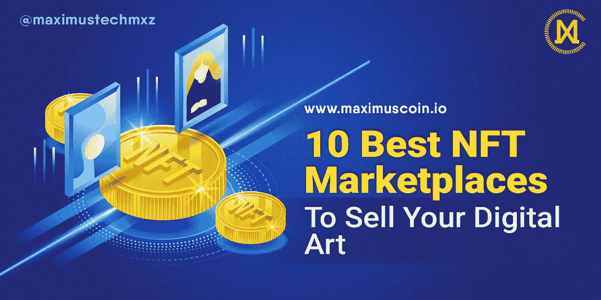

# 出售数字艺术品的 10 个最佳 NFT 市场

> 原文：<https://medium.com/coinmonks/10-best-nft-marketplaces-to-sell-your-digital-art-b578456ee11c?source=collection_archive---------14----------------------->

10 Best NFT Marketplaces To Sell Your Digital Art_Maximus_Tech

NFT 目前正在彻底改变数字艺术和收藏品的世界。NFT 被宣传为收藏品的数字解决方案，就像比特币被宣传为货币的数字解决方案一样。导致大量销售给新的加密观众，数字艺术家的生计正在改变。这些[NFT](https://www.forbes.com/advisor/in/investing/what-is-an-nft-how-do-nfts-work/#:~:text=NFT%20stands%20for%20non%2Dfungible,or%20exchanged%20for%20one%20another.)已经成为数字艺术家一种动态的赚钱方式。他们可以在一个名为 NFT 市场的平台上交易或铸造他们的数字艺术品。

[NFT 市场](https://101blockchains.com/nft-marketplace/)是可以保存、展示、交换和铸造(创造)非正规金融工具的系统。这些市场的运作方式与亚马逊的商品运作方式相同。

这些帮助他们的数字用户购买、销售和创建他们自己的令牌，以确保对独一无二的、有形和无形商品的所有权。

以下是 NFT 出售数码艺术品的 10 个最佳市场:

## OpenSea

OpenSea 是 NFT 销售的领导者。OpenSea 的平台上有各种各样的数字资产，它可以免费注册和浏览大量的产品。它还支持艺术家和创作者，如果你想创建自己的 NFT(称为“铸造”)，它有一个易于使用的过程。

> N ew to trading？尝试[加密交易机器人](/coinmonks/crypto-trading-bot-c2ffce8acb2a)或[复制交易](/coinmonks/top-10-crypto-copy-trading-platforms-for-beginners-d0c37c7d698c)

## 幼虫实验室/密码朋克

[幼虫实验室](https://www.larvalabs.com/cryptopunks)因病毒隐朋克 NFT 项目而闻名。它们最初是在 2017 年免费赠送的，但从那时起，一些加密朋克已经卖出了数百万美元的价格。幼虫实验室还有其他数字艺术项目，如 Autoglyphs，以及其他基于以太坊区块链的应用程序开发项目。

## NBA 顶级投篮市场

r [NBA Top Shot](https://nbatopshot.com/marketplace) 是美国国家篮球协会和女子国家篮球协会进军 NFT 世界的一次尝试。在它的市场上，可以从世界顶级篮球联赛中买到可收藏的瞬间(视频剪辑和比赛集锦)和艺术品。

## 稀有的

Rarible 是另一个各种 NFT 的大型市场，类似于 OpenSea。各种艺术、视频、收藏品和音乐都可以在这个平台上买卖或创作。然而，与 OpenSea 不同，你需要使用市场自己的令牌 Rarible(密码:RARI)在市场上进行买卖。Rarible 是在以太坊区块链建造的(虽然艺术品也可以在 OpenSea 上使用 Rarible 令牌进行管理)。

## 超级罕见

与 Rarible 类似， [SuperRare](https://www.superrare.com/) 也在为数字创作者建立一个市场。该网站包括艺术，视频和 3D 图像，但收藏家可以使用以太坊购买艺术品。
SuperRare 最近宣布了基于以太坊区块链的同名令牌。代币将用于为市场寻找和管理新的人才。像 Rarible 一样，超稀有 NFT 也可以在 OpenSea 上买卖。

## 基础

Foundation.app 旨在提供一种简单、实惠的方式来竞拍数字艺术品。销售通过以太坊进行。自该市场于 2021 年初推出以来，它已经售出了超过 1 亿美元的非功能性食物。

## 阿协市场

Axie Marketplace 是 Axie Infinity 电子游戏的在线商店。斧头是神话中的生物，可以被购买和训练，然后与其他玩家的斧头对战以获得奖励。在 Axie Marketplace 上，玩家可以购买新的 Axie，以及整个土地和其他物品，作为在游戏中使用的 NFT。

## 漂亮的网关

Nifty Gateway 促进了一些最受欢迎的数字艺术家的销售，如 Beeple 和歌手/音乐家 Grimes。这是一个由加密交易所 Gemini(由文克莱沃斯双胞胎控制)驱动的艺术策展平台。被称为 Nifties 的 NFT 是建立在以太坊之上的。

## 可铸造的

由亿万富翁马克·库班支持的 Mintable 旨在成为一个类似于 OpenSea 的开放市场。要参与在 Mintable 上买卖 NFT，您需要以太坊。该平台还支持为所有类型的创作者(从摄影师到音乐家)制作 NFT，这些创作者希望将他们的作品作为数字资产出售。

## θ下降

Theta 是一个区块链平台，用于在互联网上分散分发视频和电视节目。NFT 市场 [Theta Drop](https://www.thetadrop.com/marketplace) 于 2021 年首次亮相，推出世界扑克巡回赛的数字收藏品。世界扑克巡回赛是 aTV 的早期采用者，并使用该平台传输内容。

在 [www.maximuscoin.io](https://maximuscoin.io/) 上了解更多关于 Maximus Tech 的信息

关注我们的[脸书](https://www.facebook.com/maximustechmxz) & [推特](https://twitter.com/maximustechmxz/)了解更多有趣的内容。

我们也在推特上。一定要加入我们这里的 t.me/maximustechmxz