# 每个人都应该至少读一遍的 10 本书📚

> 原文：<https://medium.com/coinmonks/10-books-everyone-should-read-at-least-once-79da5bb888b5?source=collection_archive---------15----------------------->

在过去的 6 年多时间里，我轻松地阅读了 300 多本书，很多次，这里是我最喜欢的 10 本书，我认为每个人在一生中至少应该读/听一遍📚
_ _ _ _ _ _ _ _ _ _ _ _ _ _ _ _ _ _ _ _ _ _ _ _ _ _ _ _ _ _ _ _

# 十大书籍

_ _ _ _ _ _ _ _ _ _ _ _ _ _ _ _ _ _ _ _ _ _ _ _
1。**炼金术士**——*保罗·柯艾略*(教你倾听预兆(灵魂)，帮助你看到这个极其伟大的故事中总是存在的迹象)

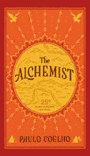

2.**思考&变得富有**——*拿破仑·希尔*(写了几十年，我最喜欢的人在这里告诉我们成功的秘密真正始于一个想法。曾经创造的一切都是从思想开始的)

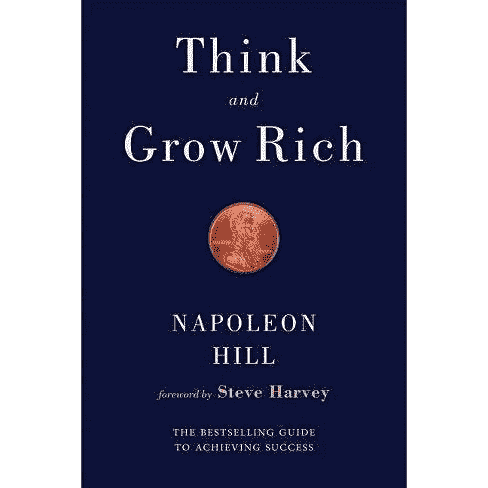

3.**维尼熊之道** — *本杰明·霍夫*(一本有趣的故事形式的短篇书，旨在让西方人了解道教，一种教导我们在每一个场景中都快乐/满足的生活哲学，位于小熊维尼的土地上)

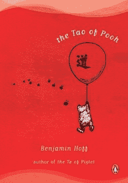

4.亨利·大卫·梭罗(写于 19 世纪的一本伟大的哲学书，书中一个人冒险进入荒野多年，靠土地为生，并写下他对生活本身的质疑)

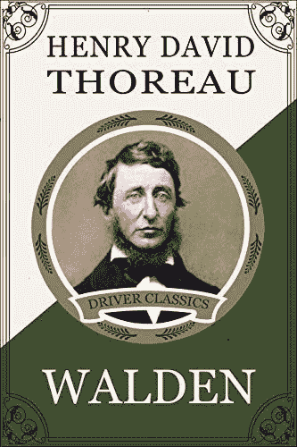

5.B.F .斯金纳(这本故事书是关于学习用不同的方式思考一种文化/社会/文明应该如何正常运转，超越社会应该如何运转的“主流”思考方式。这位哲学家生活在一个被创造出来的脱离电网的社区中，受到他的老同事的各种质疑)

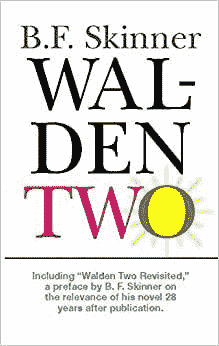

6.人类寻找意义(这是一个真实的故事，讲述了一位心理学家作为幸存者经历了二战期间的集中营，他讲述了自己的经历，并注意到心理是如何演变的。弗兰基给了我们他对一个人应该如何过上最好的生活的最佳综合

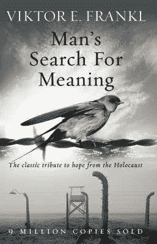

7.(这本故事书是关于一个人和一个会说话、聪明的猿，他从自己的角度向人类讲述了人类的故事。真的让你对人类作为地球征服者的感觉感到愤怒/悲伤。从人道主义的角度来看非常值得一读)

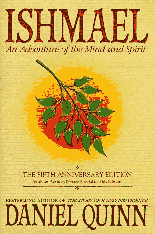

8.**智人**——*尤瓦尔·诺亚·哈拉里*(虽然有些人可能会仔细审查作者帮助克劳斯·施瓦布和他的全球主义精英，但他是一个极其聪明的人。这本书有助于从一个非常逻辑/科学的角度回顾我们的进化历史，并让你真正想到你以前可能从未想到过的关于我们自己(人类)的事情。)

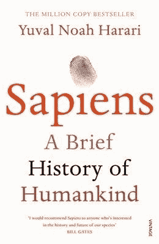

9.艾伦·沃茨(ALAN WATTS)是第一批，也可以说是有史以来最好的哲学家艺人之一。他的演讲充满魅力/有趣/浪漫/迷人，让听众想连续听几个小时。他谈到了人性的真理，世界宗教，以及在我们称之为生命的这种单纯的存在中，一个人应该如何行动。)

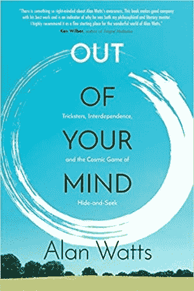

10.**如何赢得朋友&影响人物**——*安德鲁·卡耐基*(卡耐基是钢铁工业巨头，白手起家，成为世界上第一批亿万富翁之一。这本书写于 20 世纪初中期，是他对如何在商业和生活中让人喜欢、信任和依赖的描述

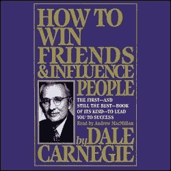

优秀奖:
**透特的翡翠石板****凯巴里昂****卖法拉利的和尚**

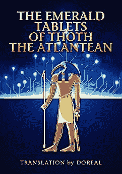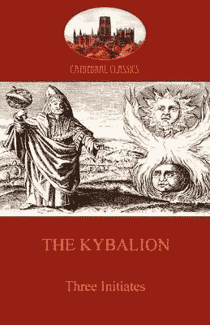

________________________________

学校教育结束后，教育才开始。

不要忘记实践你所学的☯️

享受这一天！🙏🏼

## 你会把哪本书添加到这个列表中？

_ _ _ _ _ _ _ _ _ _ _ _ _ _ _ _ _ _ _ _ _ _ _ _ _ _ _ _ _ _
_ _ _ _ _ _ _ _ _ _ _ _ _ _ _ _ _ _ _ _ _ _ _ _ _ _ _ _ _ _ _

**时刻小心！！！⚠️**

我怎么强调这一点都不为过！保持高度警惕，留意你点击的每一个链接、你做的每一笔交易和你接触的每一个人，因为这个领域骗子很多，即使是最好看的项目也会被撤下。

点击所有链接之前，仔细检查，确保它们是你要找的官方链接。此外，在给自己或他人发送任何有价值的东西之前，要再三检查所有的钱包地址。

> 请将 Polygon Matic 发送到这个 Eth 地址或 Eth Tokens，以支持我和我不断增长的家庭🙏🏼
> ***0xb 53 b 3978333 e 11 c 382 ab 619 f 02 f 469 A8 c 70750 af***

_________________________________________________________________

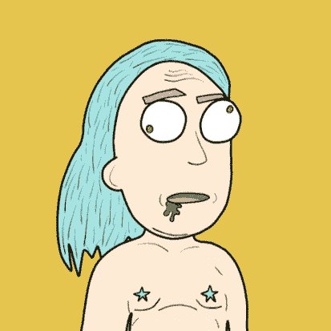

感谢阅读:]

# 干杯，
泰，又名“纨绔子弟”

**其他一些由我发表的博文:**
[web 3](/coinmonks/5-downfalls-of-web3-cd5dc8ade4fd)
[5+5 不和谐的战术](/coinmonks/5-tips-for-a-better-discord-nft-crypto-edition-ff9b039d0359)
[Crypto 101:初学者指南](/coinmonks/crypto-101-a-beginners-guide-345d440bd163)
[NFT 最佳实践(营销&社区成长)](/coinmonks/top-5-nft-best-practices-marketing-and-community-growth-7025e26eb50c)
[Web3 基础知识](/coinmonks/web3-basics-252121357f33)
[可供 NFT 选择的实用案例](/coinmonks/alternative-nft-crypto-real-life-use-cases-b7c0b08d99ef)

> 交易新手？尝试[加密交易机器人](/coinmonks/crypto-trading-bot-c2ffce8acb2a)或[复制交易](/coinmonks/top-10-crypto-copy-trading-platforms-for-beginners-d0c37c7d698c)