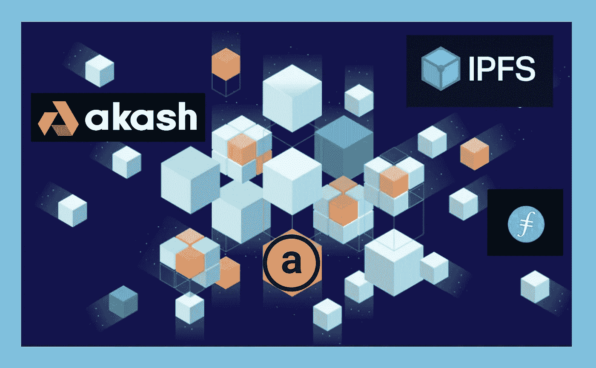

# 我学到的关于 NFTs 的 10 个趣闻

> 原文：<https://medium.com/coinmonks/10-cool-tidbits-i-learned-about-nfts-f7f505cce87e?source=collection_archive---------22----------------------->

渐渐地，我拓宽了我的探索之旅，包括了不可替代令牌(NFT)的迷人世界。我一路上学到了一些非常酷的关于 NFTs 的小知识，我想和你们分享一下。

## **一个**

NFT 不仅仅是一幅美丽的图画！NFT 包括:

*   基础智能合约
*   元数据
*   媒体文件。

NFT 的目的是记录链上数字资产的所有权。它还通常用于在非数字世界中创建有形资产的在链记录。

## **两只**

NFT 的智能合同包含:

*   令牌 ID —每个 NFT 的唯一标识符
*   钱包地址—识别所有权信息
*   功能代码-用于更新 NFT 的记录。

## **三**

NFT 的元数据可用于:

*   存放来源和接收数据
*   在 NFT 周围创建一个加密袋
*   存储原始数据
*   保存特征数据或属性
*   链接或指向外部资源。

## **四个**

虽然不可替换的令牌存储在区块链上，但是 NFT 的媒体文件通常存储在链外。对于大型图像、复杂图像、复杂文件和可执行文件来说尤其如此。例如:艺术作品、音乐文件、高分辨率图像、大型文档和长程序。

IPFS 是分布式存储解决方案，而大型云服务公司提供集中式存储选项。Akash Network 提供了一种分散的云服务替代方案。使用最广泛和最流行的提供分散托管服务的区块链是:Filecoin 和 Arweave。

## **五个**

在区块链有许多不同的 NFT 标准。

在以太坊、多边形和大多数 EVM 区块链包括雪崩中，这些令牌标准被广泛使用:

*   ERC-721
*   ERC 1155 号。

比较两种最常见的 NFT 标准，它们的基础智能合约具有强大的功能:

虽然 ERC-1155 在智能合约中注册可替换令牌和 NFT，但以太坊中使用的另一个令牌标准在这方面略有不同。ERC-998 也处理可替换和不可替换的令牌，但是通过将它们合并成一个 NFT 来实现。这样做的最大好处是可以在一个事务中包含和传输多个令牌。

## **六个**

以下是其他区块链使用的 NFT 令牌标准的一些示例:

*   BNB 链-> BEP-721，BEP-1155
*   栈(比特币)-> SIP-009
*   索拉纳-> SPL
*   泰佐斯-> FA2
*   NEO -> NEP-11
*   创-> TRC-721
*   宇宙-> CW-721
*   秘密-> SNIP-721
*   星际之门-> SG-721。

## **七个**

宇宙中使用的 CW-721 标准是基于以太坊的 ERC-721 令牌标准。反过来，Stargaze Zone 的 SG-721 标准符合 Cosmos CW-721 令牌标准，并在 CW-721 基础上添加了一组可选扩展。

## **八个**

加密货币的世界在不断发展，连通性是这一发展的前沿。NFT 桥接技术正在快速创建和实施。NFT 的创造者和所有者越来越能够将他们的数字资产从一个区块链生态系统转移到另一个生态系统。

以下是桥提供的一些可能的转移路线:

*   多边形⇔以太坊等离子体 NFT 桥
*   索拉诺·⇔以太坊的入口 NFT 桥
*   ⇔币安以太坊跨链 NFT 桥
*   斯塔克斯⇔以太坊的斯塔克斯桥。

## **九个**

星际之门小组和重力桥小组正在合作将 ERC-721 NFTs 从以太坊带到宇宙并返回。然而，为了实现跨越宇宙区块链的简单而廉价的传输，需要一种标准化的解决方案来简化这种互操作性。

来自 Cosmos 中多个开发团队的成员正在合作实现一个新的令牌标准:ICS721。跨宇宙区块链的 NFT 互操作性的 ICS721 标准最初是由 IRISnet 开发团队创建的，现在正准备由来自 Gravity Bridge、IRISnet、Stargaze、OmniFlix、CraftEconomy、Talis、UnUnifi 和 AquaOnJuno 团队的成员实施。

一旦该标准得到广泛实施，跨宇宙区块链的 NFT 转移将像目前的可替换令牌区块链间通信(IBC)转移一样普遍和高效。

## **十个**

一场技术创新浪潮正在席卷加密货币的生态系统。NFT 也不例外，许多开发团队都在拓展这些令牌的潜能。

我正在了解的一个令人兴奋的领域是这个新类别的 NFT 有许多不同的名称:嵌套、容器、实用程序、捆绑、分层或可组合。来自带电粒子和环路金融等协议的团队正在开发内置多个组件的 NFT，以创造额外的效用和财务价值。

以太坊和多边形生态系统中的带电粒子开发了嵌套的 NFT，它们拥有自己的智能钱包，可以包含:

*   LP 令牌
*   DeFi 资产
*   社交标志
*   投机代币
*   其他非功能性测试。

宇宙生态系统中的 Loop Finance 与 Tradooors NFTs 推出了第一代奖励 NFTs。这种新类别的 NFT 可以被下注，并在预定的时间段内产生奖励代币流。多个级别或层级可以包含不同数量的奖励代币，还可以包括来自不同项目、协议或 DAO 的额外代币。NFT 在 Loop Marketplace 上推出的下一个奖励是一个名为 Los Amigos 的社会影响项目。它进一步推动了 NFTs 的前沿，为持有者提供了一系列好处:五种不同的社会影响令牌，预 IDO 互换访问，自动预订列表，以及未来 NFT 薄荷糖的折扣。使用这些新的 NFT，Loop 团队能够将既得的令牌排放包装到 NFT 产品中，同时为持有者提供支持慈善和社会影响 Dao 的机会。

这种新型非功能性测试的可能性令人兴奋，包括:

*   计息代币
*   既得代币
*   多个令牌的索引帐户
*   投放时间
*   创作者的版税支付流
*   带有额外 NFT(音频、视频和艺术)的音乐专辑
*   带额外 NFT 的音乐会门票
*   带额外 NFT 的会议门票(商品“包”)
*   游戏入门包
*   游戏宝箱。

## **从怀疑，到好奇，再到无所不包**

当我开始从事 crypto 工作时，我立即被吸引到了基于我的教育和工作经验我感到舒适的领域:经济、金融和商业。而且，我非常喜欢学习 DeFi、tokenomics 和 DAOs。

然而，我发现 NFT 非常重要，它们正在改变许多行业、功能、公司和产业。如果您和我一样兴奋，您可以阅读我最近关于 NFTs 的文章(参见下面的参考资料部分)。例如，在“NFTs 的发展”中，我写了目前正在开发的创造性用例的类型。

我最激动的是艺术家、创作者、开发者和商业专业人士，他们用创新的产品、发行方式和社区建设努力推动 NFT 空间向前发展。现在进入市场的工具正在超越其最早的粉丝驱动令牌、收藏品和 PFP 的创造。我们现在看到整套工具的推出，这使得创作者可以直接与他们的观众联系。我热切期待继续我的旅程，带给你更多这些有趣的花絮！

Tot ziens — Opa。

## **资料来源、参考文献和进一步阅读**

IPFS 文章—[https://decrypt . co/resources/how-to-use-ipfs-the-backbone-of-web 3](https://decrypt.co/resources/how-to-use-ipfs-the-backbone-of-web3)

https://ipfs.tech/—[IPFS](https://ipfs.tech/)

FileCoin—[https://filecoin.io/](https://filecoin.io/)

https://www.arweave.org/#arweave-intro[阿尔韦弗](https://www.arweave.org/#arweave-intro)

阿卡什网络— [https://akash.network/](https://akash.network/)

https://bridge.mintnft.today/等离子 NFT 桥—

https://www.portalbridge.com/#/nft NFT 大桥—

跨链 https://app.crosschainbridge.org/bridge/nfts NFT 大桥—

斯塔克斯大桥—[https://stacksbridge.com/](https://stacksbridge.com/)

https://www.stargaze.zone/

OmniFlix—[https://OmniFlix . network/](https://omniflix.network/)

塔利斯—[https://talis.art/](https://talis.art/)

https://assetmantle.one/

轨道市场—[https://www.orbitmarket.io/](https://www.orbitmarket.io/)

重力桥—[https://www.gravitybridge.net/](https://www.gravitybridge.net/)

https://www.upticknft.com/index NFT 市场上涨

IRISnet—[https://www.irisnet.org/](https://www.irisnet.org/)

带电粒子—[https://www.charged.fi/](https://www.charged.fi/)

https://nft-juno.loop.markets/环 NFT 市场—

NFT — @TradooorsNFT

Aqua DAO — @AquaOnJuno

卡萨岛—@卡萨翁朱诺

## **我的 NFT 文章:**

NFTs 的演进—[https://medium . com/coin monks/the-Evolution-of-NFTs-31638 a06c 75](/coinmonks/the-evolution-of-nfts-31638a06c75)

撰写多功能 NFTs—[https://medium . com/@ kaas kop _ Opa/撰写-多功能-nfts-89020c1f2e16](/@KaasKop_Opa/composing-multi-functional-nfts-89020c1f2e16)

莱瓦娜 NFT 奇妙冒险的下一章—[https://www . loop . markets/the-Next-Chapter-in-Levana-Amazing-NFT-Adventure/](https://www.loop.markets/the-next-chapter-in-levanas-amazing-nft-adventure/)

莱瓦娜——一种进化协议——https://www.loop.markets/levana-an-evolutionary-protocol/

鸡蛋还是灰尘？——【https://www.loop.markets/eggs-or-dust/ 

解开谜团:Maneki Cosmos—[https://medium . com/coin monks/solving-the-Mystery-Maneki-Cosmos-8c 30135 D4 db 8](/coinmonks/solving-the-mystery-maneki-cosmos-8c30135d4db8)

## 你可以在这里找到我

推特— @KaasKop_Opa

中—[https://medium.com/@KaasKop_Opa](/@KaasKop_Opa)

循环—[https://www.loop.markets/user/52879](https://www.loop.markets/user/52879)

狮子座金融—[https://leofinance.io/@kaaskop](https://leofinance.io/@kaaskop)

> 交易新手？尝试[加密交易机器人](/coinmonks/crypto-trading-bot-c2ffce8acb2a)或[复制交易](/coinmonks/top-10-crypto-copy-trading-platforms-for-beginners-d0c37c7d698c)