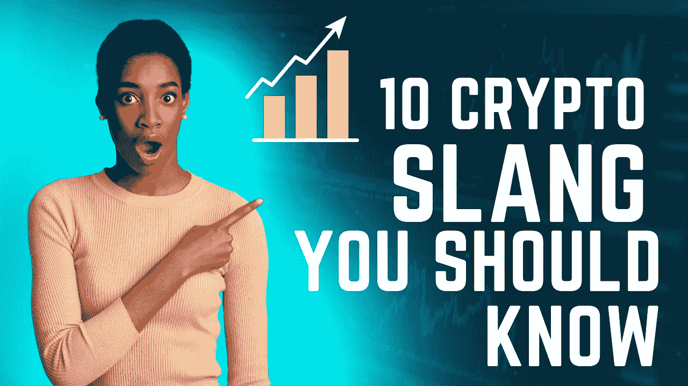

# 你应该知道的 10 个密码俚语

> 原文：<https://medium.com/coinmonks/10-crypto-slangs-you-should-know-93a5682499dd?source=collection_archive---------13----------------------->

# 钻石手

“钻石手”交易者会坚持到最后，不管市场如何表现。换句话说，这表明你喜欢冒险。在交易者看来，钻石手交易者一直持有代币，直到它们达到最大价值。

# 纸手

在交易中有“纸手”的人会很快解套。他们屈服于恐惧并出售。用纸手交易的人不愿意冒赔钱的风险；因此，他们迅速从高波动性的代币头寸中脱手。

# DYOR

缩写 DYOR 的意思是“做你自己的研究”。“这个术语经常在加密货币中使用，以强调在向项目投资之前进行尽职调查的重要性。

# FOMO

术语“害怕错过”(FOMO)指的是这种焦虑的感觉。担心会失去加密货币市场的潜在金融收益。

这种恐惧会让人不假思索地行动，凭感觉而非逻辑和理智做出投资决策。

在加密货币的情况下，担心错过(FOMO)可能会显著影响市场价格并增加波动性。因此，投资者赔钱的可能性要大得多。

# 月球

当一种加密货币的价格“上月球”时，它飙升得如此之快，以至于它象征性地上升到月球。该术语用于描述一种加密货币，这种货币预计会出现明显的看涨市场趋势。投资者可以利用这一事件来确定出售其加密货币的最佳时机，以获得最高价格。

# 小地毯

拉地毯是一种加密货币欺诈形式，项目员工在项目完成前突然退出，取走项目的所有资产，让投资者持有不值钱的货币。

# 鲸

“鲸”指的是大型加密货币持有者，可以是个人，也可以是组织。尽管官方没有规定必须拥有多少硬币或代币才能被视为“鲸鱼”，但数量必须足够大，才能在持有者购买或出售时对市场产生显著影响。本质上，他们有足够的财力来影响市场。

# HODL

首字母缩略词 HODL 指的是“亲爱的生命坚持住”，尽管它最初是一个拼写错误。今天，它表示“保持”带着保留的意图得到某物。因此，加密货币的“霍德勒”是购买了硬币但没有立即出售它的意图的交易者。

# 买蘸酱

术语“购买蘸酱”通常用于建议消费者低价购买。此外，这意味着充分利用折价购买加密货币的机会。

# 哄抬股价

抽水和倾倒计划的目的是通过散布关于资产前景的虚假或误导性的积极信息，人为地提高资产价格。在大多数情况下，一群人会以折扣率大量购买特定资产。因此，对该资产的购买兴趣增加，其价值上升。

由于价格快速上涨，更多的人会有兴趣购买。早期投资者将出售(抛售)他们的股份以获得即时利润，让后期投资者来买单。

如果您有任何疑问或意见，我很乐意收到您的来信。如果您对#crypto、#web3、#nft、#defi、#元宇宙、#社区建设、#市场营销、#领导力、#职业生涯或自我提升有任何迫切的问题，请发送给我。

如需更多咨询，请发邮件至*联系我。*

**我可以被雇佣*。*

*如果你想欣赏我的作品，你可以请我喝杯咖啡。*

*[https://www.buymeacoffee.com/abeabimbolo?new=1](https://www.buymeacoffee.com/abeabimbolo?new=1)*

*也可以关注我的*[*LinkedIn*](https://www.linkedin.com/in/abeabimbola/)*，或者*[*Twitter*](https://twitter.com/Bmarketer_)*。***

> **交易新手？尝试[加密交易机器人](/coinmonks/crypto-trading-bot-c2ffce8acb2a)或[复制交易](/coinmonks/top-10-crypto-copy-trading-platforms-for-beginners-d0c37c7d698c)**