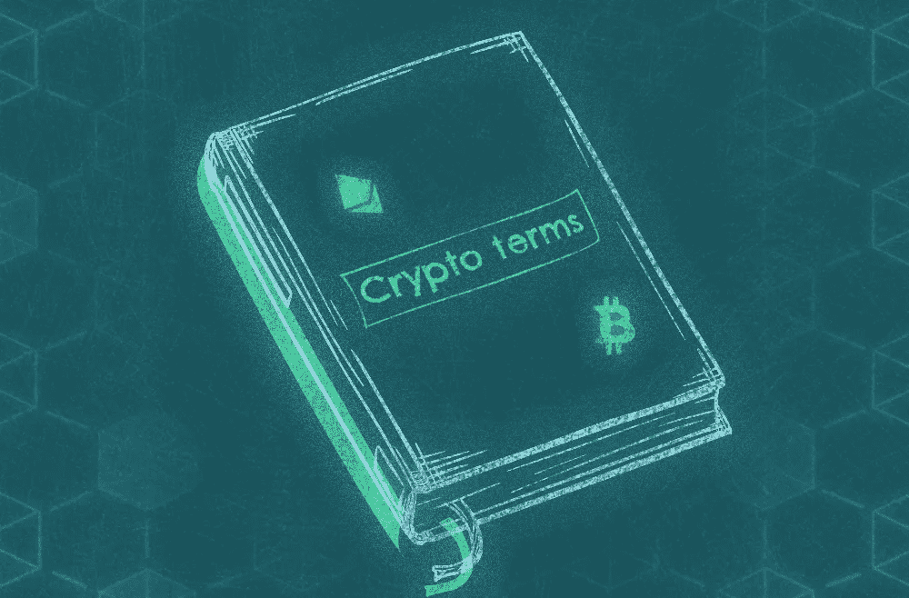

# 10 个你必须知道的秘密术语

> 原文：<https://medium.com/coinmonks/10-crypto-terms-you-must-know-to-not-feel-left-out-2a81a6b92e3b?source=collection_archive---------7----------------------->

Every crypto investor must know the **basic words** which are used in the **Cryptoverse**. Here are the **10 most popular expressions**!

如果你是第一次接触**秘密世界**，最初你可能会觉得有点**被排除在**之外。所有这些在**电报**或**推特**上的人都在用你听不懂的词。他们说的“ **Hodl** ”、“ **FOMO** ”、“ **DYOR** ”或“**先令**”是什么意思？到本文结束时，你将成为一名关于加密货币的专家，你将能够理解类似这样的句子: