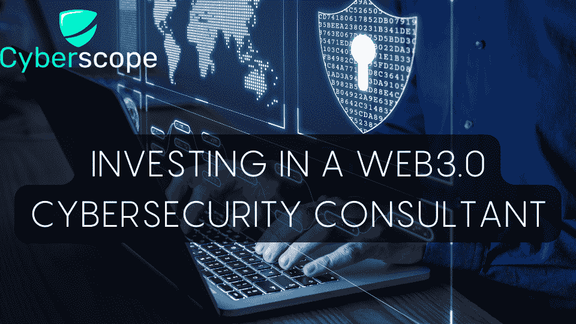

# 为您的 Web3 业务提供 10 个网络安全提示和最佳实践

> 原文：<https://medium.com/coinmonks/10-cybersecurity-tips-and-best-practices-for-your-web3-business-ded10e44dbca?source=collection_archive---------9----------------------->

# 介绍

对于任何企业来说，其资产和基础设施的安全性都是，而且应该永远是其首要任务。随着 Web3 的推出，对于希望利用网络并取得成功的企业来说，网络安全比以往任何时候都更加重要。在本文中，我们将介绍 10 个网络安全提示和实践，它们可以帮助您在浏览区块链生态系统时保持业务安全。

# 什么是 Web3.0？

为了更好地理解 Web3.0，我们需要回顾一下过去。Web 1.0 和 Web 2.0 是用来描述万维网历史上不同时代的术语。Web 1.0 大致指的是从 1991 年到 2004 年这段时间，当时大多数网站由静态页面组成，大多数用户是内容的消费者，而不是生产者。Web 2.0 基于“网络作为平台”的理念，以上传到论坛、社交媒体和网络服务、博客、维基以及其他服务的用户创建的内容为中心。Web 2.0 通常被认为始于 2004 年左右，并持续至今。

> 交易新手？在[最佳密码交易所](/coinmonks/crypto-exchange-dd2f9d6f3769)上尝试[密码交易机器人](/coinmonks/crypto-trading-bot-c2ffce8acb2a)或[复制交易](/coinmonks/top-10-crypto-copy-trading-platforms-for-beginners-d0c37c7d698c)

Web3 是一个基于区块链技术的术语，用来描述一个更加分散化和有更多可能性的网络。这可能意味着用户可以真正拥有他们的数字身份、个人数据和数字资产。这个词是以太坊的联合创始人加文·伍德在 2014 年创造的。2021 年，加密货币爱好者、大型技术公司和风险投资公司开始使用术语“Web3”来描述这种新的去中心化互联网可能如何建立。Web3.0 最重要的方面是去中心化。尽管加密货币目前是去中心化运动的焦点，但人们普遍认为去中心化是互联网的下一步，将影响多个(如果不是所有)行业的企业。

# Web3.0 有多安全？

Web3.0 基于区块链技术。虽然它最大的优点是它是分散的，但它也有一些弱点。其中大多数是由智能合约的弱点造成的，如果利用得当，这些弱点会影响数据的完整性。企业必须确保采取适当的措施来保护其系统以及避免其漏洞。

网络犯罪被列为当今企业必须面对的最大威胁之一。根据最近的报道，每 39 秒就有一次网络攻击发生。也就是说，保护你的企业免受网络攻击既不容易也不迅速。然而，为此花费的每一秒或每一分钱都是值得的。说到安全，削减开支不是你能负担得起的。您应该记住，安全的基础架构是任何成功企业的基石。

# 确保企业安全的 10 个最佳网络安全提示

越早开始部署网络安全系统，效果越好。尽管可行，但不建议在更远的地方开始。很难在以后对系统进行修改或者教育大量的人。

网络攻击的目标并不总是金融资产。如果您的企业正在处理和/或存储敏感信息，潜在的黑客攻击可能会带来灾难性的后果。你的客户会对你失去信心，违反数据保护和 GDPR 规则会给你的企业带来巨额罚款。

让我们来看看 10 个最佳网络安全提示和实践，您可以这样做来更好地保护您的企业:

1.  **评估你的网络安全威胁档案** 这是我们谈生意时最简单的第一步。你的企业属于哪一类？如果你成为黑客的受害者，你会损失什么，敏感信息还是金融资产？这样，您可以更好地了解需要采取什么样的措施来提高安全性。
2.  **教育您的员工** 员工是黑客和网络罪犯获取您的数据的最常见弱点之一。[最新报告](https://www.cybertalk.org/2022/03/30/top-15-phishing-attack-statistics-and-they-might-scare-you/)显示，65%的网络攻击者利用[网络钓鱼攻击](https://www.cyberscope.io/blog/what-is-phishing-in-crypto-and-how-you-can-avoid-it)，比如电子邮件作为他们的主要手段。

    对于未经训练的人来说，包含链接的网络钓鱼电子邮件看起来很真实，很容易上当受骗。因此，您的人员可能会落入这些陷阱，这使得网络安全意识变得至关重要。确保您的员工熟悉当前的网络攻击以及它们是如何发生的非常重要。这样你就有更好的机会防止人为错误。
3.  **保持软件最新** 另一个常见的漏洞是过时的安全或操作软件。计算机软件通常会获得安全更新，以修补最新的漏洞。这使得攻击者更难利用它们。这同样适用于安全软件，如防火墙或防病毒程序。

    你可以通过投资一个更新管理系统来自动化这个过程。这些跟踪所有软件和系统升级，确保您的设备始终是最新的。
4.  **使用 VPN** VPN 代表[虚拟专用网](https://en.wikipedia.org/wiki/Virtual_private_network)。VPN 对于没有资源投资内部网络的企业或远程工作的团队成员来说是必不可少的。在数字游牧时代，在家工作的员工比在办公室工作的员工更容易受到网络安全的威胁。

    有了 VPN，每个员工在访问敏感信息时都可以轻松开启 VPN，隐藏自己的 IP 地址。这样，他们可以帮助防止企业网络中的违规行为。
5.  **使用强密码和密码管理工具** 这听起来似乎很容易，但是大多数人至今仍在使用弱密码或普通密码。应该避免使用数字、字母、名/姓或生日的组合。对于被认为是强密码的密码，它需要包括字母(大写和小写)、数字和符号。人们总是建议避免使用序列，因为这让黑客更容易猜出正确的组合。由于有许多平台或网站，员工必须拥有一个帐户，因此拥有一个密码管理器是一条必由之路。它可以安全可靠地存储您的不同凭证，从而消除人为错误。
6.  **定期备份你的数据** 勒索软件是最常见的网络攻击之一。它们现在仍然有效，因为大多数人和小企业不备份他们的数据(或者定期备份，或者根本不备份)。可以通过使用安全的云服务来备份数据或者使用单独的物理存储位置来防止这种情况。这可以让你不必付钱给黑客来访问你的数据，并在硬件故障的情况下给你灵活性。
7.  **使用多重身份认证进行登录和批准** 大多数网站和在线平台都为登录和批准提供双重或多重身份认证。通过利用它们，即使你的凭证被泄露，黑客也无法进入你的账户。这同样适用于进行任何更改/交易，因为他们将无法访问认证码。

    最普遍的形式是使用认证软件，如谷歌认证器或 Authy。
8.  **跟踪谁有权访问您的系统** 拥有员工意味着让他们能够访问您的企业使用的系统。这应该一直被监控，因为你不想让访问你不想公开的信息。同样的做法不仅适用于你的员工，也适用于你的客户。
9.  **使用防火墙** 谈到网络安全，杀毒软件和防火墙软件是你最好的朋友。这样，您的设备既可以抵御任何可疑流量，又可以免受病毒的侵害。
10.  **让您的智能合同接受审计** 如果您的企业使用[智能合同](https://www.cyberscope.io/blog/smart-contract-audits-a-complete-guide)，您必须投资进行审计。它可以帮助:

*   寻找代码中的任何安全漏洞或弱点
*   有助于以更好、更高效的方式简化业务的潜在改进。

# 投资一个 Web3.0 网络安全顾问

雇佣一名 Web3.0 网络安全顾问对你在这个领域的成功至关重要。由于 Web3.0 可能会非常混乱，尤其是如果你没有经验，依靠网络安全顾问是正确的选择。一家经验丰富的公司可以通过提供重要的见解和指导您采取必要的措施来帮助您保护您的业务。

# 结论

试图找出如何保护您的组织免受网络犯罪和攻击的方法可能会让人感到力不从心。网上有很多信息，很难确定该做什么，因为有时你会看到相互矛盾的信息。然而，通过阅读这篇文章，你可以更好地了解你应该关注和研究哪些方面。让智能合同成为您业务的一部分可以帮助您自动化许多复杂和/或耗时的任务。也就是说，像 Cyberscope 这样的咨询公司可以帮助你提高安全性，让 Web3.0 对你和你的企业更安全。

*…*

*原载于*[*www . cyber scope . io*](https://www.cyberscope.io/)