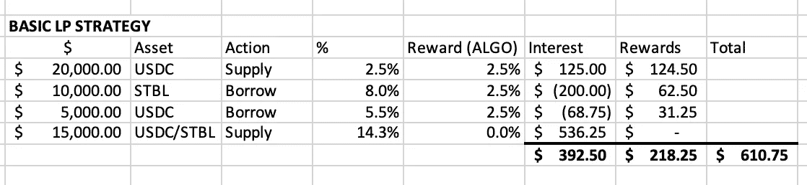
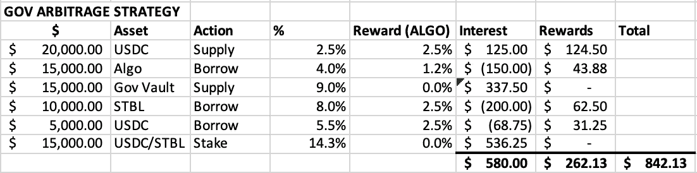

# 还剩下 10 天的时间来使用 Algorand DeFi 策略

> 原文：<https://medium.com/coinmonks/10-days-left-to-use-this-algorand-defi-strategy-d17aa5e6f14a?source=collection_archive---------3----------------------->

摘要

*   治理套利策略可以用来获得额外的稳定回报
*   它依赖于治理奖励和算法库
*   您只能在治理注册期内报名(在撰写第 4 轮治理报告后的 10 天内)
*   治理期完成后才能退出，否则赚的钱比基本策略少。

我通常更喜欢谈论基础技术和事物如何工作，而不是金融策略，但我看到了这个有趣的机会，并认为这将是一次关于 Algorand 治理的独特机制及其如何影响交易策略的伟大探索。

下面我将介绍一种策略，它利用治理参与奖励和 AlgoFi 的 Vaults 和 DeFi Suite，以最小的风险显著增加您的回报。

让我们先回顾一下基本部分

# 阿尔格兰德治理

阿尔格兰德基金会是阿尔格兰德核心社区的非营利机构，其任务是鼓励阿尔格兰德区块链的发展和权力下放。

这是他们网站的使命宣言:

> 阿尔格兰德基金会的使命是在阿尔格兰德区块链技术的基础上，大规模地实现一个包容的、去中心化的、无国界的全球经济。

除了交流和记录，他们实现目标的一种方式是通过拨款和奖励。

Aeneas 计划和其他拨款提供了财政激励，以鼓励社区参与和建立网络，并为社区带来明显的好处。

> 交易新手？试试[密码交易机器人](/coinmonks/crypto-trading-bot-c2ffce8acb2a)或者[复制交易](/coinmonks/top-10-crypto-copy-trading-platforms-for-beginners-d0c37c7d698c)

它们也为社区治理提供了类似的激励。来自 Algorand 利益相关方的社区治理是基金会努力实现进一步权力下放的一个关键组成部分。因此，基金会设立了治理注册、投票功能，允许任何 algorand 钱包投票。对本文更重要的是，基金会留出一个 ALGO 令牌池，分发给治理参与者。

治理工作如下:

1-每个季度都有一个治理注册期。在此期间，任何钱包都可以注册，但这些钱包需要在治理中投入任何数量的 ALGO

*   赌注金额可以随时提取，但是如果您这样做了**，您将失去在**期间获得治理奖励的资格
*   注意不要将钱兑换成其他代币，如 DeFi 代币或取钱。

2 -将会宣布你必须参加的投票。到目前为止，这只是投票表决的一个项目，但理论上它可能会在未来扩大。

*   一般来说，reddit/discord 上有很多关于每个选项优点的文档和讨论。基金会还提供了一个建议和一个简单的“投票支持这些建议”的方法(注意，虽然基金会可以推荐，但他们没有投票权)
*   如果您不参与投票，**您将失去在该期间获得治理奖励的资格。**

3 -最后，你要等到治理期结束后才能收回你的奖励

*   即使投票期在治理期结束之前就结束了，也要小心不要把钱从钱包里拿出来。我自己使我的帐户不合格，并且因为犯了那个错误而失去了一些奖励。

长话短说，如果你是长线投资者 ALGO·霍德勒，这提供了一种无风险、低投入的方式来获得可观的回报。

> **专业提示:**因为对于任何给定的钱包来说，资格要么全部要么没有，所以一个好的策略是将你的资金分成多个钱包，这样，如果你需要一些紧急流动性，你可以让一个钱包不合格，而不妨碍其他钱包获得回报。你必须为注册和投票做更多的交易，但是 Algorand 网络上可以忽略不计的费用使这成为一个非常值得的策略，以获得更多的灵活性

敏锐的读者会注意到，下注你的 ALGO 会有机会成本，因为你不能在定义赌注和池中使用 ALGO。的确，你直接参与治理，就是这样。

但是，如果我告诉你有一种方法，你可以在治理中使用你的算法，但也可以在定义中使用这些算法令牌…

你可以用 [AlgoFi](https://app.algofi.org/) 来做到这一点。

# 进入 algo fi:algo rand 的 DeFi 一站式商店

AlgoFi 是 algorand 网络上的一个 DeFi 协议，它提供了分散金融所需的几个核心组件。这包括:

*   借出和超额抵押借款功能
*   与美元挂钩的稳定的 STBL 币
*   像 uniswap 或 tinyman 这样的标准分散式交换(DEX)
*   Nano-Swap:一种稳定的曲线型低费用/低滑动指数

最近，引入了一个名为 Vaults 的新功能。

> 这个特性提供了将你的 ALGO 投入治理和在 DeFi 中使用的选项！

通过 vaults 智能合约，您可以参与治理、投票和要求奖励，就像直接参与治理一样。然而，与直接参与不同的是，你的股份被算作抵押品，你可以从中借款。跳马你的算法打开了借用它和参与 DeFi 的大门。

此外，如果你基于你的金库借用 Algo，你会得到一个特别独特的好处，价格波动不会对你的抵押率产生任何影响…换句话说，你没有被清算的风险。

现在，我们已经了解了核心组件，让我们深入研究一下策略吧！

# 治理套利策略

这种策略不仅能提供稳定的流动性，还能给你带来更大的回报，同时不会让你受到 Algo token 价格波动的影响。它包括以下步骤:

1.  **把 USDC 带来并借给 AlgoFi** 从 USDC 开始，将消除 Algo 代币的任何价格波动风险。如果你想曝光，那么你应该跳过第 1 步& 2。这应该会给你一点兴趣和 USDC 算法奖励。
2.  **借 Algo**
    你需要这样做来获得 Algo 的股份，但是，因为你没有用它来交换任何东西，你将获得并归还你所借的等量 Algo 代币。因此，你永远不会因价格变化而面临风险(或收益)。
    注意:您将为此支付利息，但赌注奖励会抵消利息，并给您留下盈余。
3.  将算法提供给管理金库
    将借来的算法扔进金库，我们借来的所有算法现在都会为我们产生奖励。然而，它也将提供抵押品。这意味着，我们借用的算法将不计入抵押品！我们也不受 Algo 代币价格的影响，因为抵押的拱形 Algo 和借入的 Algo 将上下浮动相同的数量。
4.  **借 STBL 和/或 USDC** 此时你应该借一些马厩。现在看来，STBL 和 USDC 的价格差不多。我认为会有一些价格波动，但通过借用两者的一点点，它们会回到相同的价格。你可以利用两者之间的微小价格波动。如果你想谨慎行事或者不信任 STBL，你可以选择 USDT 而不是 STBL。
5.  **在 STBL/USDC 纳米互换资金池中提供和持有流动性** 我相信 STBL 和 USDC 将保持其联系汇率，但如果对你们更合理的话，可以用 USDT 来代替。
6.  **记得投票并坚持到治理期结束** 这是至关重要的。如果你变得不合格，你将不得不支付借用算法的费用，而不是积累盈余。确保你参与治理，否则这个策略不会比仅仅直接借用和 LPing 更好。

本质上，上面的策略让你免费获得借款利息和治理回报之间的差额。你唯一要做的事情就是确保你在整个期间保持你的立场，并且记得投票。

# 让我们看看这个策略是如何发挥出来的！

让我们假设我有 20，000 美元可以使用。这是我对治理期#4 的保守预期:

基本 LP 策略:
-只是借出和借入，使用借入的抵押品来提供 LP

治理套利策略:

查看结果，您会发现本质上:

> 你只需点击投票按钮就能获得 200 美元的免费。

注意:两种策略都做出假设:

*   借贷利率有点波动
*   我们不会知道最终的治理库比率，直到我们知道在治理中总共有多少 Algo 令牌。不过，9%看起来确实是一个保守的估计
*   为简单起见，我们假设 STBL/USDC 的价值相似，ALGO 的价格保持稳定。
    …如果算法的价格上涨，第二种策略的收益会更大，如果价格下跌，收益会更小。
*   假设进入 LP 的交易和转换费用可以忽略不计。

# 评估风险

*   **失去治理资格**

如果你做了忘记投票或提前退出的事情。你得不到任何治理奖励。因此，没有什么可以抵消借 Algo 代币的利息，你必须从你的 LP 利润中支付。

这也意味着这个策略只有在你锁定整个季度的情况下才有效。如果你提前退出策略，你就没有资格了。

*   **假设有误**

在前一节的结尾，我提到了一些我为了简单起见或者因为我认为它们是安全的赌注而做的假设。我认为这些假设是正确的，但也有可能不成立

如果 Algo 借款率高于治理报酬率，那么这个策略就无效了。这种情况发生的可能性极小，但是有可能。通过监控可以降低风险。有了适当的监控，您就可以做出决定，要么希望事情稳定下来，对您有利，要么退出策略，失去治理回报利益。

*   **利用金库和/或 AlgoFi 智能合约**

由于治理令牌位于 vault 智能合约中，因此可能会发现漏洞，令牌可能会受到损害。这是参与 DeFi 的一般风险，我确实认为 AlgoFi 总体上是值得信赖的，并得到了 Algorand 基金会的支持，因此我预计这对于任何参与 DeFi 的人来说都是可消化的风险。

*   **信任 AlgoFi**

除了智能合约风险，还不清楚 AlgoFi 是否可以任意改变金库抵押品权重或借贷协议中的其他参数，这些参数可能会意外或故意锁定资金或强制清算。

这是一种权衡，我认为在之前的风险中，每个州的风险相对较低，但应予以考虑。尤其是在这个时代，金融生态系统中的大型(尽管明显更加不透明和集中)实体正在禁止取款，并执行其他粗略的滑稽动作。

*   **STBL(或 USDC)与美元脱钩**

STBL 是一个相当新的和相对未经考验的稳定硬币。它在可靠的加密资产 AFAIK 上被过度抵押，所以这使得它比算法稳定币风险更小，但是它肯定仍然没有像/戴/那样经过战斗考验。

如果有一个脱钩，你借了没有脱钩的硬币，那么你就必须想办法支付差额来偿还你所借的。

这个问题影响两种策略，并且不是治理套利策略特有的风险。减轻这种情况的一个方法是使用 USDC/USDT 的游泳池，但我不认为此时你可以从阿尔戈菲借 USDT，所以你必须完全借用 USDC 并转换。