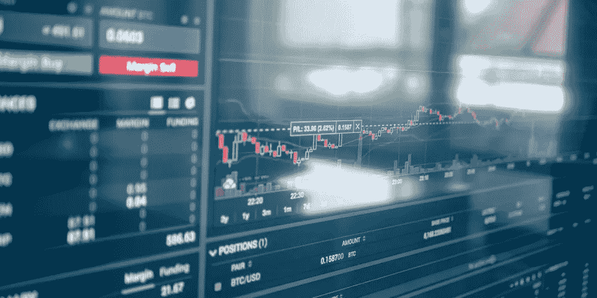

# 10 个健康的加密货币投资技巧:初学者指南

> 原文：<https://medium.com/coinmonks/10-healthy-cryptocurrency-investing-tips-beginners-guide-79131e6ae0f?source=collection_archive---------27----------------------->

加密货币是一种相对较新的投资类型，它们仍然有点令人困惑。但是有了正确的工具和知识，你就可以开始投资加密货币了。在你投资任何新形式的货币之前，一定要做适当的研究。这意味着研究每种加密货币的独特之处，以及它如何融入你的整体投资组合。

# 分散投资

当你投资加密货币时，分散投资非常重要。这意味着不要把你所有的钱都放在一个加密硬币里，你应该把风险分散到不同的硬币里。如果一枚硬币严重缩水，失去了大部分甚至全部价值，仍然可以选择另一枚硬币崛起，取代它成为新的“它”加密货币。

当根据加密货币在一段时间内的表现(而不仅仅是根据当前价格)选择购买和出售加密货币时，请确保每种货币都有良好的社区成员/用户和投资者记录，这两者都是选择加密货币应该成为任何投资组合的一部分的重要因素！

# 永远不要停止学习

了解最新的新闻很重要。如果你不熟悉加密货币投资，可能很难知道市场上正在发生什么，事情是如何变化的。保持消息灵通的最佳方式是阅读涉及加密货币的文章，但即使你没有时间阅读每一篇文章(甚至任何文章)，仍然有方法保持消息灵通:

定期订阅简讯或来自其他网站的涵盖加密主题的简讯；当他们发布新内容时，他们会发送一封电子邮件。如果他们不经常更新他们的网站，或者不擅长传播信息，那么考虑订阅，这样当他们更新的时候，你就可以进一步访问他们的内容了！

使用 Google Alerts——这在概念上类似于订阅，但不需要给他们钱/依赖广告商(只需要“相关”的)。无论你最感兴趣的话题是什么，只要在网上出现任何相关信息，你都会收到通知；不管它与今天我们周围发生的一切相比有多么微不足道！"

# 设定现实的目标

为你想投资的金额设定现实的目标是关键。不要把所有的钱都放在一种加密货币后面，甚至只是几种加密货币。你不想失去这一切，以防市场出现问题。

如果你决定投资多种加密货币，并且它们都同时达到峰值，那就太好了！但如果这种情况发生，也会导致一些用户陷入恐慌，因为他们担心自己的钱可能会在一夜之间化为乌有(这是有可能的)。最好不要孤注一掷；分散你的投资有助于防止这种情况发生，也有助于通过比特币基地或类似的交易所更轻松地管理不同的投资账户，用户可以在网上轻松地进行硬币交易。"

# 投资加密货币的同时如何保护自己？

投资加密货币时保护自己的最佳方式是使用硬件钱包。这是一个硬件，允许你在上面存储你的私钥，然后在用加密货币进行交易时使用这些密钥。硬件钱包可以用于任何加密货币，但如果你投资的是 Monero 或 Zcash 等增强隐私的硬币，这一点尤为重要。

同样重要的是要指出，并非所有的热门钱包都是生来平等的——有些钱包可能实际上不提供任何保护！你应该在使用热钱包做其他事情(比如转账)之前，先了解它的工作原理和安全性。

# 不要害怕问问题

有很多关于加密货币的信息，但很难筛选。你可能会感到不知所措，但不要因此而停止提问！你应该问自己以下问题:

*   我为什么要投资呢？我在这个公司或项目中看到了什么，让我想把钱投到那里？
*   当这种加密货币相关的业务或行业出现问题时，是否有任何警告信号？如果有，我们如何避免它们？

# 不要相信你听到或读到的一切

加密货币市场正在呈指数级增长，人们正在将资金投入这一新的资产类别。然而，有许多关于密码的神话和误解必须不惜一切代价避免。如果你想确保你的投资成功，这里有一些建议:

不要相信你听到或读到的一切！在处理任何新事物时，你都应该提出问题；不要害怕被嘲笑，如果它对我来说足够重要，我不仅想要，而且还期望从我的来源(和我)那里得到。问问这个人为什么对加密货币背后的技术评价这么高。

是什么让他们对其未来的潜力有把握？他们的观点和那些不同意他们的人有什么不同？通过问这类问题，我能够更好地了解双方，然后根据他们告诉我的内容做出决定，而不是根据我们周围发生的一切，别人可能认为最好的方式。"

# 永远不要投资超过你能承受的损失

投资加密货币有很多风险。你必须时刻意识到这些风险，但你永远不应该投资超过你能承受的损失。

发生这种情况有几种方式:

*   加密货币市场可能会下跌，几年甚至几十年都不会恢复。
*   *你的投资可能会因为一个意外事件(比如黑客攻击)而在一夜之间失去所有价值。*
*   *你可能会被在互联网上或在类似于 Bitconference 或 CoinFestival 的活动中出售假币的人诈骗*

# 只投资你愿意失去的东西

这是加密货币投资过程中至关重要的一步。你需要确定如果不成功，你愿意并且能够损失你的钱。如果你对此感到不舒服，那么你应该三思而后行，把钱投入加密货币。

你可能会担心尽快失去你的投资，但不要担心——一旦这种情况发生，你会感觉更好！一旦它真的发生了，除了我们对事情一次又一次出错的那一天的记忆之外，我们人类在地球上什么也没有留下。无悔最大的好处是它让我们拥有各种自由:免于恐惧；免受压力；无忧无虑；令人作呕的等等…

# 这些都是加密货币投资的好建议。

在投资加密货币时，你能做的最好的保护自己的事情就是关注新闻。如果一枚硬币或代币有好消息，它将反映在其价格上。这有助于防止你在机会出现时不注意而错失良机，也让投资者有机会做出明智的决定，他们希望他们的投资在未来能为他们带来什么。

分散投资不仅仅是分散投资于不同的硬币，还包括确保每一枚硬币都有独特之处(比如由现实世界的资产支持)。例如，如果一枚硬币是由房地产支持的，而另一枚根本没有任何支持，那么这两枚硬币都不可能超过它们目前的价值水平，因为它们都只依赖于作为货币的效用，而没有任何其他原因来解释为什么有人会把它们用作其他东西！

重要的是不仅要看历史图表，还要看技术分析图表，这些图表显示了具体因素的详细信息，如支撑位/阻力位等。以便我们确切地知道在这个过程中需要注意什么，而不是仅凭直觉盲目猜测。

# 关注新闻

如果你是加密货币的新手，了解最新动态的最佳方式是关注新闻。有很多网站报道加密新闻，Telegram、Twitter 和 YouTube 上也有一些很棒的团体。

# 结论| 10 个健康的加密货币投资技巧

我希望这些建议对你有所帮助。我知道当谈到加密货币投资时，很难做出决定，但我建议在进行任何投资之前花些时间做些研究。当您准备好了，请联系我们，我们将帮助指导您完成整个过程！

> 交易新手？试试[加密交易机器人](/coinmonks/crypto-trading-bot-c2ffce8acb2a)或者[复制交易](/coinmonks/top-10-crypto-copy-trading-platforms-for-beginners-d0c37c7d698c)