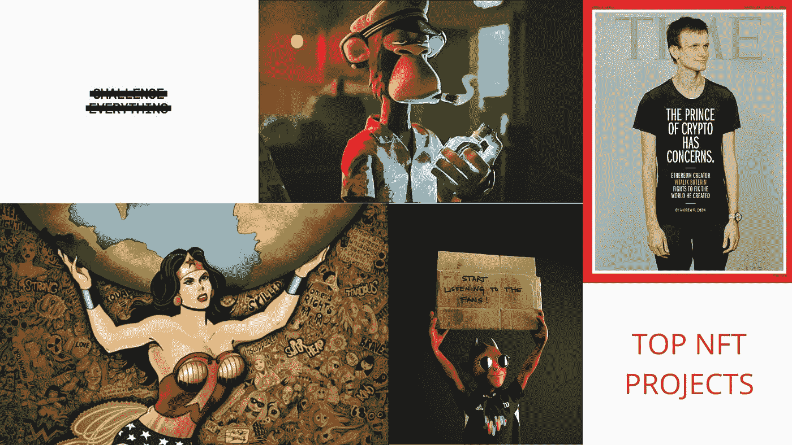
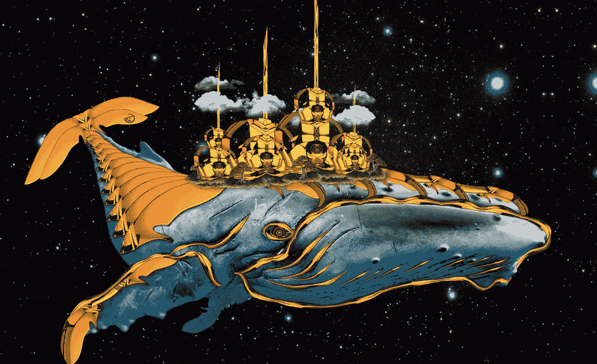
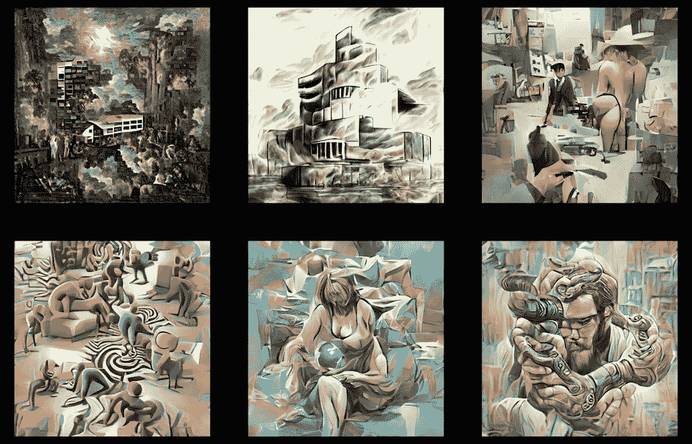
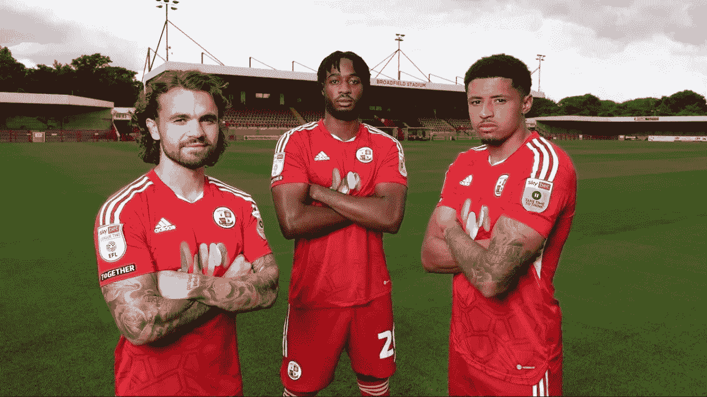
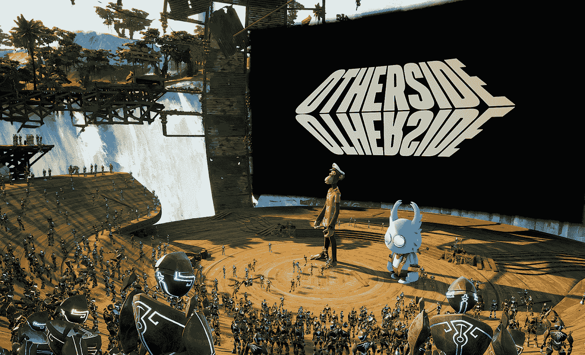
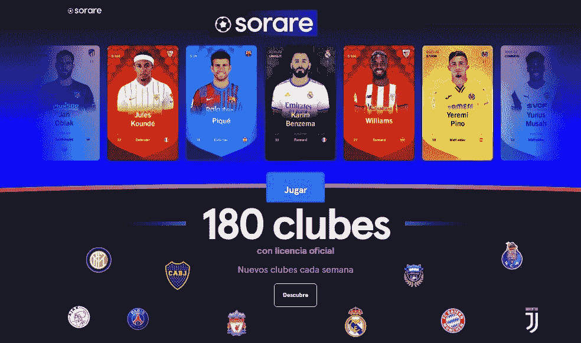
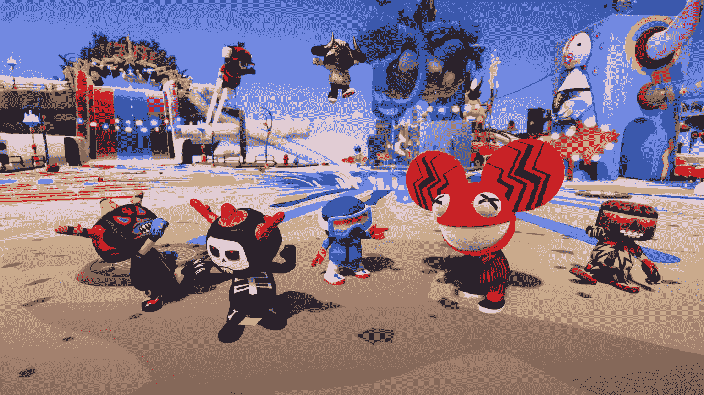
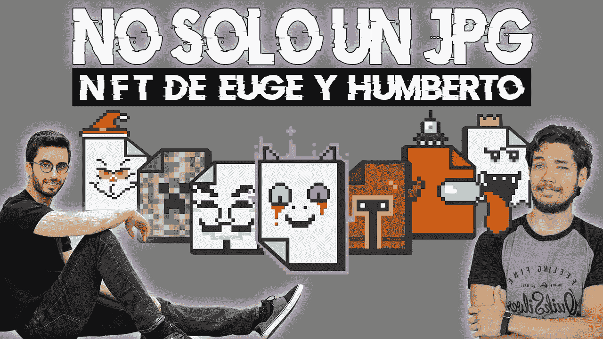
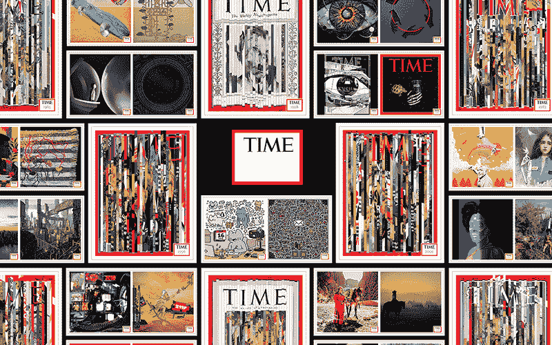
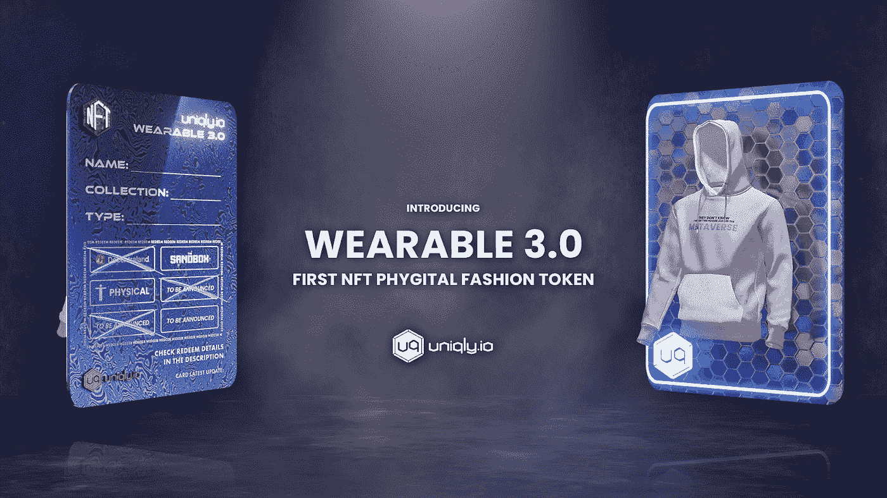

# 2023 年将跟进 10 个 NFT 项目

> 原文：<https://medium.com/coinmonks/10-nft-projects-to-follow-in-2023-f35ae145d7ac?source=collection_archive---------2----------------------->

## 艺术、数字服装、音乐、足球等等。

我们逐渐度过了否认阶段，在此期间，有些人甚至厌恶非功能性测试。

我觉得讨厌技术没有任何意义。

我理解你的第一反应，如果你了解到关于 NFTs 的第一个信息是一个名人花数百万欧元购买了一幅猴子画。WTF？

然后你开始怀疑这背后是不是真的有什么耐人寻味的东西。确实有。

由于 NFTs 只能有一个所有者，因此可以将艺术品、收藏品、产品甚至房地产等物品令牌化。通过在以太坊智能合约平台(基于区块链和大数据)下运营，有可能保证资产的真实性和非欺骗性。

今天，在 NFT 繁荣两年后，市场并没有经历它的最佳时刻，然而它继续增长，预计它在未来也会如此。记住，我们还早。

作为一名无银行道的撰稿人，我必须对那些为持有者提供新机会的创新项目进行大量研究，并重新发现网络互动的新方式。

下面我将简要介绍 10 个需要密切关注的 NFT 项目。

1.  鲸鱼成员
2.  博托
3.  和记联队
4.  他方金属
5.  无限物体
6.  索拉雷
7.  布兰科斯街区派对
8.  没有单独的 JPEG
9.  时间片段
10.  优衣库

# [鲸鱼成员](https://www.whale.me/)

该组织将自己描述为“数字原住民的全能会员俱乐部，专注于让鲸鱼会员沉浸在数字艺术和文化的重生中。”

WHALE 为新一代数字粉丝提供实物和元宇宙内容、信息和体验。它是在俱乐部的本地社交令牌 WHALE 上运行的，由一个公共金库支持，该金库存放数字音乐、游戏、艺术、摄影以及元宇宙资料。

该保险库仅由 WhaleShark 个人拥有并在发布时维护的 NFT 组成。他决定告诉邻居他的成功。

# [波托](https://www.botto.com/)

博托以“分散的自主艺术家”的身份，根据统治群体的反馈和观点创作艺术。Botto 是一个机器学习系统，以 NFTs 的形式制作艺术作品。

Botto 每周向公众展示 350 件艺术作品，然后由公众投票选出他们最喜欢的。总的来说，投票通知 Botto 的生成算法，它应该与即将到来的艺术作品系列的路线。

一旦公众做出决定，该商品就会在 SuperRare 上出售。所有拍卖收入都分配回社区，30%归国库，30%作为空投，20%归一个挖掘流动性的项目，20%归基础设施。

# [和记联队](https://wagmiunited.com/)

普雷斯顿·约翰逊(Preston Johnson)和埃本·史密斯(Eben Smith)创立了 WAGMI United，目标是重塑职业体育俱乐部的运作方式。他们通过建立由热情支持者组成的紧密团结的社区，并为他们提供所需的工具，让他们在团队的过去和现在都发挥积极作用。

2022 年 4 月，WAGMI United 成功完成了对英格兰足球联盟 Crawley Town Football Club (FC)乙级联赛的开创性收购，成为第一家收购重要职业足球队的 Web3 集团。

尽管他们很务实，也知道有许多变量会影响运动成绩，但他们的目标是让克劳利镇足球俱乐部进入英超联赛。然而，球迷们寻求改变，因为球队在旧的管理风格下苦苦挣扎。

# [彼岸 Meta](https://otherside.xyz/)

根据他们的文章，“Otherside 是一个构建世界的平台，提供了一个令人兴奋的环境来一起玩、创造、竞争、联系和探索。最初，用户将通过一个叙事游戏体验(也称为旅行者之旅)来体验另一个世界，这是由宇迦实验室和 probability 共同开发的，基于 M

对于这个演示，一个沉浸式的游戏空间是专门为它制作的。通过使用 Chrome 网络浏览器，成千上万的用户能够使用真实的语音聊天和人群友好的空间音频进行实时交流。顾名思义，这个演示旨在突出彼岸平台的技术实力。随着社区在创建 Otherside 的过程中提供建议和帮助，litepaper 的内容将随着时间的推移而发展和演变。

# [无限物体](https://infiniteobjects.com/)

无限对象是一个为区块链资产公司支持的数字内容生产有形收藏品的项目。产品研发机构 Planeta 和 GIPHY 在 2017 年合作创造了无限物体。

无限对象的主要目标是增加视频艺术的可收集性和可访问性。

# [Sorare](https://sorare.com/)

Sorare 是一款使用数字卡的梦幻体育游戏，玩家可以购买、交易和使用该游戏。每张卡代表一个团队或联盟的授权数字可收集证书。

您可以在 Sorare 中创建阵容、设计套牌和玩竞技游戏。

Sorare 及其 NFT 交易卡系统使用基于以太坊的区块链技术，并得到视频游戏公司育碧的支持。

在与皇家马德里和巴塞罗那达成协议之前，他们开始与足球组织结盟。他们在今年三月与 MLB 签订了合同。他们与 NBA 的联系是他们最近主要声明的焦点。

# [布兰科斯街区派对](https://blankos.com/)

Blankos Block Party (BBP)是一款免费游戏(F2P)，开放世界，多人游戏，集成了区块链技术，基于 Eosio 构建，允许玩家拥有自己的 Blankos。Blankos 是你用来参加街区聚会的数字玩具。每个布兰科都是 NFT。

游戏中的许多迷你游戏让布兰科斯互相争斗。与 BBP，你可以设计自己的机器人风格的环境，并享受替罪羊类型的游戏。此外，你可以玩类似堡垒之夜皇家战役模式的游戏。您可以创建自己的关卡，收集可识别的空白，并与 BBP 的朋友交流。

这款游戏是由总部位于洛杉矶的区块链视频游戏开发公司“神话游戏”开发的。

# [没有单人联合国 JPEG](https://nosolounjpg.com/)

没有独奏联合国 JPG (NSUJPG)是第一个西班牙语教育和公用事业 NFT 项目。第一代包括 2，514 个手动创建的令牌，每个令牌都有独特的属性、元素、类和实用程序。

NSUJPG 系列拥有各种元素，包括人工制品、物品、流行文化典故和秘密属性，这些元素增加了该系列的稀有性，超越了每个令牌的卓越特性。

NSUJPG 的目标是向讲西班牙语的人介绍 NFT 技术。创始人决定用母语推出整个系列、他们的播客和他们的 YouTube 频道，因为他们认为这对教育过程至关重要，还因为西班牙语是世界上第二大口语。

为了 NFT 工业的持续发展，这种社区教育项目是必不可少的。它不会被要求解释如何创建一个加密货币钱包或如何在几年后创建您的第一个 NFT，但就目前而言，它绝对是至关重要的，值得赞赏。

# [时间片](https://time.com/collection/timepieces-nft/)

这家知名杂志决定在 2021 年 3 月发布前三期 NFT:一系列三个独特的、非常有远见的时代封面，包括有史以来第一个专门作为 NFT 创作的封面，“菲亚特死了吗？”

他们历史上一些最知名的封面为这些 NFT 提供了灵感。一个题为“上帝死了吗？”出版于 1966 年。他们出版了《真理死了吗？2017 年回应唐纳德·特朗普，五十多年后。时代杂志刚刚发布了一个有争议的问题的新封面。

为了在 2023 年《时代》杂志 100 周年之前获得无限的访问权，钟表的所有者将能够把他们的数字钱包链接到该网站。NFTs 提供的其他一些优势包括现场活动的独家邀请和独特的在线体验。

# [优衣库](https://www.uniqly.io/)

优衣库的创始人克里斯托弗·佩德克(Christopher Perdek)表示，该平台允许用户生产和交易可穿戴设备 3.0 代币，这些代币可用于在不同地点使用一台 NFT 购物。

可穿戴设备 3.0，也称为物理时尚令牌，是一种非功能性技术，可以在众多 metaverses 和 AR 应用程序中提供对有形物体和数字可穿戴设备的访问。你将能够在现实生活中穿着你的可穿戴设备，以及在 AR 平台和 metaverses 如分散土地和沙盒中穿着。

例如，独特地与 NFT 项目合作，如 Metakey、Cyberkongz 和 Supducks。这些系列的所有者有资格在多个元数据中使用可穿戴的 3.0。对于较小的项目、企业和艺术家，优衣库还提供了一项服务，允许你在与他们的员工进行初步接触后，与他们合作创作和推出你的系列。

## 最后的想法

例如，由于 3D 打印机提供的新地平线，数字世界的到来极大地拓展了艺术家在平面设计、插图甚至雕塑领域的可能性。

数字艺术家现在非常需要完成网站设计项目，创建视频图形，或者只是创建一个新的企业形象。

在数字艺术家越来越多的环境下，NFT 介入为在线艺术产业提供了新的动力。

虽然商业或数字项目的委托艺术品可能与工艺作品更密切相关，但 NFTs 将艺术品作为收藏家的物品重新收集起来，并将其转移到数字环境中，由于区块链，这使得独一无二、不可复制的作品得以分发。

许多 NFT 项目可能在几年后就不存在了，但仍会有其他类似上面提到的项目继续引发讨论。

如果你喜欢这篇文章，你可以做以下三件事来支持我的工作:

*   为这个故事鼓掌👏
*   订阅我接下来的故事。
*   在[推特](https://twitter.com/kafcrypto)上关注我

*作者传记*

我是 KAF，一个自由撰稿人兼网络顾问，帮助人们走近、道、德菲和。在 kafcrypto@gmail.com 雇佣我

> 交易新手？试试[密码交易机器人](/coinmonks/crypto-trading-bot-c2ffce8acb2a)或者[复制交易](/coinmonks/top-10-crypto-copy-trading-platforms-for-beginners-d0c37c7d698c)