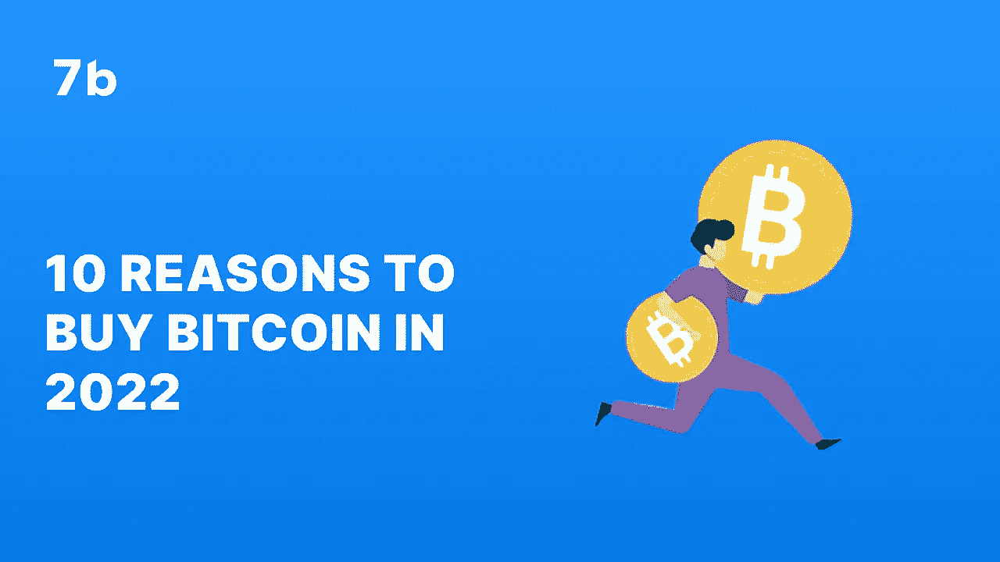
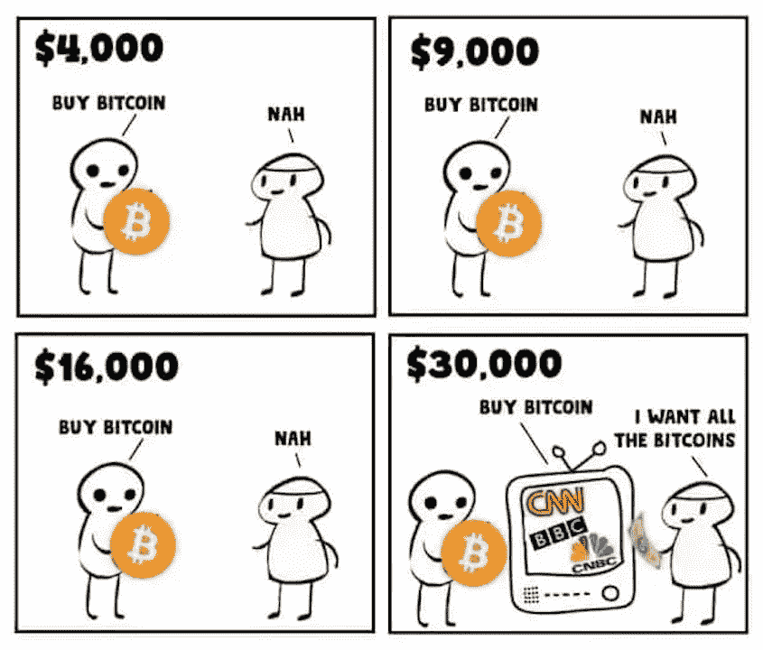

# 2022 年购买比特币的 10 个理由

> 原文：<https://medium.com/coinmonks/10-reasons-to-buy-bitcoin-in-2022-5286571a2fb1?source=collection_archive---------58----------------------->

# 比特币于 2009 年 1 月推出，是第一种进入市场的加密货币。

在流通了大约 8 年后，该硬币在 2017 年迎来了第一次大繁荣。从那以后， [BTC](http://sevenb.io/currencies/bitcoin?utm_source=medium&utm_medium=article) 以指数级的速度飞速增长，目前是世界上最有价值的加密货币。虽然[比特币](http://sevenb.io/currencies/bitcoin?utm_source=medium&utm_medium=article)同样经历了几个季度的价格波动，但这种货币作为出色的价值储存手段的声誉依然存在。

值得注意的是，作为一项长期投资，比特币显示出令人难以置信的前景，因为其价值通常预计会随着时间的推移而增加。随着世界继续意识到法定货币替代品的概念，更多的企业和品牌开始采用加密货币作为支付形式。随着比特币轻松成为现有最受欢迎的加密货币，如果世界变得更加分散，它可能会成为数字支付的一种形式。比特币实际上也不受通货膨胀的影响。事实上，随着比特币的整体回报继续减半，加上其 2100 万枚硬币的固定供应量，通货膨胀导致的贬值几乎是不可能的。

在这篇文章中，我们将找出 BTC 是否仍然是一个好的投资，列出 2022 年 T4 购买比特币的 10 个理由。

[Download 7b](https://play.google.com/store/apps/details?id=io.sevenb.terminal)

# 2022 年比特币的历史

尽管比特币有很多优点，但它在今年的加密寒冬中受到了重创。2021 年 11 月达到的接近 70，000 美元的价格高点在 2021 年第一季度完全消失，因为硬币跌至 35，000 美元以下。硬币的价格继续下跌，7 月中旬交易价格略低于 20，000 美元。然而，比特币已经开始显示出一些复苏的迹象，到 8 月底已经飙升至 24，000 美元。

比特币目前的交易价格略高于 24700 美元，仍低于 2021 年的高点。但根据比特币的通缩模型，可以相当肯定的是，比特币将不止一次超过 ATH，而是在未来几年甚至几十年内多次超过。

这是因为尽管比特币易受波动性的影响，但如果你想把钱投资于一项长期增长的有价值资产，它仍然是一个可靠的投资选择。如果你想知道如何交易 BTC，看看我们的[博客。](https://sevenb.io/blog/how-to-trade-bitcoin/)

作为这一事实的证明，以下是 2022 年投资比特币的十大理由。

**1。比特币是一种新的资产类别**

纵观历史，资产类别一直是投资者用来保护和增加收益的金融工具。传统的资产类别包括股票、债券，以及很常见的房地产。自比特币进入市场以来，投资者开始认识到加密货币是一种潜在的有价值的投资工具。幸运的是， [7B](https://play.google.com/store/apps/details?id=io.sevenb.terminal) 拥有广泛的交易工具，一定会让你的投资体验变得轻松而有利可图。

**2。比特币完全去中心化**

比特币没有发行，并且仍然完全不受任何政府机构的监管。虽然这恰好引起了一些政府和投资者的担忧，但比特币的这一特性证明了它作为未来货币的声誉。关于比特币的决定和修改由持有人的社区协议一致决定。这通常被称为分散自治组织(DAO)。这一特点也有助于资助反对压迫性政府的示威游行。

**3。比特币不易受到通货膨胀的影响**

比特币的运行完全独立于传统市场，因此当价格波动和经济下行冲击传统市场时，比特币的价格不会受到影响。此外，比特币的最大供应量被限制在 2100 万单位，这一固定数量使得通货膨胀几乎不可能发生。

**4。比特币是一种巨大的价值储存手段**

比特币是一种极好的价值储存手段。在阿根廷和其他遭受恶性通货膨胀蹂躏的拉美国家，比特币仍然是公民保护自己的钱和对冲通货膨胀危机的一种途径。

**5。比特币安全有保障**

比特币运行在区块链技术上。简而言之，这意味着用比特币进行的每一笔交易都被记录在一个公开的分布式账本上:每个人都可以看到它，没有人可以改变它。这使得它几乎不可能复制或伪造，不像法定货币。因此，比特币比法定货币安全得多。

**6。加密货币产业正在蓬勃发展**

目前，加密货币行业正在快速增长，并且没有放缓的迹象。从汽车制造商到奢侈品牌，再到整个国家，全世界的行业都在加入加密的行列。因此，涉足加密货币投资领域可能会非常有利可图。随着世界向 Web3 和元宇宙集成倾斜，加密货币行业预计在未来几年仍将进一步增长。

**7。比特币提供了更高效的金融支付系统**

比特币提供了一种比传统方式更高效的交易方式。随着比特币闪电网络的实施，交易可以在瞬间发起并完成，从世界任何地方，没有跨境限制。

**8。比特币提供了更大的金融自由**

比特币被称为货币的未来是有充分理由的。由于它不受中央集权机构的控制，它真正地将权力交还给了人民。自其诞生以来，越来越多的人有理由探究和质疑传统金融体系的运行方式，发现其缺陷，并寻求替代解决方案。

**9。比特币是数字的**

比特币是一种虚拟货币。因此，它非常便于保存和使用。任何数量的比特币都可以存储在一个数字钱包中，转移到另一个钱包，或者用于交易，几乎没有任何限制。

**10。未来的钱**

随着世界不可避免地向虚拟和去中心化基础设施转型，比特币仍然处于这一趋势的前沿，为交易提供便利。随着非金融交易的增加，以及关于元宇宙推出的更多讨论，在一个去中心化的世界里，个人转向去中心化的支付解决方案似乎是很自然的。

比特币拥有巨大的未来前景。如果你想投资比特币来增加收入，那么 [7B](http://sevenb.io/?utm_source=medium&utm_medium=article) 是你值得信赖的交易工具。凭借我们广泛的交易工具、快速的交易时间和低廉的费用，您一定会发现与我们进行交易是一个舒适而轻松的过程。

*原载于 2022 年 8 月 22 日*[*https://seven b . io*](https://sevenb.io/blog/10-reasons-to-buy-bitcoin-in-2022/)*。*

> 交易新手？尝试[加密交易机器人](/coinmonks/crypto-trading-bot-c2ffce8acb2a)或[复制交易](/coinmonks/top-10-crypto-copy-trading-platforms-for-beginners-d0c37c7d698c)