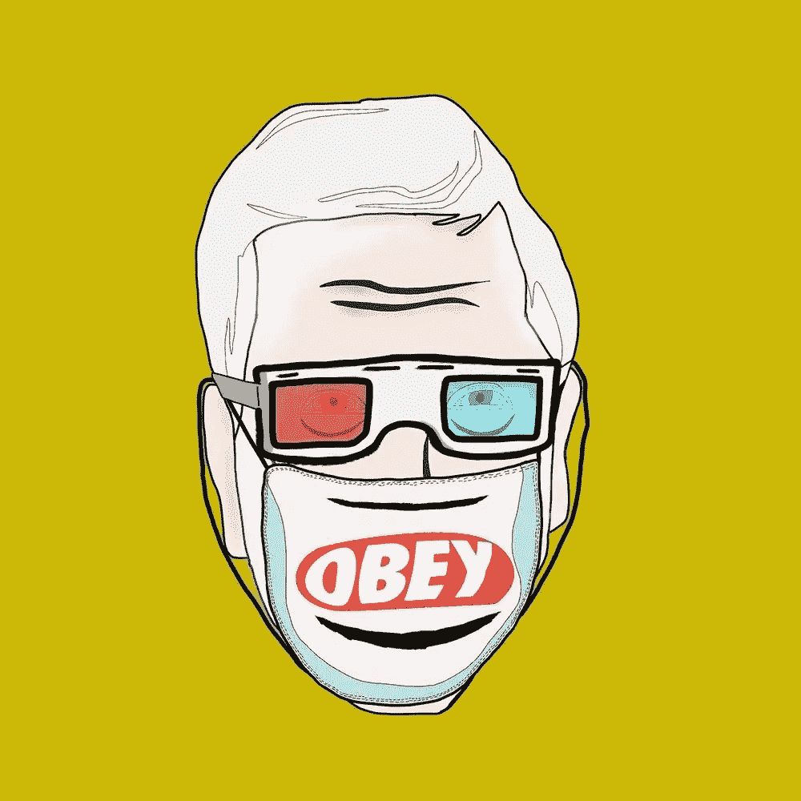
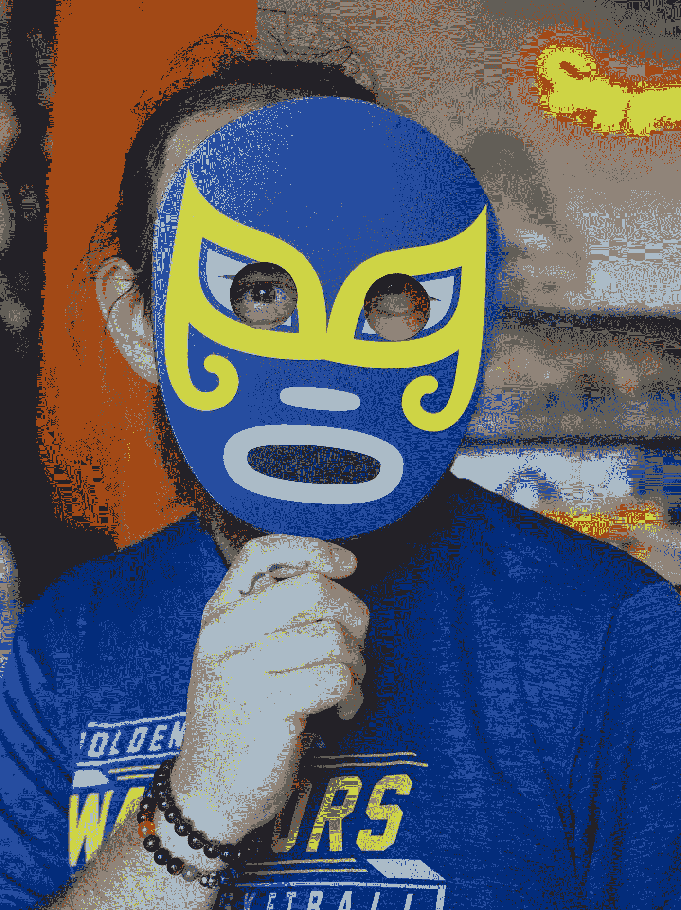

# 你的 NFT 卖不出去的 10 个原因🎨

> 原文：<https://medium.com/coinmonks/10-reasons-why-your-nfts-aren-t-selling-2f5acdd7cd70?source=collection_archive---------2----------------------->

我们都是从启动一个 NFT 项目开始的，希望能卖出价值数千甚至数百万美元的 JPEGS 图像…

在发布日，经过几个月的准备，我们终于有了我们的发布，却发现只有 23 个人从你的收藏中铸造了一个 NFT…

不是你想要的目标…

在这篇简短的博文中，我们将讨论你的 NFT 项目没有卖出更多 NFT 的 10 个最常见的原因。

______________________________________

## 1.你没有观众

当你只有 230 个 Discord 成员和 400 个 Twitter 追随者时，你不能指望卖出 1000 个 NFT……你需要用真正的追随者来发展你的社区，那些关心你在做什么的人，而不是简单的付费机器人。

> 请看这篇关于如何建立社区的博文:
> [https://medium . com/coin monks/top-5-NFT-best-practices-marketing-and-community-growth-7025 e 26 EB 50 c](/coinmonks/top-5-nft-best-practices-marketing-and-community-growth-7025e26eb50c)

## 2.归咎于熊市

自从近一年前熊市开始以来，所有社交网站中的 web3/crypto/NFT 社区已经逐渐消失了…这意味着他们只是不再像以前那样频繁地使用社交媒体，可能会专注于更多的 IRL 内容，或者只是不再像以前那样随意消费…

你对此无能为力…

## 3.平庸的艺术

当然，我见过许多 NFT 项目的蹩脚艺术品销售一空，在一天结束的时候，艺术真的没有太大的关系…但是，我可以说的一点是，好的艺术会吸引更多的注意力，它会吸引更多的人群…你对你的项目越关注，你的潜在客户就越多。

## 4.没有炒作

尽管我们不愿意承认，NFT 空间仍然非常注重炒作。

> “炒作”——名词
> 
> 过度的宣传和随之而来的骚动。
> 
> 特别是在广告或促销材料中夸大或夸大的说法。
> 
> 广告或促销策略。

那么如何打造炒作呢？让人们兴奋起来，或者对即将到来的事情感到兴奋。拍摄…让他们对即将到来的一切感到兴奋…新的关注者数量，新的赠品，新的白名单现场公告，新的团队成员雇佣，新的艺术作品，NFT 发布…也给那些参与炒作的人奖励。

## 5.你没有为什么

你最初为什么要创建你的 NFT 项目？？？如果你只是想从中赚钱，这不再是一个足够好的理由 not 投资者(他们中的大多数)现在足够聪明，不会简单地投资那些看起来粗略的项目，就像他们在一年或一年半前会做的那样…

每个项目现在都需要一个为什么…我们代表什么，我们如何解决问题，我们如何把人们聚集在一起，为什么有人会买我们的项目而不是另一个项目？

## 6.钱用完了

拥有充足的启动资金对于 NFT 的成功启动至关重要。当然，你可以启动你的项目，大概赚几千，但是如果没有像样的营销预算，你将很难卖出一个 10k NFT 系列。

我参与了一个项目，该项目在营销上花费了 25 万多英镑，但在造币日，他们的 NFT 系列仍未售出 25%。

让你的项目出现在有可能购买你的 NFT 的人们眼前对销售来说至关重要……一旦你吸引了他们的注意力，你需要从心理上说服他们，他们需要你的 NFT。

## 7.缺乏一致性

如果你(或一些创始团队成员)每天都不积极，你将很难从你的社区中获得信任……尤其是在 NFT 项目刚开始的时候。

你应该努力每天在你选择的平台(Discord/Twitter/抖音)上发表文章。)

没有人说启动一个成功的 NFT 项目是容易的，因为它不是…它可以，而且很可能会耗尽你的数字耐力。保证充足的睡眠，多喝水，做伸展运动，尝试健康饮食。

> 发展你的社区的技巧:
> [https://medium . com/coin monks/tips-for-growing-your-NFT-crypto-community-563 c 7481d 796](/coinmonks/tips-for-growing-your-nft-crypto-community-563c7481d796)

## 8.没有效用

即使你可以找到一些没有成功的公用事业的 NFT 项目，这是非常罕见的，这些项目往往会很快淡出。

你应该努力给你的持有者尽可能多的价值。赌注选项、IRL 奖励、聚会、独家赠品、抽奖等等……这些都可以是 NFT 项目的额外津贴/效用

## 9.有缺陷的团队

如果你有一个团队，要快速招聘和解雇。一个违背你的项目文化的团队成员是不好的。一个团队成员在礼貌地纠正他/她很多次后，仍然不能完成任务，这是不好的。一个不断需要指导的团队成员是可以的，但更喜欢有经验的团队成员，不需要在每个角落都有人管着他/她。

确保你的团队成员也值得信任，因为最糟糕的事情就是你的团队成员中有一个是骗子…

## 10.没有远见

你认为你的项目在 1 年、3 年、5 年、10 年后会怎样？你希望你的项目因什么而出名，因什么而被认可？

作为领导者，你的任务是描绘出(通常以故事的形式)你的社区将走向何方，以及你将如何到达那里。包括旅途中的短暂停留和大肆宣传。了解你的社区成员。随着时间的推移，不断发展信任。每天都出现。

引导他们通过 NFT/加密世界的开放海洋。

________________________________________

_ _ _ _ _ _ _ _ _ _ _ _ _ _ _ _ _ _ _ _ _ _ _ _ _ _ _ _ _ _
_ _ _ _ _ _ _ _ _ _ _ _ _ _ _ _ _ _ _ _ _ _ _ _ _ _ _ _

**永远小心！！！⚠️**

我怎么强调都不为过！保持高度警惕，留意你点击的每一个链接、你做的每一笔交易和你接触的每一个人，因为这个领域骗子很多，即使是最好看的项目也会被撤下。

*在点击所有链接之前，反复检查，确保它们是你要找的官方链接。此外，在给自己或他人发送任何有价值的东西之前，要再三检查所有的钱包地址。*

关注我的新营销代理公司**多层次营销**，获取更多未来几年的营销技巧/建议！

> [*推特*](https://www.twitter.com/metadadsxyz)[*不和*](https://discord.gg/mchzhDCwhF)[*YouTube*](https://www.youtube.com/channel/UC7pbtSBs9nRJHK6coMhCR8g)[*抖音*](https://www.tiktok.com/@thedudescrypto)[*insta gram*](https://www.instagram.com/metadadsxyz)[*Spotify 播客*](https://open.spotify.com/episode/5U8vXE9HDAsGbSbebw9p62?si=2rZIigw-Tw2pCxjxmkbYzQ)
> 
> 请通过发送 Polygon Matic 到这个 Eth 地址或 Eth Tokens 来支持我和我不断增长的家庭🙏🏼
> 
> ***0xb 53 b 3978333 e 11 c 382 ab 619 f 02 f 469 A8 c 70750 af***
> 
> ***或***
> 
> 从我们的 OpenSea 购买 NFT(报价)更多信息请访问 11 月[https://opensea.io/collection/plusone-v2](https://opensea.io/collection/plusone-v2)

_________________________________________________________________

# 干杯，
Ty

**我的一些其他博文:**
[5 个没落的 Web3](/coinmonks/5-downfalls-of-web3-cd5dc8ade4fd)
[5 + 5 个不和谐的战术](/coinmonks/5-tips-for-a-better-discord-nft-crypto-edition-ff9b039d0359)
[Crypto 101:一个初学者指南](/coinmonks/crypto-101-a-beginners-guide-345d440bd163)
[NFT 最佳实践(营销&社区成长)](/coinmonks/top-5-nft-best-practices-marketing-and-community-growth-7025e26eb50c)
[Web3 基础知识](/coinmonks/web3-basics-252121357f33)
[替代效用案例对于 NFT 的](/coinmonks/alternative-nft-crypto-real-life-use-cases-b7c0b08d99ef)
[什么是营销&为什么](/coinmonks/what-is-marketing-why-everyone-should-be-a-marketer-6173b8dffd61)

> 交易新手？尝试[加密交易机器人](/coinmonks/crypto-trading-bot-c2ffce8acb2a)或[复制交易](/coinmonks/top-10-crypto-copy-trading-platforms-for-beginners-d0c37c7d698c)