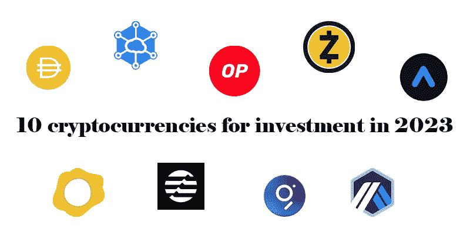
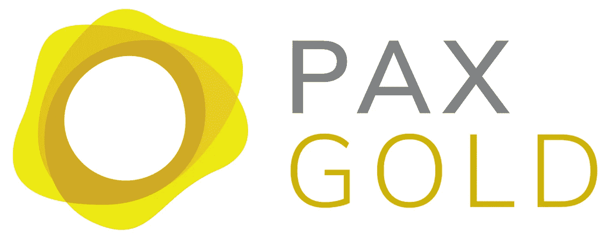
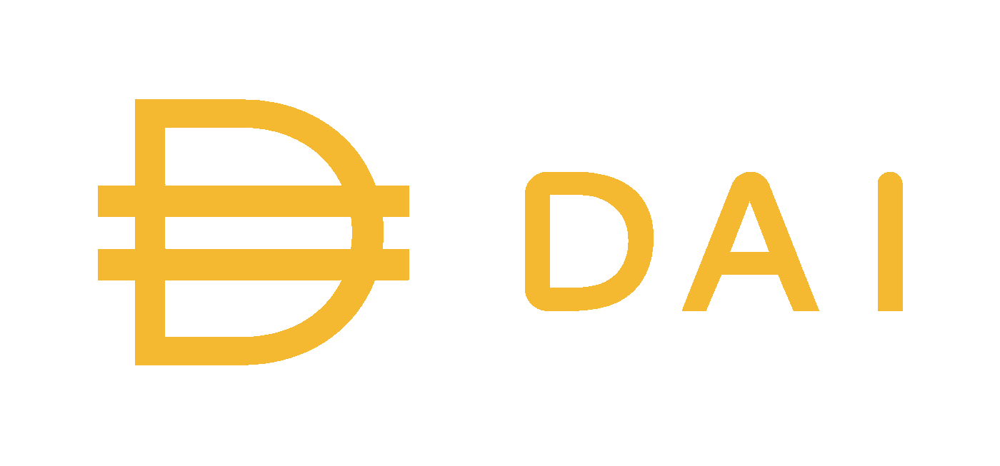
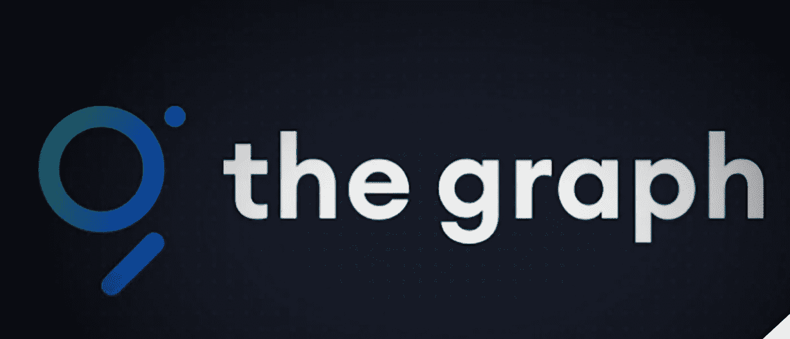
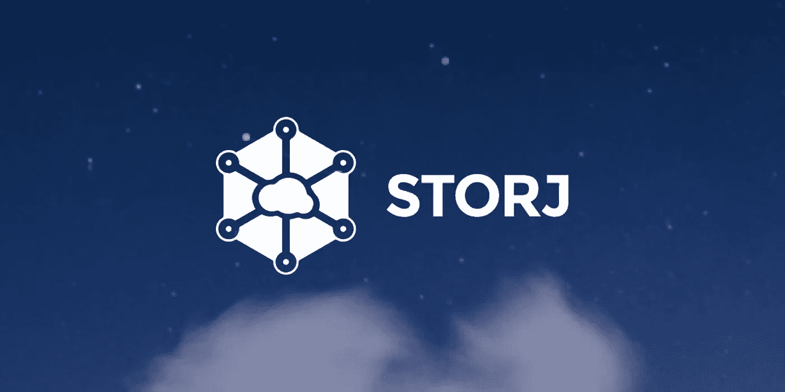
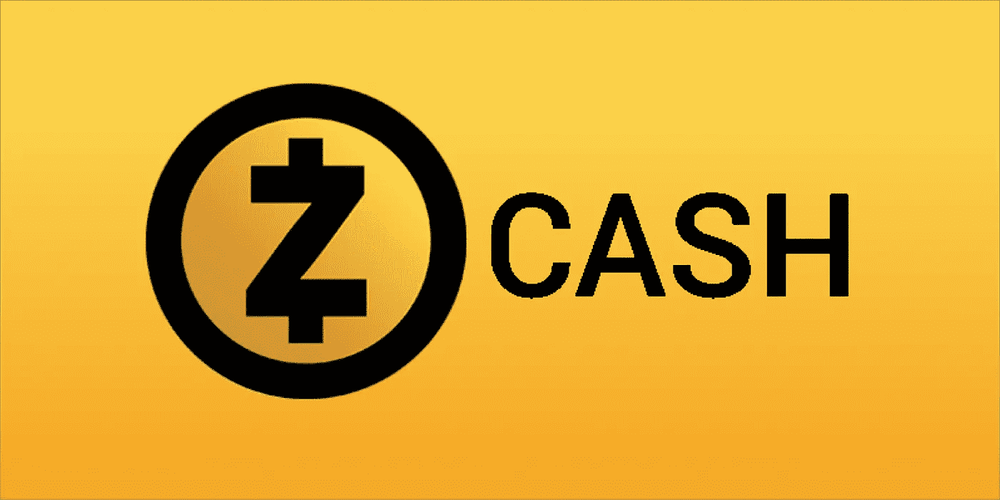
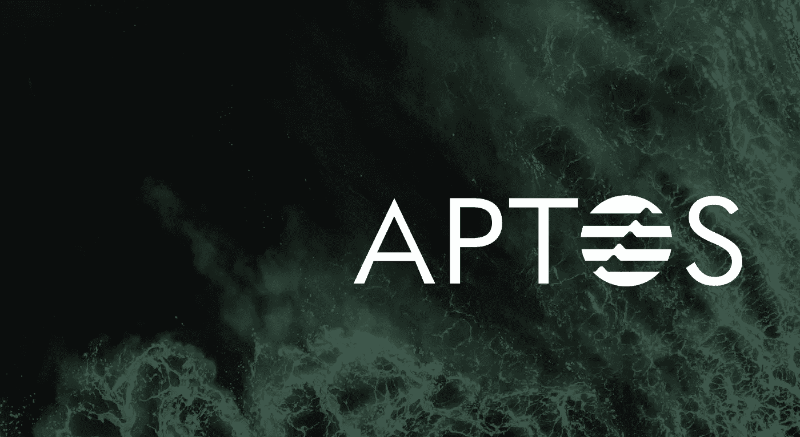
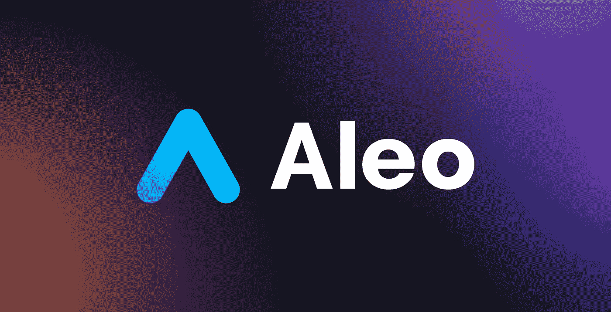
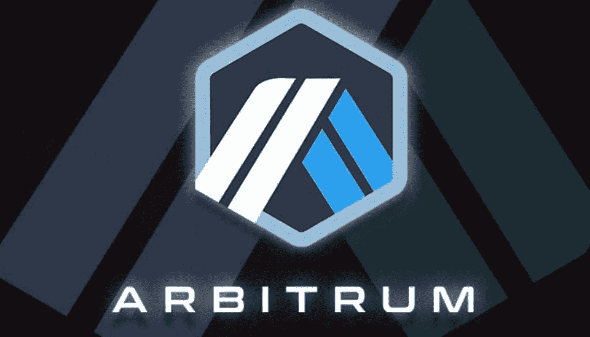

# 2023 年适合投资的 10 种加密货币

> 原文：<https://medium.com/coinmonks/10-suitable-cryptocurrencies-for-investment-in-2023-7fda0fdbe783?source=collection_archive---------5----------------------->

在这篇文章中，我们从专家的角度来看看 2023 年适合投资的 10 种乐观的加密货币。

预测显示，2023 年的情况可能比今年更糟，我们将看到加密货币世界的停滞和崩溃继续下去。所以，在你的投资中，要花适当的时间来分析市场形势。正确的进场和出场时间对你的投资回报起着决定性的作用。此外，项目的条件会随着时间的推移而变化，这一点您应该在进入之前进行检查；例如，团队成员、目标或项目路线图的变化会影响其风险和未来前景。

1.PAX 帕克斯金

我们使用的第一种加密货币是风险最小的货币之一，由黄金支持。PAXG 由 Paxus 公司提供，根据伦敦商品交割金条标准，每个代币代表一盎司黄金。支持这种代币的金条存放在官方认可的仓库里。

考虑到目前加密货币市场的停滞、当前国家之间的关系和战争，以及黄金盎司的技术状况，Pax Gold 可能是明年最安全的投资加密货币。这种加密货币可以从币安、库币、北海巨妖、双子星等处购买。交流。

2.奶妈

加密货币市场不好的时候，比特币和以太坊已经不能算低风险了。在这种情况下，稳定的货币被认为是低风险的加密货币，在熊市中，最好让你的投资组合中有很大一部分是稳定的加密货币。我们必须有足够的稳定收入，才能在适当的时候进入市场。

如果我们打算长期持有一种稳定的货币，我们应该对它的安全性感到放心。具有集中稳定性的加密货币(如 Tether 或)总是有风险，因此选择分散稳定的货币是有意义的，戴是其中最安全的。

3.图表(GRT)

随着区块链的发展和该技术使用的增加，在不同网络上生成的数据量急剧增加，存储和访问这些数据成为一项挑战。图形网络是不同区块链和 Dapps 之间的中间层，它组织智能合同数据并用于搜索区块链和存储网络上的信息。该协议减少了数据存储所需的空间，并导致高效和可靠的数据的创建。

Graph 在以太坊上开始了它的工作，然后是它的兼容网络，然后它已经集成到其他网络中，如 Near，Polkadot 和 Cosmos。GRT 是图形生态系统的核心，费用和奖励也随之支付；例如，开发人员必须以 GRT 令牌的形式支付费用才能使用图形服务。此外，网络中的参与者必须持有这种加密货币。因此，如果更多的项目使用图形服务，GRT 的需求和价值的增长就离预期不远了。

4.斯托尔杰

Storj 提供基于区块链的云数据存储。例如，传统的云存储提供商有数据中心。但是 Storj 允许任何人与网络共享他们的硬盘空间，并创建一个存储节点。

这意味着任何拥有符合 Storj 要求的硬盘的人都可以将存储空间借给其他人。Storj 已采取措施确保委托给用户的数据的安全性。例如，Storj 在用户上传文件之前对其进行“加密”。

> 交易新手？在[最佳密码交易所](/coinmonks/crypto-exchange-dd2f9d6f3769)上尝试[密码交易机器人](/coinmonks/crypto-trading-bot-c2ffce8acb2a)或[复制交易](/coinmonks/top-10-crypto-copy-trading-platforms-for-beginners-d0c37c7d698c)

Storj 向用户奖励 STORJ 令牌，以换取他们向网络提供的存储空间。随着对云存储需求的不断增长，Storj 提供了一种能够改变这一领域的高质量、高效的产品。

5.兹卡什(ZEC)

ZCash 是一个加密货币项目，以其私密性而闻名。该项目的技术使得在交易中隐藏发送者、接收者和转账金额的信息成为可能。换句话说，它促进了不可追踪和匿名的交易。ZCash 和类似项目的区别在于，你可以选择交易是否隐藏。用户还可以指定应该隐藏交易的哪一部分。

ZCash 投资者可以放心地进行购买或捐赠，并选择交易是透明的还是保密的(隐藏的)。这一特性使得 ZCash 的用例变得清晰，并使其成为具有较高上升潜力的数字货币之一。

6.阿罗约

在一个数据非常宝贵的世界里，最基本的需求之一就是讨论存储空间。谷歌、亚马逊或微软等大型科技巨头向用户提供集中式存储空间，我们意识到了其作为集中式系统的缺点，但 Filecoin、Arroyo、Storge 等几个区块链项目。寻求提供分散存储服务。。虽然 Filecoin 更为人所知，但我在本文列表中选择的加密货币是 Arweave。

阿罗约有一个重要的特点；你只需支付一次费用，你的数据就会永远保存在 Arvio 中。对于那些项目、区块链网络和需要永久或长期存储数据的用户来说，Arroyo 是正确的选择。值得注意的是，Solana、Avalanche、Polkadot、Cosmos 和 Nair 是将与 Arroyo 合作存储的主要区块链网络。

7.乐观主义

乐观是今年推出令牌的首批以太坊第二层解决方案之一。顾名思义，这个项目使用了乐观的方法，其结果是大大减少了事务的处理时间。所有在以太坊网络平台上创建的平台都可以很容易地在乐观的平台上形成。

OP 加密货币是乐观主义者提出的治理令牌，将引领网络走向去中心化。这种代币的总供应量约为 43 亿，年增长率为 2%。2023 年，这个项目计划推出使用分片技术的卷装。乐观主义有像 Paradigm，Andreessen Horowitz 和 Lastseen Ventures 这样的主要投资者。

8.Aptos

Aptos 是由脸书区块链项目团队创建的安全、可扩展和可伸缩的基础设施区块链。这个区块链的工作始于三年前，大约有 120 名开发人员参与其中。

该项目已经能够在共识、智能合约、安全性、性能和分散化方面进行创新，如果您有兴趣了解更多信息，请参考本节末尾的介绍文章。这个项目用的编程语言是 Move，是他们自己团队开发的。Optus 网络每秒可处理高达 160，000 笔交易。

主要的 Aptos 网络计划于今年秋季推出，并且刚刚推出。值得注意的是，当 Aptos 主网络还没有启动时，已经有几个项目在其上创建，并准备启动它们的平台。关于 APT Tokenomics，我们还应该提到，其最初的总供应量为 10 亿，在编辑本文时，有 1.3 亿枚 APT 硬币在流通。

在过去的几个月里，这个项目分三个阶段成功吸引了 4 亿美元的资本，Andreessen Horowitz、Paxos、Multicoin Capital、Circle Ventures 和 PayPal Ventures 等知名公司都是其投资者。币安实验室最近也增加了对 Aptos 的投资。还有一个关于 Aptos 投资者的负面观点；FTX 和阿拉米达就在其中。总的来说，我们必须等待 Aptos 在未来几个月的表现。如果一切顺利，Aptos 可能是 2023 年投资的最佳加密货币之一。

9.阿莱奥

Aleo 是一个允许创建完全私有的应用程序的平台。为此，Aleo 使用分散系统和零知识证明加密算法。为了便于在 Leo 中开发私有应用程序，他们开发了一种叫做 Leo 的编程语言。

隐私问题的重要性以及监管辩论可能使 Elo 成为一个重要的网络。该网络还成功吸引了软银、Kora Management、Andreessen Horowitz、Tiger Global、Samsung Ventures 等著名公司的约 2.98 亿美元。

10.任意性

Arbitrum 是另一个以太坊第 2 层解决方案，也是一个乐观的汇总。Arbitrum 被认为是提高以太网当前可扩展性的最成功的解决方案。这个项目是由 Offchain Labs 创建的，其创始人是三名普林斯顿大学计算机科学教授和博士生。

这家公司已经成功吸引了三轮约 1.2 亿美元的资本，在最后一轮，其价值估计为 12 亿美元。Arbitrum 刚刚更新了 Nitro。Arbitrum 生态系统是第二层中最大的生态系统之一，其上部署了 300 多个分散式应用。

注意，这个项目的令牌还没有启动，需要把这个项目放在显微镜下仔细观察，在它完全启动并检查其性能之前，不可能对它的历史给出明确的意见。就目前而言，证据表明它可以制造很多噪音，并成为有前途的加密货币之一。

