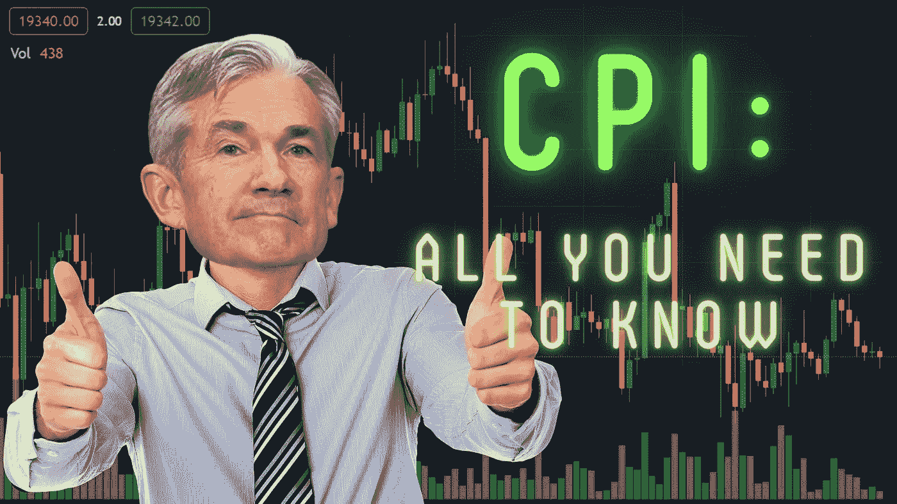

# 关于 CPI，每位加密货币投资者都需要了解 10 件事

> 原文：<https://medium.com/coinmonks/10-things-every-crypto-investor-needs-to-know-about-the-cpi-70f9adf10fa4?source=collection_archive---------5----------------------->

CPI 数据对美联储的货币政策有很大的影响，而后者又对比特币的价格有很大的影响。以下是你需要知道的一切。

## **1。何谓消费物价指数？**

CPI，即消费者价格指数，衡量消费者支付的价格的每月变化。它在世界范围内被用来衡量通货膨胀和通货紧缩。每个国家都有…