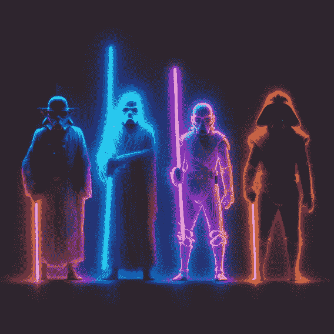

# 发展在线网络 3 社区的 10 个技巧🌱

> 原文：<https://medium.com/coinmonks/10-tips-for-growing-your-online-web3-community-49cce931889d?source=collection_archive---------27----------------------->

**社区建设**对于 web3 初创公司来说是必不可少的，在这篇简短的博客文章中，我将分享发展和培育一个繁荣的在线社区的 10 个吸引人的策略！

> *如果您在 2023 年 1 月 15 日之前订阅时事通讯，您将有机会赢得来自🦧⬇️*[*NFT 项目*](https://twitter.com/TheWokeys) *的 1/10 免费 NFT*
> 
> [*订阅时事通讯！*](https://multilayeredmarketing.beehiiv.com/subscribe) *📰*

**1。以一种有机自然的方式与你的“人”联系起来！**
和那些热爱你的产品和服务的人，和那些刚开始熟悉的人交谈。对你的用户表现出关心和关注将会大有帮助。

**2。引出他们的故事！虽然展示真诚、真实、对你的员工感兴趣很重要，但别忘了展示他们和他们的独特性。向他们展示你关注他们的个人需求。**

**3。推出欢迎马车！提供折扣或其他奖励来吸引新会员。建立激励和奖励机制，帮助新成员感觉自己是“家庭”的一部分。**

**4。创造一些肯定会像病毒一样传播的东西！这可以是一个幽默的视频或者更严肃的东西，但是可以促进你的使命和价值观。**

**5。激发你所在社区的集体创造力。举办竞赛、挑战或其他活动，让会员贡献并展示他们的想法和艺术。**

**6。一定要让对话进行下去！**
这可以是讨论线程、网络研讨会、播客和其他参与社区的方式。

**7。提供额外的支持。这可能包括一个个人接触点、一个帮助台、教程，甚至是一个私人群组。**

**8。一定要集思广益，好好规划！**
与会员合作，或针对您的品牌或使命组织焦点小组，以获得有价值的反馈和新想法。

**9。通过提供价值和透明度来建立信任。** 向成员表明你优先考虑社区的福祉，证明你诚实可信。

**10。还给我！通过支持非营利组织或你的成员关心的其他有价值的事业来展示你对可持续发展的承诺。**

## 号外！

**11。一定要衡量成功！** 跟踪你的社区随时间的增长，保持与成员沟通的畅通渠道。这将确保所有人步调一致，共同努力实现共同的目标。

__________________________________________________________________________________________________________________________________

> *[*WOKEYS*](https://twitter.com/TheWokeys)*即将于 1 月 17 日到来！！！**

*_ _ _ _ _ _ _ _ _ _ _ _ _ _ _ _ _ _ _ _ _ _ _ _ _ _ _ _ _ _
_ _ _ _ _ _ _ _ _ _ _ _ _ _ _ _ _ _ _ _ _ _ _ _ _ _ _ _ _ _ _*

***时刻小心！！！⚠️***

> **这一点我怎么强调都不为过！保持高度警惕，留意你点击的每一个链接、你做的每一笔交易和你接触的每一个人，因为这个领域骗子很多，即使是最好看的项目也会被撤下。**
> 
> *点击所有链接之前要再三检查，确保它们是你要找的官方链接。此外，在给自己或他人发送任何有价值的东西之前，要再三检查所有的钱包地址。*

> *请将 Polygon Matic 发送到这个 Eth 地址，或 Eth Tokens，以支持我和我不断增长的家庭🙏🏼*
> 
> ***0xb 53b 3978333 e 11 c 382 ab 619 f 02 f 469 A8 c 70750 af***
> 
> **或**
> 
> ****买点 Merch！*** *[*https://www . red bubble . com/I/sticker/Mick-And-Rory-Adventure-Time-2-by-多层/131503580ejug 5*](https://www.redbubble.com/i/sticker/Mick-And-Rory-Adventure-Time-2-by-MultiLayered/131503580.EJUG5)**
> 
> ***_ _ _ _ _ _ _ _ _ _ _ _ _ _ _ _ _ _ _ _ _ _ _ _ _ _ _ _ _ _ _ _ _ _ _ _ _ _ _ _ _ _ _ _ _ _ _ _***

> ***如果您在 2023 年 1 月 15 日之前订阅时事通讯，您将有机会赢得来自🦧⬇️wokeys NFT 项目的 1/10 免费 NFT***
> 
> **[*订阅时事通讯！*](https://multilayeredmarketing.beehiiv.com/subscribe) *📰***

****

# **干杯，
泰因泰**

**[链接树](https://linktr.ee/multilayeredmarketing)**

****我的其他一些博文:** [web 3 十大作家](/coinmonks/top-10-web3-writers-ca995689c17f) [web 3 的 5 个败笔](/coinmonks/5-downfalls-of-web3-cd5dc8ade4fd)
[5 + 5 不和谐的战术](/coinmonks/5-tips-for-a-better-discord-nft-crypto-edition-ff9b039d0359)
[Crypto 101:初学者指南](/coinmonks/crypto-101-a-beginners-guide-345d440bd163)
[NFT 5 大最佳实践(营销&社区成长)](/coinmonks/top-5-nft-best-practices-marketing-and-community-growth-7025e26eb50c)
[Web3 基础知识](/coinmonks/web3-basics-252121357f33)
[另类](/coinmonks/alternative-nft-crypto-real-life-use-cases-b7c0b08d99ef)**

> **交易新手？尝试[加密交易机器人](/coinmonks/crypto-trading-bot-c2ffce8acb2a)或[复制交易](/coinmonks/top-10-crypto-copy-trading-platforms-for-beginners-d0c37c7d698c)**