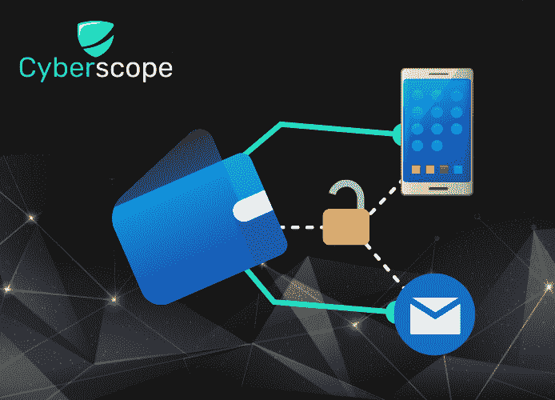

# 保护加密钱包的 10 个技巧

> 原文：<https://medium.com/coinmonks/10-tips-for-securing-your-crypto-wallet-f7e96c0c549a?source=collection_archive---------44----------------------->

# 介绍

正如我们从过去几年无数的[事件中看到的，加密货币和支持它们的基础设施不断受到攻击。加密交易所是网络罪犯的主要目标，他们总是想方设法窃取你的钱。似乎这还不够，如果你不够小心，加密货币钱包本身也容易受到攻击。因此，时刻保证你的钱包安全是很重要的。在这篇文章中，我们将讨论保持你的加密钱包安全的重要性，以及如何做到这一点的一些提示。](https://www.cyberscope.io/blog/the-top-10-cryptocurrency-hacks-of-all-time)

# 什么是加密钱包

在我们提到如何保护你的加密钱包的一些技巧之前，理解它实际上是什么是很重要的。加密货币钱包是一种存储您的私钥并与各种区块链交互的数字钱包。它还使用户能够发送和接收数字货币，并监控其余额。

一些最著名的加密钱包，即 Metamask、TrustWallet、Exodus、Crypto.com 和比特币基地，现在有大量的加密持有者正在使用。

# 为什么安全性对您的加密钱包很重要

众所周知，安全性很重要。无论你是保护你的家，你的车还是你的生意，总有风险要考虑。但当涉及到你的加密钱包时，风险甚至更大，因为你多年来投资的钱可能会因为一个简单的错误而被盗，有时甚至不留痕迹。

如你所知，保护你的投资的最重要的事情之一就是保证你的加密钱包的安全。

# 保护加密钱包的 10 种方法

在下一节中，我们将分析 10 个技巧，这些技巧将证明对保护您的加密钱包免受黑客攻击和其他恶意行为非常有用。

## **1。使用冷钱包**

说到加密货币，你可能会遇到两种类型的钱包。冷热钱包。

热门钱包(如 Metamask)与互联网相连，这使得它们容易受到在线攻击。尽管它们提供了便利，允许您随时随地登录，但它们也带来了更大的数据失窃和泄露风险。

[冷钱包](https://www.guru99.com/best-crypto-cold-wallets.html)，另一方面，是硬件设备(如 u 盘)，不连接到互联网。冷钱包虽然需要一些技术知识来设置，但被认为要安全得多。此外，即使它们离线，也有办法在被盗或被破坏的情况下恢复它们。

## **2。保护您的种子短语**

种子短语，也称为助记符或恢复短语，是存储恢复加密钱包所需的所有信息的单词列表。如果你丢了钱包，你可以用你的种子短语来再生它。您的钱包的安全性取决于您用来访问它的种子短语。请确保不要在网上分享或存储在公共设备上。

## **3。创建一个强密码，并经常更改它**

与所有在线帐户类似，创建一个别人很难猜到的强密码很重要。它应该至少有 8 个字符长，并且包含大小写字母、数字和特殊字符的组合。为了保证钱包的安全，经常更改密码也很重要。

## **4。不同于个人/工作活动的加密投资**

确保将您的加密货币交易与您的个人和工作设备分开。创建一个新的电子邮件帐户，专门用于您的加密钱包，而不是使用个人或工作电子邮件地址，这可能更容易受到威胁。

## **5。使用 2FA**

双因素身份验证(2FA)是用于保护在线帐户的附加安全层。即使有人知道你的密码，他们也无法登录你的帐户，除非他们也能访问第二个因素，这通常是发送到你的手机或电子邮件地址的代码。2FA 是保护你账户安全的重要工具，你应该考虑将它用于你所有的在线账户和钱包。

## **6。始终投资可信的项目**

说到投资，一定要选择可信的项目。有这么多选择，很难知道选择哪一个。但是，通过坚持可靠的来源，你可以放心，你的投资将会得到妥善处理。始终选择来自合法平台的项目和那些有[审计](https://www.cyberscope.io/#audit)或[了解你的客户(KYC)](https://www.cyberscope.io/#kyc) 认证的项目。

## **7。谨防网络钓鱼**

[网络钓鱼](https://www.cyberscope.io/blog/what-is-phishing-in-crypto-and-how-you-can-avoid-it)是一种网络攻击，通常使用欺诈性电子邮件诱骗用户点击恶意链接或提供个人信息。网络钓鱼电子邮件通常看起来像来自合法来源，如可信的网站或公司。这使得它们很难被发现，但有一些泄露秘密的迹象可以帮助你识别它们，比如检查发件人的电子邮件地址是否使用了公司的官方域名。

另一种类型的网络钓鱼攻击是骗子创建看起来与合法网站相同的虚假网站。通过这种方式，他们试图欺骗用户输入他们的登录凭据或其他敏感信息，只是为了让骗子稍后检索它们。与电子邮件类似，一个好方法是检查网站的 URL 是否是相应公司的官方域名之一。

## **8。避开公共网络**

如果你想保护你的个人信息安全，那么你应该不惜一切代价避免公共 wifi。黑客喜欢公共 wifi 网络，因为它们容易被利用，而且经常有很多人在使用它们。这意味着他们找到黑客的机会更大。他们还可以很容易地设置假热点，拦截通过网络发送的数据。这可能会导致数据被盗，从而危及您的钱包。

因此，如果你想避免成为公共 wifi 黑客的下一个受害者，那么最好避开这些网络。

## **9。仔细检查目的地地址**

钱包地址只是一串字母数字字符，代表加密货币交易的目的地。正如您需要银行账号来接收电汇一样，您需要钱包地址来接收加密货币。在发送任何金额之前，请确保仔细检查收款人的钱包地址，因为恶意软件可以用黑客的地址替换它。区块链网络上的交易是不可逆转的，所以一旦操作完成，就没有回头路了。

## 10.让你的软件保持最新

新的安全威胁不断出现，新的功能和安全更新不断推出以抵御这些威胁。通过让你的钱包软件保持最新，你可以确保你使用的是最安全和最有效的软件版本。此外，通过使用最新版本，您可能能够在您的加密资产使用的网络发生任何变化的情况下访问您的资金。

# **结论**

加密钱包就像你家的钥匙；你不会希望任何人都能接触到它。同样，你不希望任何人都能访问你的加密投资。始终做自己的研究，并尝试应用尽可能多的安全措施来保护您的钱包，从而保护您的投资免受所有可能的威胁。

*…*

[*原载于 www.cyberscope.io*](https://cyberscope.medium.com/)

> 交易新手？尝试[加密交易机器人](/coinmonks/crypto-trading-bot-c2ffce8acb2a)或[复制交易](/coinmonks/top-10-crypto-copy-trading-platforms-for-beginners-d0c37c7d698c)