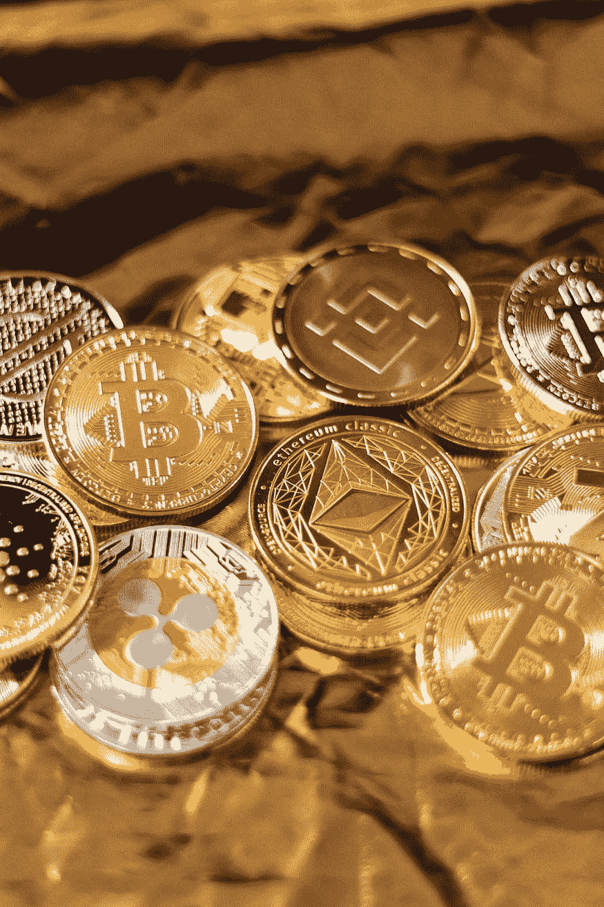
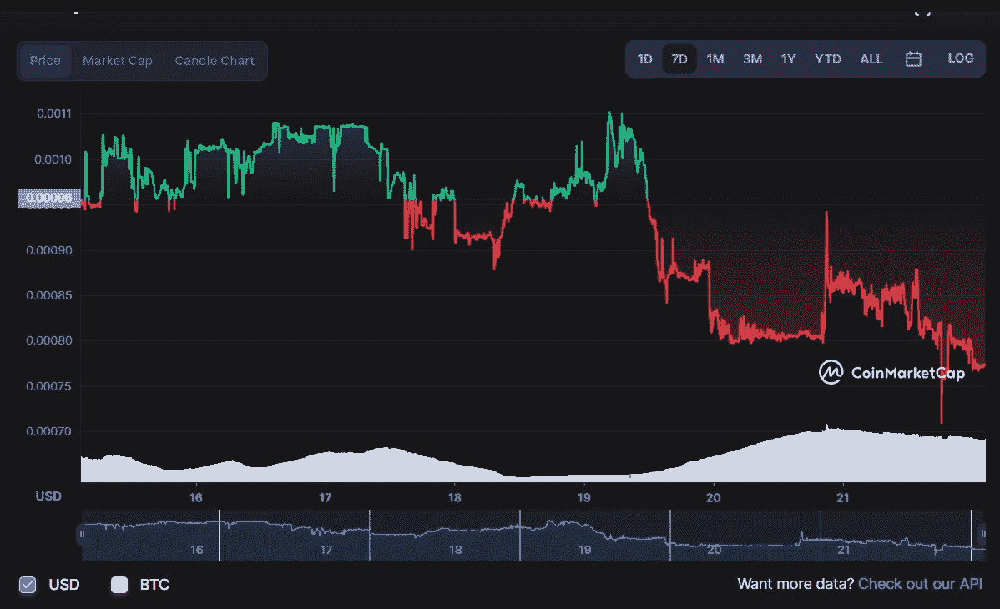

# 100 美元的高风险加密投资更新#1

> 原文：<https://medium.com/coinmonks/100-high-risk-crypto-investment-update-1-4f529598a9f8?source=collection_archive---------19----------------------->

## 正如我所承诺的，这是我对岩石圈 100 美元投资的第一次更新。

Photo by [Art Rachen](https://unsplash.com/@artrachen?utm_source=unsplash&utm_medium=referral&utm_content=creditCopyText) on [Unsplash](https://unsplash.com/s/photos/crypto?utm_source=unsplash&utm_medium=referral&utm_content=creditCopyText)

[上一次](/coinmonks/i-invested-100-in-a-high-risk-cryptocurrency-to-see-how-it-turns-out-6469ba29e1d8)，我提到我买了价值 100 美元的岩石圈硬币，每个硬币的价格为 0.0011 美元。因此，我目前持有约 9 万 LITHO。

在我写这篇文章的时候，尽管我认为我是以尽可能低的价格买的，但这枚硬币的价格下降到了 0.0008 美元，价值下降了 27%。因此，我的持股从之前的 100 美元变成了 70 美元。

Lithosphere’s 7-day Graph

因为我有一些零钱，我又买了 50 美元的硬币，所以我现在有 15 万英镑。

总结一下，我最初的 100 美元投资变成了 70 美元。我用 50 美元买了更多的硬币，这使我目前持有的价值 120 美元。

为了清楚起见，我现在已经投资了 150 美元，不会再增加了。因此，下一次更新的标题将是“150 美元高风险加密投资更新#2”。

> 交易新手？试试[密码交易机器人](/coinmonks/crypto-trading-bot-c2ffce8acb2a)或者[复制交易](/coinmonks/top-10-crypto-copy-trading-platforms-for-beginners-d0c37c7d698c)