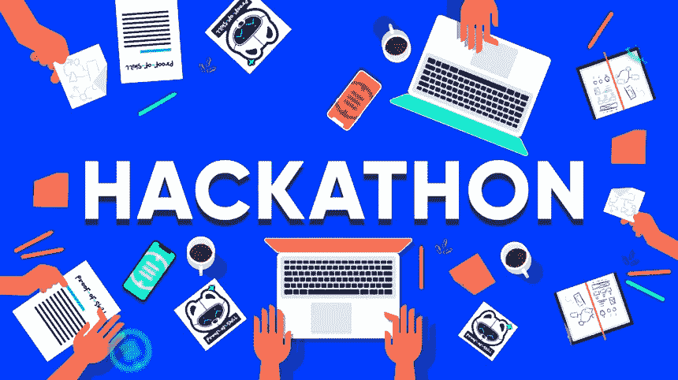
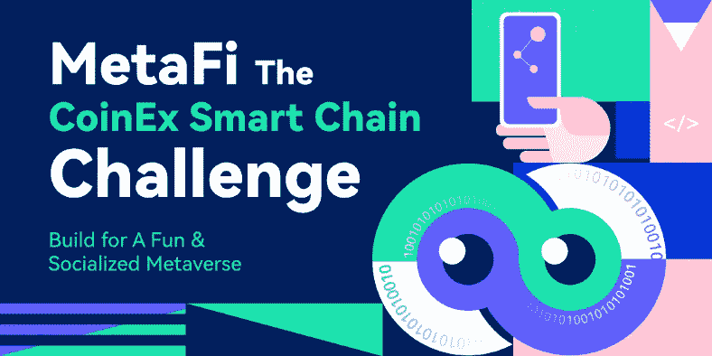
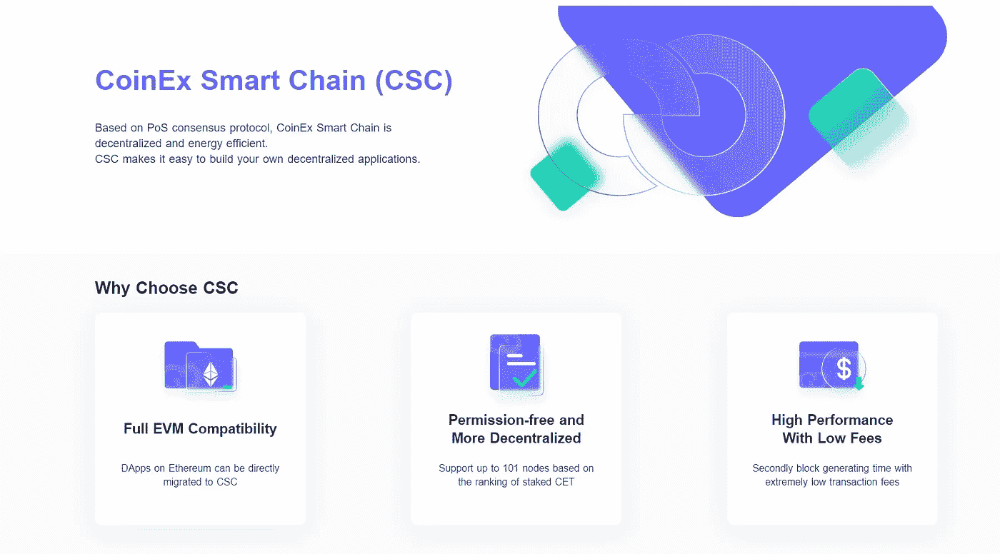
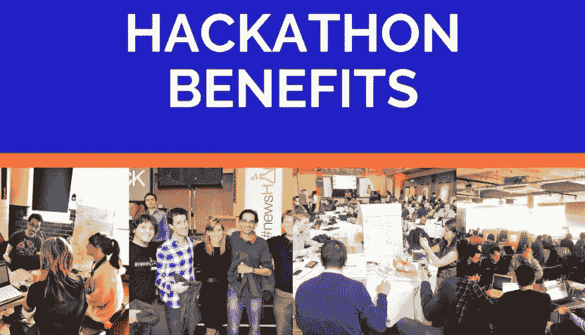

# 10 万美元的黑客马拉松

> 原文：<https://medium.com/coinmonks/100k-hackathon-d47221b88c4a?source=collection_archive---------40----------------------->

## 有技巧吗？让我们看看你有什么！

首先，什么是黑客马拉松？只是高级程序员疯狂地一行行键入复杂代码的高压编码事件，对吗？不对！不仅有大量面向初学者的黑客马拉松，越来越多的人欢迎从未编写过代码的参与者。

因此，让我们马上消除这些误解——是的，有许多不同类型的黑客马拉松，虽然不是所有的都适合初学者或孩子，但仍然有许多活动旨在让所有年龄和经验水平的人对编码感兴趣。

## 享受黑客马拉松的好处

黑客马拉松活动提供了一个机会来解决我们许多人在过去一年中一直努力完成的事情:高质量的远程学习、原型构建和投入独立的激情项目。

一旦进入令人兴奋的黑客马拉松世界，就会有更多的发现。

从那里，职业黑客马拉松可以启动职业生涯，吸引雇主；正是因为这个原因，30.3%的黑客马拉松在大学校园举行。在下一个级别，学生将有机会在专业水平的过程中尝试自己的双手，并有可能进行现场工作面试。

## 参加

当然，知道在哪里可以找到黑客马拉松是挑战的一半。大多数活动不仅是在网上进行的，还需要从一长串即将举行的活动中筛选出合适的级别、编码挑战和社区来开始您孩子的编码冒险。

做一点调查，你就能找到最合适的！

## CSC $100K 黑客马拉松！

# CSC — CoinEx 智能链

作为一个新兴的公共链，CSC 旨在发展成为区块链世界的基础设施，为区块链开发者提供更好的服务，使他们能够实现他们的区块链梦想，并构建更好的下一代区块链应用。

## MetaFi CoinEx 智能链黑客马拉松

***欢迎来到 MetaFi the CoinEx 智能链黑客马拉松！在 CSC 上创建一个有趣的应用程序，以社交网络和元宇宙元素为特色，并赢得 100，000 美元。***

今年的 CSC 黑客马拉松旨在向更多开发者介绍公共链，并帮助他们在 CSC 上构建自己的元宇宙项目，同时鼓励更多社区成员体验元宇宙、GameFi 和 SocialFi。在 CSC 过去的支持计划中，我们看到了许多优秀的 DeFi 项目。因此，我们希望更多的 MetaFi 项目能够在本次黑客马拉松中为 CSC 的生态系统建设做出贡献。

**点击加入黑客马拉松:**[**MetaFi the CoinEx Smart Chain，赢取 10 万美元奖金**](https://cscchallenge.devpost.com/?utm_source=CoinEx&amp;utm_medium=Blog&amp;utm_campaign=launchpost)

# 关于黑客马拉松

*   时间:8 月 10 日—10 月 28 日
*   提交时间:8 月 10 日—10 月 12 日
*   评审期:10 月 17 日—10 月 24 日
*   获奖者公告:10 月 28 日

# 我们喜欢什么样的项目？

*   Web 3.0 基础设施(infra structure):这些项目应遵循去中心化、互操作性和可组合性的原则，既可以作为用户可以直接使用的工具，也可以作为部署其他应用的基础。
*   **SocialFi** :这些项目应该结合 DeFi 和社交网络功能，同时用户不会失去隐私或失去资产的风险。
*   **GameFi** :这些项目可以是嵌入了 DeFi 特性的游戏项目，同时要坚持去中心化，不存在用户资产流失的风险。
*   NFT:这些项目应该规定一件 NFT 作品是如何被创作出来的，以及它的价值来自哪里。关于 NFT 移交的政策和程序也应该明确
*   **其他创意项目包括 DeFi、工具等。**

# 要求

在 CoinEx 智能链上构建 Dapp，并至少在 Testnet 上部署:[https://testnet.coinex.net](https://testnet.coinex.net/)

# 提交什么

*   提供一个工作项目的 URL 和一份白皮书或轻型纸来展示你的项目的词汇学和项目意识形态。
*   投影一个 URL 并访问您的项目代码库。必须通过公开或与**developer@coinex.org**和**testing@devpost.com 共享来授予访问权限。**
*   在 CoinEx 智能链上提供来自您的项目的已部署智能合约。
*   包括一个视频(大约 3 分钟)，演示您的提交。视频必须上传到 YouTube、Vimeo 或脸书视频并公开。
*   项目至少需要在 Testnet 上完成部署，并具备全部功能。为了获得最佳获奖机会，您可以选择项目解决方案的类别。
*   项目开发人员需要提供您的电子邮件地址、电报 ID 作为联系信息，并加入 discord 服务器。(将在黑客马拉松开始时添加)

***请注意，我们高度鼓励所有项目建立在 CoinEx 智能链上，但是只有那些已经完全部署在 CoinEx 智能链测试网上的项目才有资格获得奖励申请**。

# 奖赏

*   黄金(大奖) :在 USDT 获得 20000 美元
*   银牌(2):USDT 1.5 万美元
*   铜牌(2):USDT 1 万美元
*   亚军(6):USDT 5000 美元

# 评判标准

每个标准都有同等的权重。评委将根据以下标准对参赛作品进行 1-5 星评分:

*   **概念质量:**项目的代币组学是否健康，代币的效用是否合理，项目的创意和吸引力如何？
*   **实施:**项目开发完成程度如何？网站或原型为用户准备好了吗？社区参与功能、游戏性或令牌组学的构建如何？如果令牌已经实现到 dapp？
*   **用户体验:**项目功能是否经过深思熟虑且易于使用？用户是否能够容易地理解项目的概念？产品的流畅度和用户友好度如何？
*   **潜在影响:**这类项目的需求有多大？这个项目会受到社区的欢迎，这合理吗？团队是否表现出继续改进和推广其项目的潜力？

# CSC 是什么？它提供什么？

CoinEx 智能链(CSC)是由 CoinEx 团队为分散式金融创建的分散式高效公共链。公共链与以太坊生态系统完全兼容，具有高效率、低费用以及无许可验证器的特点。所有开发人员都可以基于 CSC 轻松构建他们自己的分布式应用程序，或者在 CSC 上快速部署他们的 EVM 应用程序。

CSC 提供了 101 个验证器，这些验证器按照每个验证器标记的 CET 数量确定的顺序生成块，从而最大程度地确保了公共链的去中心化和安全性。与此同时，CSC 的低收费也有助于它从众多公共连锁店中脱颖而出。目前，在 CSC 上执行一笔交易只需要 0.01 CET，约合 0.0005 美元。这些特性使 CSC 成为开发人员构建高频应用程序的有利环境。

除了技术上的便利，CSC 还提供满足您需求的全面支持。CoinEx 团队致力于区块链行业六年，已经开发了许多一流的产品，包括 ViaBTC Pool、CoinEx Exchange、CoinEx Smart Chain、ViaBTC Capital、ViaWallet 和 OneSwap。依靠其多年来建立的强大的区块链资源网络，该团队在筹款、代币交易、媒体宣传和社区扩展方面为项目提供强有力的支持。

通过这次黑客马拉松，我们希望找到更多和我们一样对 MetaFi 和 Web 3 抱有雄心的项目，共同传播区块链的价值。

# 开发资源:

*   官方网站:[https://www.coinex.org](https://www.coinex.org/)
*   mainnet Explorer:[https://www.coinex.net](https://www.coinex.net/)
*   开发商文件:[https://docs.coinex.org/#/en-us/introduction](https://docs.coinex.org/#/en-us/introduction)
*   Testnet 水龙头: [Coinex 智能链:认证水龙头](https://testnet.coinex.net/faucet)
*   跨链桥: [CoinEx 智能链(CSC)桥](https://bridge.coinex.net/)
*   JSON-RPC API:[CSC OPEN-RPC Playground](https://api.coinex.net/)

# 元掩码配置:

*   **Mainnet:**

RPC:[https://rpc.coinex.net](https://rpc.coinex.net/)
Chain id:52
symbol:CET
Explorer:[CoinEx 智能链(CSC) Explorer](https://www.coinex.net/)

*   **测试网:**

RPC:[https://testnet-rpc.coinex.net](https://testnet-rpc.coinex.net/)
Chain id:53
symbol:tCET
Explorer:[CoinEx 智能链(CSC) Explorer](https://testnet.coinex.net/)

**与我们共建，助力区块链技术发展！**

## 为什么要参加黑客马拉松？

如果你还不知道，黑客马拉松是持续 24 小时到一周的编程活动。黑客马拉松的目的是让一群程序员在一个合作项目中一起工作。大多数黑客马拉松都是这样的比赛，几个团队在比赛中创造原型，在一个主题上创新或改进现有的项目。黑客马拉松有很多好处

*   在黑客马拉松活动中，你通常会遇到和你有相同兴趣和技能的人。这为网络创造了完美的环境。你所需要做的就是与你的程序员同事建立网络并交换联系信息。谁知道呢，你们将来可能会合作。
*   **为你的简历或履历增加价值—** 参加黑客马拉松在你的简历或履历上看起来很不错。它向人们表明你有编程技能，有在紧张环境中工作的经验，并且知道如何取胜。人们都知道参加黑客马拉松会立即增加你的知识和技能水平。
*   创造新的概念和想法——我认为像黑客马拉松这样的解决问题的环境有助于创造创新的想法和概念。你必须与来自不同领域、拥有不同兴趣和技能的人一起工作，共同解决同一个问题。有时间限制的事实使这项任务更加令人兴奋，并激发出人们最大的潜能。
*   **公司品牌化—** 如果你的公司赞助或组织一次黑客马拉松，它可以立即提高其在行业中的知名度。参加活动的人将会非常熟悉你的公司及其员工。这样，他们就开始了解你的团队是如何运作的，以及你带来了什么。
*   **人才获取—** 如果你的公司组织或赞助了这个项目，你可以利用这个机会评估和发现潜在的人才。如果他们能在这种紧张、快节奏的环境中生产，他们就有可能在你的公司里提高生产水平。这使得黑客马拉松成为科技公司寻找人才的绝佳方式。
*   **产品开发—** 黑客马拉松背后的主要理念是发现问题，并合作创造解决问题的技术。在黑客马拉松结束时，公司发现他们有一个或多个原型，可以成为新产品。
*   **当然是现金福利啦！**
*   **个人满意度**。你在创造新事物的过程中获得乐趣，这种感觉很有收获。你的工作赢得了他人的尊重，你也参与了技术的进步。

# 举办一场好的黑客马拉松的一些建议

*   **音高太重要了！** —很多人认为这部分没那么重要。他们错了！你需要尽快推销你的想法。我的意思是，这完全取决于你参加黑客马拉松的原因。如果你是来赢球的，那么你绝对应该考虑球场。如果你只是来玩的，并不真的在乎输赢(这也可以)，那就另当别论了。
*   **与最好的人一起工作** —你的团队是你成功的一部分。你应该有战略眼光，与拥有不同技能、不同背景、不同视角的人共事。如果你有一个好主意，在黑客马拉松开始的时候提出来，解释你在找谁以及项目的要求，这样你就可以找到合适的人一起工作。
*   **仅仅“酷”是不够的** —你可以拥有最棒的产品，拥有令人惊叹的功能，但如果它对情况没有帮助，那么其他人就没有兴趣投资它。记住这一点。
*   **有备而来** —另一个建议是做好研究，阅读文档，了解你将要使用的库&技术。没有必要在黑客马拉松期间浪费时间！你也可以准备一个已经做好的演示模板，一个枕头，一条毯子，一瓶水等等！
*   **现实一点**——有伟大的想法显然很好，但对你的期望和目标现实一点也很重要。仅仅在 24-48 小时内，你不可能真的相信你会得到最终产品。因此，关注价值，专注于实现 MVP。不要把你所有的时间都花在计划一些不切实际的事情上，结果几乎什么都没有实现！

现在，你应该已经被说服来尝试我们的**黑客马拉松**。或者至少，你应该明白为什么它对某些人来说很有趣。

> 交易新手？试试[密码交易机器人](/coinmonks/crypto-trading-bot-c2ffce8acb2a)或[复制交易](/coinmonks/top-10-crypto-copy-trading-platforms-for-beginners-d0c37c7d698c)