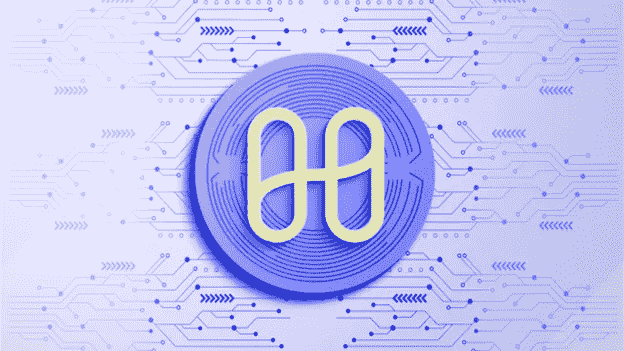

# 1 亿美元和谐黑客解释

> 原文：<https://medium.com/coinmonks/100m-harmony-hack-explained-366a3216235c?source=collection_archive---------12----------------------->

和谐地平线大桥项目是 2022 年 6 月黑客攻击的目标，这是五次最昂贵的 DeFi 攻击之一。被泄露的私钥使得该项目损失了 1 亿美元的代币。

# 黑客攻击是如何发生的？

与大多数跨链桥一样，Harmony Horizon 桥有一个用于批准在桥上传输的交易的验证过程。在这种情况下，具有五个验证者的多重签名系统被用于批准过程。

然而，该桥只采用了 5 分之 2 的验证方案。这表明，黑客只需获得两个区块链账户的访问权限，就可以完成他们想要的任何恶意交易。获得了两把私人钥匙，然后用它们进入了和谐地平线桥。没有一个系统可以访问多个明文私钥，这些私钥是用密码和密钥管理服务加密的。然而，攻击者能够访问并解密许多密钥。攻击者能够创建一个交易，使用他们控制的两个帐户从桥上提取 1 亿美元，并确认交易，因为他们可以访问桥的两个私钥。

许多被盗的代币后来被攻击者用 Tornado Cash 清理掉了。自从攻击以来，多重签名方案已经被更新为要求 5 个验证者中的 4 个的同意。

> 交易新手？试试[加密交易机器人](/coinmonks/crypto-trading-bot-c2ffce8acb2a)或者[复制交易](/coinmonks/top-10-crypto-copy-trading-platforms-for-beginners-d0c37c7d698c)

# 谁是幕后黑手？

区块链分析公司 Elliptic 今天发布的一份报告称，与朝鲜有联系的臭名昭著的网络犯罪集团 Lazarus Group 参与了资金被盗和洗钱的过程。美国政府在 4 月份认定，美国联邦调查局(FBI)称，拉扎勒斯(Lazarus)是一个“国家支持的黑客组织”，被发现对游戏 Axie Infinity 使用的一个跨链桥进行了 6.22 亿美元的黑客攻击。

跨链桥用于链接侧链(如 Axie 的以太坊侧链 Ronin)，在将工作传回更安全的区块链(如以太坊 mainnet)之前，它可以提供速度和更低的交易费用。它们连接区块链，常用于连接侧链。

# 我们学到了什么？

管理高价值资产的最佳实践是使用多个签名，但是五分之二的签名方案提供的安全性很低。通过要求更多的验证器并确保一个私钥的泄露不会将其他私钥置于危险之中，有可能阻止类似的攻击在未来发生。这可以通过将密钥存储在不同的系统上、用不同的口令或密钥保护它们等来实现。