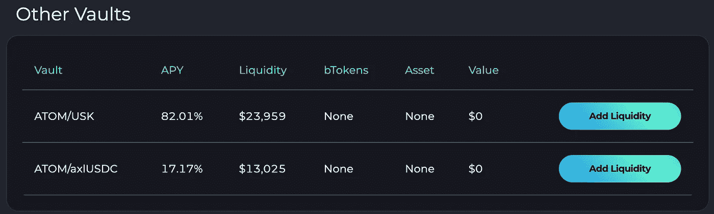

# 100x —项目审查—库吉拉(库吉)

> 原文：<https://medium.com/coinmonks/100x-project-review-kujira-kuji-3f8b979c45d8?source=collection_archive---------1----------------------->

经过几个月对数百个项目的分析，我已经将我的观察列表缩小到少数几个我认为有潜力成为 100 倍重头戏的协议。对于下一波加密浪潮将如何发展，每位投资者都有不同的观点，但对我来说，我会寻找市值在 1 亿美元或以下的更新项目(在牛市后推出),以增强今天的零售体验。我还考虑了象征经济学和竞争优势，这将增加下一个 alt 赛季获得市场份额的可能性。

我将要写的第一个项目是 https://kujira.app/的鲸声优。鲸声优最初在 Terra 生态系统上发射，但在$UST 的死亡螺旋后不久决定迁移到宇宙层 1。他们开发和执行路线图的速度不会被忽视。这些家伙上船了！该团队正忙于开发我认为将成为宇宙生态系统的 DEFI 中心。

引起我注意的是记号经济学。大多数 DEFI 项目都被夸大为有效的激励验证器，但从长远来看，大部分都是不可持续的。在我看来，鉴于供应被严重稀释，高通胀项目被编码为 0.00 美元。

有了 KUJI，来自其基础产品(ORCA、FIN、USK)、生态系统 dApps(收入共享)，甚至 NFTs/外链验证器的所有收入都将用于赌注奖励。首批实际产量协议之一，总供应量为 1.224 亿枚硬币。这也创造了一个非常支持的社区，因为每个人都相互受益。

我喜欢的另一个特点是，你可以在多种资产中获得赌注回报，因为费用是以多种方式和方法收取的。实际收益率协议很难达成，因为你没有通胀缓冲，但如果成功，可能会给早期投资者带来巨大回报。

在我看来，它们的主要特征是清算协议 ORCA，它允许散户投资者对清算资产进行竞价。在鲸声优之前，清算投标是一个困难的过程，需要一定程度的编码知识来利用堕落投资者的贴现资产。有了鲸声优，你可以轻而易举地以低至 30%的折扣竞标资产。目前，这将很快在 NBTC 的 ATOM 和 DOT 上实现，但关键是，该基础的构建是为了跨他们认为合适的尽可能多的资产进行扩展。随着生态系统的发展，这是我认为将吸引巨大效用的主要产品。

除了 ORCA，他们还有 FIN，这是他们的链上订单簿，有 24 对/杠杆交易(perps)和他们自己的过度抵押稳定硬币，USK。今天，你可以抵押你的 ATOM 和 DOT，但预计在不久的将来，这将扩展到更多的资产。

既然我们已经讨论了协议和令牌组学，我想解释一下为什么我认为这个项目有 100 倍的潜力。

**价格数据:**

*   当前市值——87，581，429 美元
*   锁定的总价值——2，512，583 美元

首先让我们看看当前的活动。鲸声优最近在最后一个季度推出了 ORCA 和 USK，因此鉴于生态系统的初级阶段，交易量仍然很少，但实际收益率已经达到 2.9%。他们有一只活的 dApp，黑鲸(【https://blackwhale.money/】)在活了一个月后已经有了大约 75 万美元的 TVL。他们还有大约 9 个 dApps 在开发中，所以下一季度产量应该会大幅增加。

我非常喜欢黑鲸，因为它是鱼翅的做市商。它本质上是一个交易机器人，利用订单簿中的非自然运动获利。目前，有 7 个金库会在你选择的配对中自动交易。我个人最喜欢的是 ATOM/KUJI 跳马，因为它的回报比赌注高得多，如果有暂时的损失，我不介意长期持有这两个项目。除了稳定的一对，所有金库目前的收益率在 17-82%之间，因此肯定有一些回报值得关注。

**从**[**https://mapofzones.com/**](https://mapofzones.com/)**看数据点，KUJI 站如下(30 天):**

*   在 IBC 销量排名第 6
*   总交易量排名第 4
*   9，360 个月活跃用户

鲸声优也推出了他们自己的钱包，据说可以集成债务卡，这样你就可以用 USK 支付日常开支。这将是另一个关键的驱动力，通过 USK 造币，将提升整个生态系统的 TVL，并将自然地转化为虎鲸的数量。

对 FIN 来说，他们只有一对交易对手——ATOM/USK——进行垂直交易，杠杆比率最高只有 2.5 倍。看看 CEX 交易量的统计数据，杠杆交易通常是现货交易的 10-15 倍，所以你可以看到这里的潜力。假设 ORCA 能够维持清算，未来杠杆率可能会增加到 2.5 倍以上。

当看这三个主要特征时——虎鲸、鳍、USK，它们没有独立增加多少价值。有大量的链上订单簿与 perp 交易以及无尽的稳定硬币可供选择，但当你将这三个功能结合在一起时，价值会显著提高，特别是 ORCA 在后端捕捉价值(清算)。所有这三个特性一起工作绝对是一件特别的事情，显著地提高了价值，并且我认为这是围绕这个协议的护城河。鲸声优为散户投资者创造了一个公平竞争的解决方案。许多项目都有一个特性，但没有一个项目同时具备这三个特性。

**我对未来的期望:**

*   更多的 dApps 加入生态系统，以帮助 KUJI stakers 产生产量。具体来说，我希望看到一个借出/借入协议(也许通过火星协议？？)或更多铸造 USK 的激励措施。这个想法是创造一个“低风险”的地方来停放 USK。
*   鉴于抵押资产时错过的收益率，我希望看到 stATOM 和其他 stride tokens(假设数量允许)或一种流动性的 staking 解决方案来为 USK 抵押。目前，当一个抵押原子，他们能够利用高达 60%的 USK 价值，但错过了 19%的赌注收益率。任何一种获取抵押资产收益率回报的解决方案，都将让铸造变得完全不需要动脑筋。另外，如果 ORCA 数量允许，提高杠杆数量以增加清算，这将增加进入 ORCA 系统的贴现资产(但是，我确信他们不这样做还有其他原因)。
*   更多的罪犯以更高的杠杆率进行金融交易。2.5 倍不足以与其他链上订单簿竞争，因此希望在未来看到 50-100 倍的选项，再次假设 ORCA 可以支持清算量。

总的来说，这是目前为止我最喜欢的低市值项目之一。KUJI 生态系统的基础已经建立，所以我预计在接下来的几个季度内会有大的发展。该团队行动迅速，经过精心策划，似乎在密码世界里人脉很广。他们不仅通过象征经济学，还通过治理(【https://blue.kujira.app/senate】T2)推动加密货币向前发展，如果他们找到其他新方法来设定生态系统的黄金标准，我不会感到惊讶。自己看看这个项目吧！

请在推特上关注[未丢失 0x](https://twitter.com/undisclosed0x) 的实时更新。

无投资建议—内容仅供参考，您不应将任何此类信息或其他材料理解为法律、税务、投资、财务或其他建议。

> 交易新手？尝试[加密交易机器人](/coinmonks/crypto-trading-bot-c2ffce8acb2a)或[复制交易](/coinmonks/top-10-crypto-copy-trading-platforms-for-beginners-d0c37c7d698c)