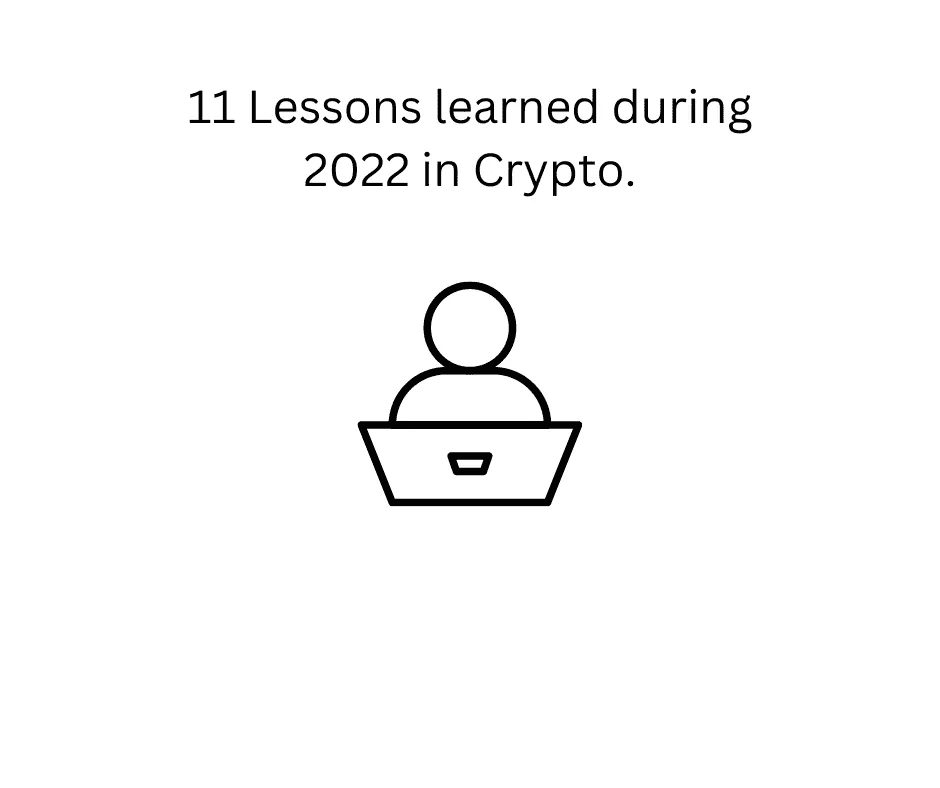

# 2022 年在 Crypto 学到的 11 条经验

> 原文：<https://medium.com/coinmonks/11-lessons-learned-during-2022-in-crypto-4cecab090bfb?source=collection_archive---------20----------------------->

2022 年我在密码空间学到的东西。

11 Lessons learned during 2022 in Crypto.

#1 不要想当然，任何大事都可能失败。

FTX，摄氏，3AC 宣布破产。它们都是大型的中央集权实体。他们的领导人未能信守承诺，最终死去。

> 交易新手？在[最佳密码交易所](/coinmonks/crypto-exchange-dd2f9d6f3769)上尝试[密码交易机器人](/coinmonks/crypto-trading-bot-c2ffce8acb2a)或[复制交易](/coinmonks/top-10-crypto-copy-trading-platforms-for-beginners-d0c37c7d698c)

#2 真正的真相是链上的。

区块链正在走向成熟。集中实体的例子表明，只有在真正的区块链全天候工作时，你才能找到真相。每个人都在问 SBF 钱去了哪里。如果它在区块链号上，就能被追踪到。既然是在阿拉米达，就不能。

#3 DeFi 和 CeFi 不一样。

SBF 的公司失败了。德菲没有公司。人们在没有 KYC 的情况下使用它，它是开放的，没有权限，给人们选择，不需要任何集中的中介。

#4 随着集中式实体的消亡，分散式应用将会兴起。

中央集权实体的消亡就是一个例子，说明了为什么我们需要更分散的主动性。你不再需要中介来运作了。我们可以通过 Dapps 自己做。

#5 通过 NFT 的作品，任何能被象征化的东西都会被象征化。

NFT 的发病率正在上升。那些快速盈利的项目现在已经不存在了，我们将会看到更多成熟的项目和系列出现。但 NFT 的真正价值是通过效用嵌入，一些人开始意识到这一点。

#6 谨慎收益率从何而来。

Terra 站的锚协议就像一个中央银行。他们有 20%的收益率，但这表明这只是他们为营销活动增加的一个数字。

#7 注意令牌组学。

没有代币组学的协议就像任何没有固定供应的货币，他们总是可以“印刷”更多的代币，因此你的代币会在你不知道的情况下贬值。

#8 以太坊采用。

以太坊费用在从工作证明机制升级到利益证明“合并”后正在下降。这导致以太坊在某些情况下会随着网络燃烧代币而紧缩。此外，越来越多的第 2 层区块链解决方案正在以太坊上构建。

#9 区块链网络正在走向成熟

区块链技术正在走向成熟。越来越多的人对技术方面感兴趣，而不是加密货币方面，这是公平的。没有区块链的技术核心，我们甚至不可能拥有一种加密货币。作为技术的区块链可以颠覆世界上的许多行业，而且它已经在这么做了。

#10 很多人离开了空间，但他们还会回来。

在 2022 年发生的悲剧事件之后，人们已经失去了对 crypto 的信任，这是事实。那些留下来的人着眼于长远(我也是)。但我可以猜测，一旦下一个周期开始寻求利润，他们就会回来。

最后也是最重要的一课:

#11 不是你的钥匙，不是你的密码。

在 FTX 有钱的人(不是我)无法拿回他们的钱。如果钱在区块链，你有钥匙，你可以。任何集中交易都可能失败，你可能会失去所有的资金。不是你的钥匙，也不是你的密码。

我真的希望 2023 年比 2022 年更适合太空。悲剧事件多于快乐事件。而且最重要的是，它伤害了人们的生活。

如果你喜欢阅读并学到了一些东西——关注更多！

你可以在推特上找到我——[https://twitter.com/pinadefi](https://twitter.com/pinadefi)

https://pinadefi.substack.com/[子栈](https://pinadefi.substack.com/)

出版 0x—【https://www.publish0x.com/@Pina-DeFi 

> 加入 Coinmonks [电报频道](https://t.me/coincodecap)和 [Youtube 频道](https://www.youtube.com/c/coinmonks/videos)了解加密交易和投资

# 另外，阅读

*   [如何购买 Monero](https://coincodecap.com/buy-monero) | [IDEX 评论](https://coincodecap.com/idex-review) | [BitKan 交易机器人](https://coincodecap.com/bitkan-trading-bot)
*   [CoinDCX 评论](/coinmonks/coindcx-review-8444db3621a2) | [加密保证金交易交易所](https://coincodecap.com/crypto-margin-trading-exchanges)
*   [红狗赌场评论](https://coincodecap.com/red-dog-casino-review) | [Swyftx 评论](https://coincodecap.com/swyftx-review) | [CoinGate 评论](https://coincodecap.com/coingate-review)
*   [Bookmap 评论](https://coincodecap.com/bookmap-review-2021-best-trading-software) | [美国 5 大最佳加密交易所](https://coincodecap.com/crypto-exchange-usa)
*   [如何在 FTX 交易所交易期货](https://coincodecap.com/ftx-futures-trading) | [OKEx vs 币安](https://coincodecap.com/okex-vs-binance)