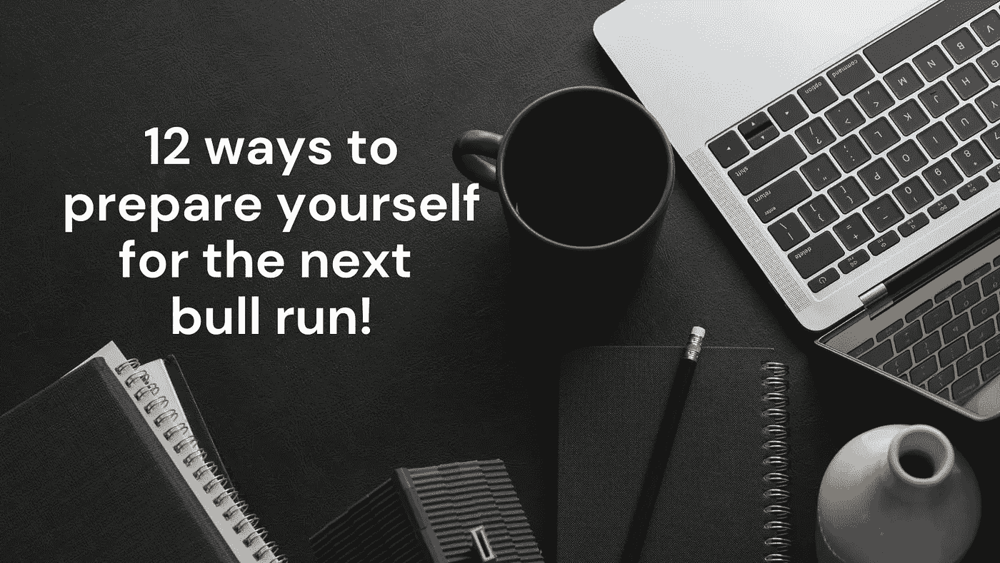

# 为即将到来的牛市做准备的 12 种方法

> 原文：<https://medium.com/coinmonks/12-ways-to-prepare-for-the-upcoming-bull-run-187d58f54421?source=collection_archive---------3----------------------->

***让我们为你的下一次牛市做好准备。进一步阅读，了解牛市或牛市，如何发现牛市，并从中受益！***

# 介绍

在使用股票、房地产、加密货币或任何其他资产时，你可能会听到市场被描述为看涨或看跌。简单来说，牛市在涨，熊市在跌。由于其巨大的波动性，市场不断变化，增长和下降。本文将概述为即将到来的牛市做好准备的 12 个策略，但首先必须理解牛市和熊市之间的区别。

# 理解牛市和熊市

# 牛市还是牛市

牛市，也称为牛市，是交易者或投资者购买的时候。在牛市中，需求超过供给，从而推高价格。假设你注意到一个市场的价格快速上涨。在这种情况下，这可能意味着大多数交易者或投资者对价格进一步上涨越来越乐观或“看涨”，标志着牛市的开始。

# 熊市还是熊市

当价格开始下跌，熊市就开始了。此时供应大于需求，投资者或交易者信心不足。因此，悲观并预测未来市场下跌的投资者被称为“空头”在下跌的市场中交易可能具有挑战性，尤其是对新手投资者来说。

任何投资者或交易者都必须理解市场行为。帮助交易者和投资者为即将到来的牛市做准备的策略将更容易学习和理解。

# 为牛市做准备的方法

# 投资质量，而不是新奇！

在牛市期间，不断增加的大额硬币价值会在整个加密货币领域传播。整个市场开始上涨。然而，随着牛市走向成熟，激励措施只会给予那些有着合理商业计划的可靠执行者。纯粹因为表现最佳的硬币推动市场上涨而升值的硬币，在牛市结束前将不可避免地下跌。

在牛市的早期，小盘股的新硬币可以获利丰厚。但随着市场的发展，经验丰富的投资者建议逐步将你的股票转换成蓝筹股。

# 1.瞄准便宜货

在牛市开始时，一些硬币和代币被低估，尤其是市场上新鲜的小盘密码。据专家称，在牛市中，这些硬币可能会经历一次巨大而快速的攀升。留意这些硬币，这样你就可以交易它们并获得更多。

# 2.寻找新的和创新的技术

市场上没有多少全新的硬币和代币可以普遍取代法定货币。专用硬币正在出现，用于特定用途，如分散式银行业务、NFT 管理和区块链甲骨文支持。其中一些代币利用尖端技术，避开了市场上典型的大盘股。据专家称，在牛市中，为解决某个问题或某个有前途的市场而创造的硬币表现最佳。

# 3.寻找具有更高增长潜力的平台

根据过去的表现预测硬币未来价值趋势的艺术是基本面分析。例如，特定代币的历史价值会随着总体市场的上涨而上涨，但涨幅要比市场平均涨幅高出几个百分点。如果这种趋势持续下去，我们有理由预计，在牛市中，硬币的表现会好于市场。如果你做研究的话，你可能会找到投资回报率高的代币。

# 4.考虑投资小盘股

市场可能还没有意识到低市值新代币的优势。当资金匮乏时，这种代币很难吸引投资者，但它们有机会在牛市中证明自己的价值。牛市让新货币有可能在回报投资者的同时增加市场份额，尽管小盘股市场风险更大。

# 5.让自己多样化

专业投资者通常直言不讳，固执己见。然而，他们一致认为在牛市中分散投资组合很重要。通过多样化的投资组合，你可以降低风险，并从许多不同领域的市场增长中获利。

在加密领域，多样化的投资组合可能包括大型产品、新令牌、活跃于 DeFi 和其他扩展行业的令牌、与尖端技术相关的令牌、市场上新出现的小型令牌等等。这些条件支持通过交易所交易基金和指数基金实现多样化。这与进行全市场投资是一样的，这是你在牛市期间想做的事情。

# 6.进行再投资

不管市场涨到多高，如果你不投资，你就会原地踏步。许多金融专家主张进入牛市，获利，卖出，以更高的价格再投资。收益率，在牛市开始时你没有，本质上允许你留在市场上，有闲钱。

# 7.分阶段投资

在牛市中降低风险的另一个策略是逐渐增加你的投资。你可能会慢慢接近市场，如果你的一些资产因为价格立即下跌而成为输家，之前的购买可以抵消你的损失。

# 8.分阶段销售

此外，分阶段销售是有道理的。本周卖出一些代币，下周卖出一些，再下一周卖出一些，以此类推，因为你永远无法保证它们能得到最令人难以置信的价格。这种策略减少了市场波动，有助于维持你的投资组合的整体价值。

# 9.有一个退出策略

牛市诱惑投资者多逗留一天以增加他们的利润。然后另一个出现了，然后又出现了另一个。直到最后，市场低迷导致价格飙升，让你绝望。

专家因此鼓励投资者提前做好计划。当你的投资组合价值达到特定水平时，决定离开市场，然后信守诺言。更多的增长可能会失去，但你也可能锁定价格下跌带来的收益。

# 10.利用衍生品降低风险

例如，由于期权是为了降低投资者的风险，因此在牛市中是有益的。如果你与一家有加密衍生品的交易所合作，考虑将你的一部分资金投入期权或期货。它们是促进市场扩张和保护您的底线免受市场低迷影响的绝佳工具。

# 11.设定你的个人目标

如果你有一个在某一天达到一定财富的个人目标，那是最好的。在这种情况下，一个长期的 HODL 计划是有意义的。你打算为你的未来存钱吗？然后，为了降低风险，你可能想要放弃特定的增长机会。如果你 20 多岁，想投资一些可自由支配的现金，在你的投资组合中包括一些高潜力、高风险的代币。了解市场和分析你的目标和偏好同样重要。

# 12.在密码市场没有什么是确定的

牛市是惊心动魄的，但在加密货币市场，总会有赢家和输家。聪明的投资者通过平衡风险和增长可能性来开发适合他们个人需求的投资组合。你必须完成作业。如果你考虑你的选择并决定你想要达到的目标，你将准备好从牛市中获益。

# 底线

无论是牛市还是熊市，都有几种盈利方式。成功的秘诀是为每个市场选择合适的投资工具，并最大限度地发挥它们的潜力。投资者或交易者应该知道，市场是高度波动的，本文提到的所有策略都不包含任何确定性。

# 免责声明:

我是一名金融分析师，分享观点仅供学习和参考。我不是你的顾问，你也不应该根据我的工作进行交易。在进行任何金融交易之前，一定要咨询你的独立财务顾问。我假设市场参与者的任何交易都没有造成损失或损害。

# 最后:

如果你喜欢我的作品，请为我鼓掌！这将有助于我接触更多的人。这也会提高我的士气，我会分享更多我的工作！非常欢迎您的评论。也欢迎你不同意我的观点！

> 交易新手？试试[加密交易机器人](/coinmonks/crypto-trading-bot-c2ffce8acb2a)或者[复制交易](/coinmonks/top-10-crypto-copy-trading-platforms-for-beginners-d0c37c7d698c)