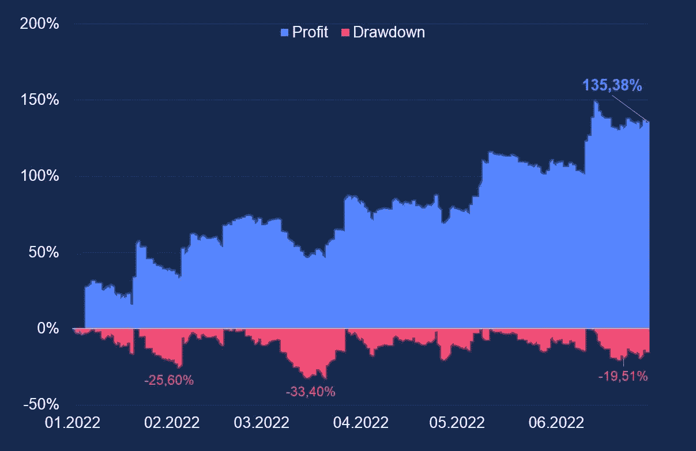
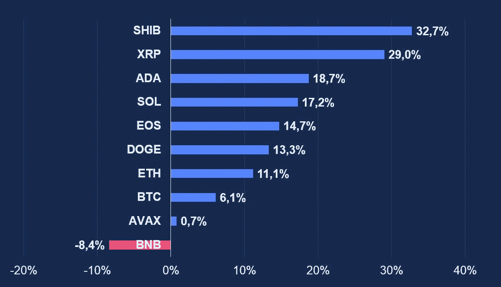
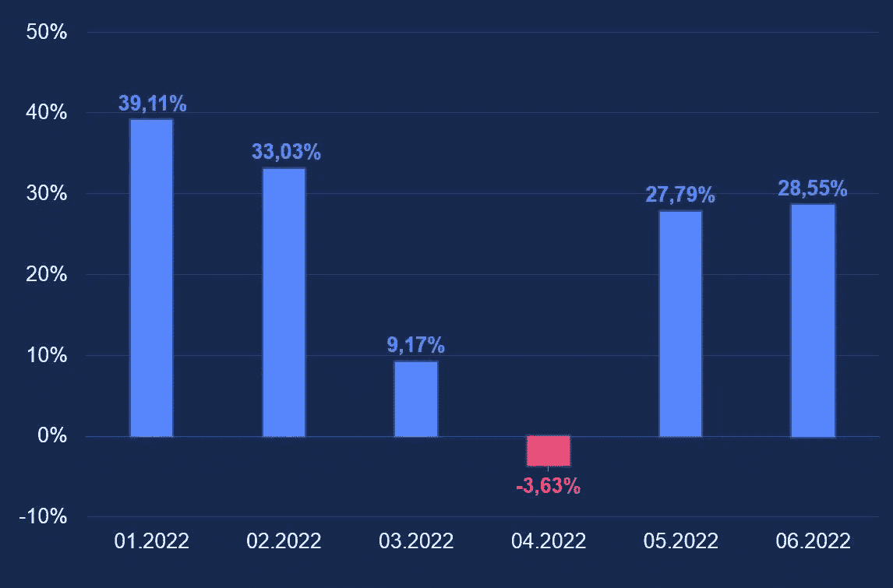

# 通过 Bot 交易在 1H 2022 年获得 130%的利润

> 原文：<https://medium.com/coinmonks/130-profit-in-1h-2022-on-bot-trading-38440f35671d?source=collection_archive---------3----------------------->

## AlgonautBot 结果

## 比特币在 2022 年上半年下跌了 58%

在超额完成 2021 年后，另一个隐秘的冬天已经到来。大多数替代币已经贬值了 80%,比特币下跌了 58%,跌破 20000 英镑。

原因是繁荣和围绕稳定的危机之后通常的市场冷却。美国美联储的政策发挥了重要作用——利率上升和“廉价资金”减少导致贵金属、股票和加密货币出现回调。

## AlgonautBot 结果为 1H2022

自 2022 年 1 月以来，我们一直关注 altcoins，并积极撰写相关文章。半年后，我们将交易工具的清单扩大到 10 种。目前我们交易 BTCUSD/ETHUSD/XRPUSD/ADAUSD/shib USD/DOGEUSD/SOLUSD/bnb USD/EOS USD/AVAXUSD。

替代硬币波动性更大，在市场回调和快速增长期间波动更剧烈。如果能应用于加密货币，它们的贝塔系数更高。

我们逐渐得出结论，市场上自动化交易的最佳选择是与大量的机器人进行交易。这不仅考虑了一种工具的多样化风险，而且增加了结果的稳定性。

在 6 个月内，10 种工具的 bot 投资组合产生了+135%的收益。最大提取率为 33%。60%的交易都在盈利。

最好的工具是 SHIBUSD、XRPUSD 和 ADAUSD。三种工具总共产生了 80%的收益。但经典的 BTCUSD 和 ETHUSD 的总收益率约为 17%。唯一不盈利的(-8.4%)工具变成了 BNBUSD。然而，这并不是将其排除在僵尸工具之外的理由。收益率分布不均，重要的是这些工具如何远距离交易。

## 风险管理

交易机器人并不等同于购买和持有加密货币。通过购买加密货币，投资者希望资产在未来实现多重增长。他购买后可以获得很大的提现(甚至 90%！).

Monthly Profit in 1H2022

自动机器人交易不像一个简单的购买。这是大量交易的组合，风险管理非常重要。这就是为什么在我们的策略中，我们特别控制一笔交易的风险大小。比如是交易保证金的 0.5%。这意味着一笔交易的最大损失可以是 1%。如果连续有 20 笔这样的交易，那么亏损可能是 1 -(0.99 ⁰) = 18.2%。重要的是要避免临界提取(超过 40–50%)，否则很难从中脱身。

出于这个原因，如果用户交易超过 4 种工具，我们使用每次交易小风险(设置中的低风险)。

我们正致力于创造 mega bot——它将同时包括 10 个仪器，并将有最少的设置。一键就能让你和 10 个机器人开始交易，这样你就能越赚越多。敬请关注更多更新！

## 使用 AlgonautBot 开始自动交易的 6 个步骤

1.  **参观**[**【algonautbot.com】**](http://algonautbot.com/?utm_source=medium&utm_medium=organic&utm_campaign=medium_articles&utm_content=article1_hist_270)并报名
2.  [**用 API key 连接你的币安或者 Bybit 账号**](https://algonautbot.com/dashboard/exchanges) 和 AlgonautBot。无需在任何地方转移资金— **机器人只会在你的账户上交易**。
3.  **购买不限制机器人数量的专业计划**。
4.  **查看你的美元对人民币期货**币安账户。你必须有一些 USDT 来交易。
5.  [**创建 10 个机器人**](https://algonautbot.com/dashboard/bots) **(每个仪器 1 个**)**与** **低风险**互为对方并启动它们。
6.  在设置中连接您的电报以通知交易。

你有什么没有币安期货账户或对交易有疑问？发送电子邮件至 support@algonautbot.com[了解更多信息。](mailto:support@algonautbot.com)

跟随我们，我们将讨论加密和算法交易。如何创建自己的 bot？如何检查是否有效？如何进行统计分析，预测结果？我们将来一定会报道它。

> 交易新手？尝试[加密交易机器人](/coinmonks/crypto-trading-bot-c2ffce8acb2a)或[复制交易](/coinmonks/top-10-crypto-copy-trading-platforms-for-beginners-d0c37c7d698c)