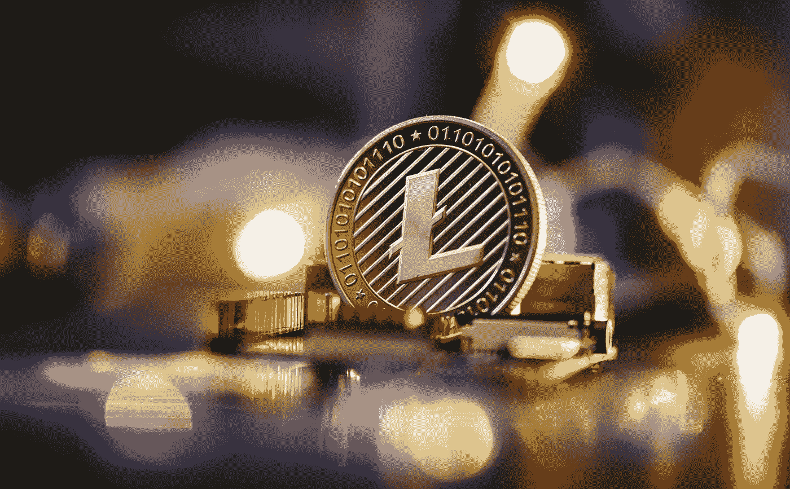

# 15 种加密货币你仍然可以挖掘！

> 原文：<https://medium.com/coinmonks/15-cryptocurrencies-you-can-still-mine-88c50282097c?source=collection_archive---------4----------------------->

Photo by [Michael Förtsch](https://unsplash.com/@michael_f?utm_source=medium&utm_medium=referral) on [Unsplash](https://unsplash.com?utm_source=medium&utm_medium=referral)

随着加密市场的不断发展，它的一些功能变得越来越不流行。工作验证(PoW)机制就是一个例子。以前，这种方法受到称赞，主要是因为它有助于权力下放。如今，PoW 在密码爱好者中越来越不受欢迎。

这部分是由于股权证明(PoS)的兴起。这个机制很多…