# Cosmos $ATOM 生态系统上的 15 个无令牌新项目

> 原文：<https://medium.com/coinmonks/15-new-projects-with-no-tokens-on-the-cosmos-atom-ecosystem-f77ab89b994?source=collection_archive---------1----------------------->

如果出现熊市，ATOM Ecos 持有人和投资者会怎么做？我们将坚持一个可靠的投资计划:努力赚钱并经常投资比特币和以太坊，了解更多关于加密货币的知识，并确定潜在的项目。Beehive 为社区聚集了关于 Cosmos $ATOM 生态系统中 15 个新项目的信息，这些项目还没有令牌。

> 从顶级交易者那里复制交易机器人。免费试用。

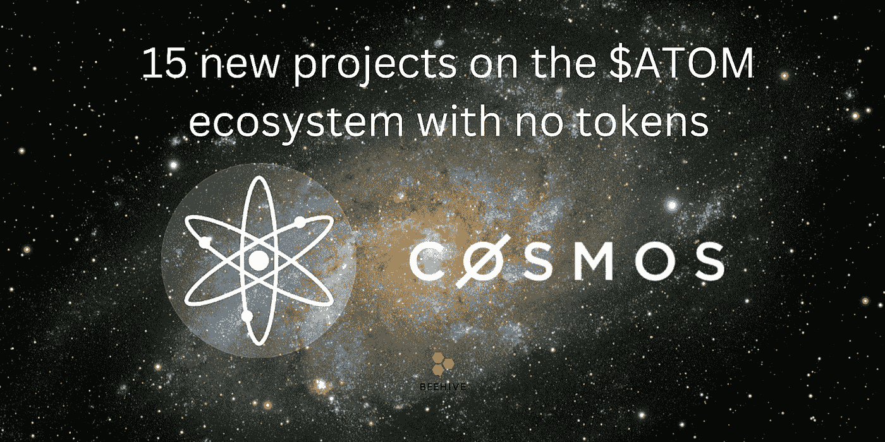

# 1.类星体

Quasar 是一个去中心化的点对点网关，可实现 IBC 式的收益创造，通过单一解决方案解决交易量、流动性和资本聚集问题。通过在 Quasar Token 持有者的控制下积极管理 Cosmos 生态系统，它将成为流动性提供商(LPs)提供资本和总收益的主要中心。

项目社区:[网站](http://quasar.fi/) | [推特](https://twitter.com/QuasarFi) | [媒体](/@quasar.fi) | [不和](https://discord.com/invite/Rn39NauP5w)

# 2.中子

Neutron 是一个区块链网络，它使用 CosmWasm 将智能合同集成到 Cosmos-family 区块链中。中子通过 IBC 协议与网络通信。Cosmos Hub 网络使用链间安全来提供中子安全(块验证)。

Cosmos SDK 框架用于创建中子。在 Tendermint BFT 之上，这是一个通用的框架，它简化了开发安全区块链应用程序的过程。它建立在两个基本原则上:模块化和基于能力的安全性。

中子 [$NTRN](https://twitter.com/search?q=%24NTRN&src=cashtag_click) 令牌生成事件预计于 2023 年在 Q1 发生

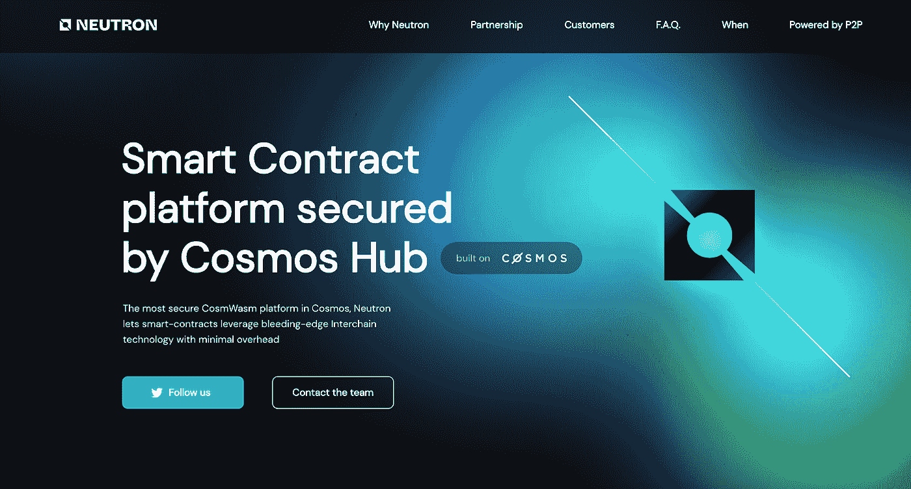

项目社区:[网站](https://neutron.org/) | [推特](https://twitter.com/Neutron_org) | [不和](https://discord.com/invite/gFq4aarTSD)

# 3.冒险故事

Saga 为远见者提供了实现其 Web3 目标所需的顶级工具和帮助。

在 Saga 协议的帮助下，开发人员可以获得一个单租户虚拟机，并立即将其部署到一个具有完全配置的验证器和适当激励的安全结构的特定区块链上。

saga XYZ——多元宇宙中的下一个 1000 链

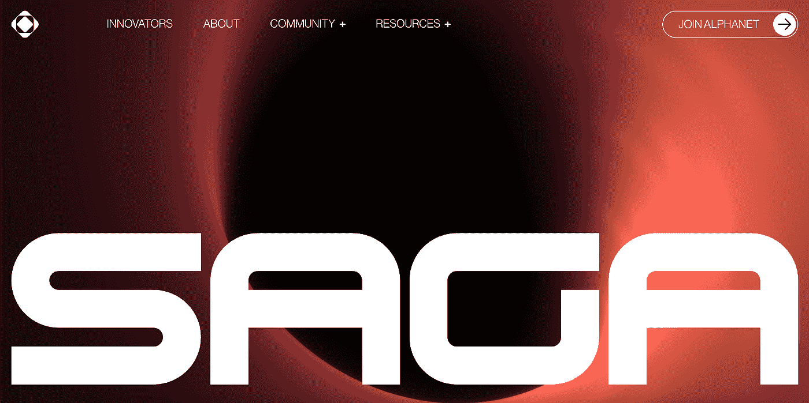

项目社区:[网站](https://www.saga.xyz/) | [推特](https://twitter.com/Sagaxyz__) | [媒体](https://medium.com/sagaxyz) | [不和](https://discord.com/invite/uHh8gfc56b)

# 4.超新星

通过使用 IBC 查询、ICA 和专有模块，Supernova 将使对宇宙的液体赌注成为可能。staking 资产的理想平台是 Supernova。

对于应用链上的所有原生硬币，Supernova 提供了液体赌注。

对于影子代币的可信服务，如自动复利和将它们用作稳定铸币的抵押品，请求助于 Supernova。

Supernova 为赌注资产提供了一个公平的互换。

Supernova 将演变成一个贿赂宇宙应用链管理的系统。

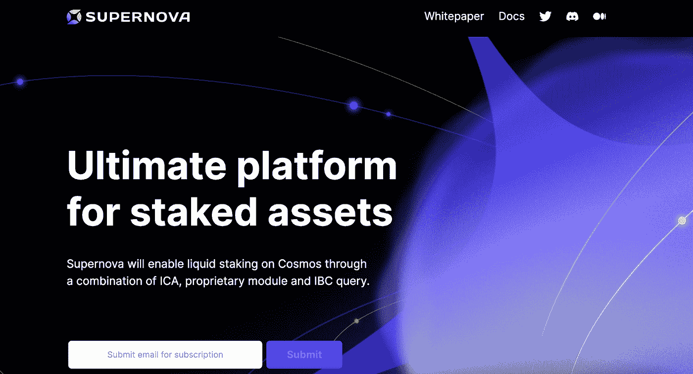

项目社区:[网站](https://www.supernovaprotocol.xyz/) | [推特](https://twitter.com/Supernovazone) | [媒体](https://medium.com/supernovazone) | [不和](https://discord.com/invite/2gj8fScWqD)

# 5.尺寸

迪姆森区块链平台是一个模块化的结算层，提供了快速启动作为宇宙生态系统一部分的神圣卷所需的所有工具和基础设施。引入一个全新的分散用例维度。

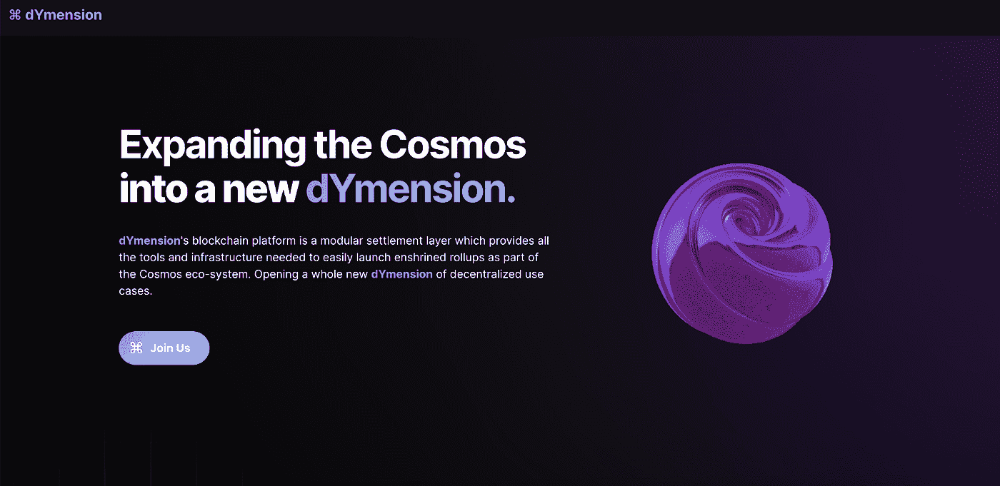

项目社区:[网站](https://www.dymension.xyz/) | [推特](https://twitter.com/dYmensionXYZ) | [媒体](/@dYmensionXYZ) | [不和谐](https://discord.com/invite/mvnh3YVa2W)

# 6.二元性

二元性是一种去中心化的交易所，它优先考虑资本效率和可扩展性，同时保护用户免受有害的价格操纵。通过双重性，流动性提供者和协议对流动性参数和分配有直观、精细的控制。它具有以下特点:

*   简单灵活
*   最好的 AMMs 和订单
*   共享流动性
*   MEV 保护和再分配

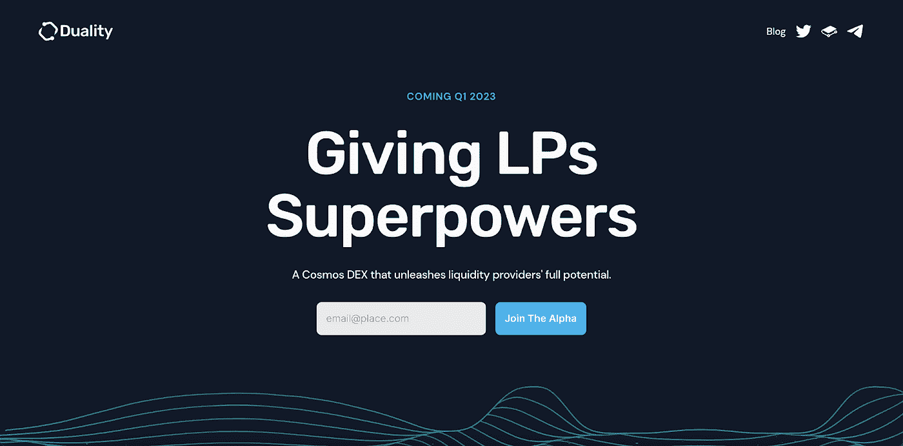

项目社区:[网站](https://duality.xyz/) | [推特](https://twitter.com/dualityxyz)

# 7.边缘协议

边际协议正在为 CosmWasm 网络创建分散式永久协议和多链边际引擎。

永久是第一个用例。另一方面，Margined 凭借其通用边际引擎设计，能够支持各种使用案例，包括:

*   泥炭田
*   动态 vAMM
*   利率互换
*   广义杠杆

项目社区:[网站](https://www.margined.io/) | [推特](https://twitter.com/margined_io) | [媒体](/@margined_io) | [不和](https://discord.com/invite/NsmHWB8vaJ)

# 8.产量

Yieldmos 通过自动计算回报来帮助投资者提高收益率。该协议通过在单一平台上识别、组合和打包机会，在整个宇宙生态系统中产生收益。

Yieldmos 提供非托管选项，允许用户继续成为其资产的唯一所有者，同时让他们工作。

关于宇宙生态系统及其他，Yieldmos 计划提供一整套策略。同样，他们打算在整个风险范围内推出收益产品，允许客户快速组合和对比收益机会，以创造他们想要的风险敞口。

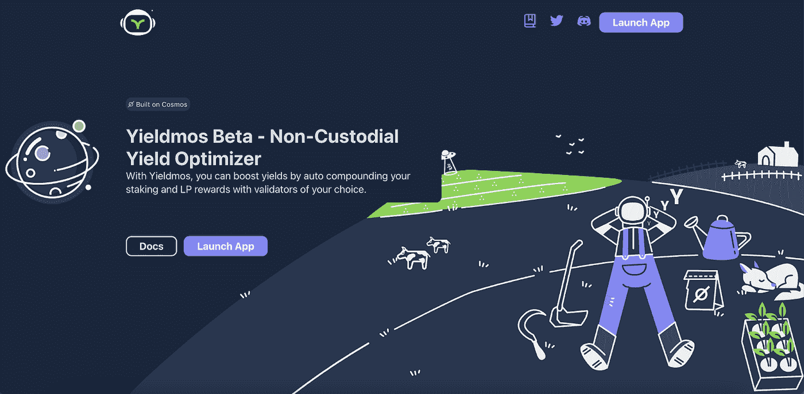

项目社区:[网站](https://www.yieldmos.com/) | [推特](https://twitter.com/yieldmos) | [媒体](/@yieldmos) | [不和](https://discord.com/invite/FPUzr9xjse)

# 9.熔岩网络

Lava Network 是一个区块链远程过程，称为缺乏信任的市场(RPC)。熔岩可以帮助向任何区块链传送请求。该市场由 Tendermint 拜占庭容错(BFT)共识和 Cosmos 软件开发工具包(SDK)创建的应用链驱动。

Lava 协议可以分为 4 个关键阶段，它们控制着消费者、提供者和验证者之间的交互和价值交换:

●配对和服务

●服务质量

●冲突检测和解决

●付款请求和结算

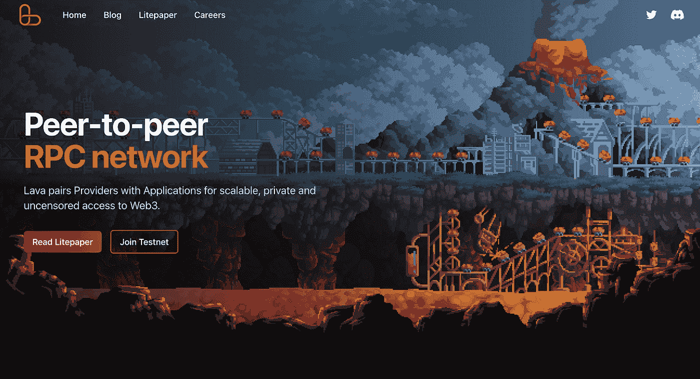

项目社区:[网站](https://lavanet.xyz/) | [推特](https://twitter.com/lavanetxyz) | [不和](https://discord.com/invite/5VcqgwMmkA)

# 10.奥洛站

OLLO Station 提供各种尖端交易工具和跨链投资组合自动化。为了提供有价值的服务和确保项目的未来，我们的设计基于创新和可持续的努力。

OLLO Station 的开发团队致力于开发实用、简单的交易工具。我们的服务使用户能够从 OLLO Station 直接控制和自动化他们的整个投资组合，包括跨链资产和头寸。

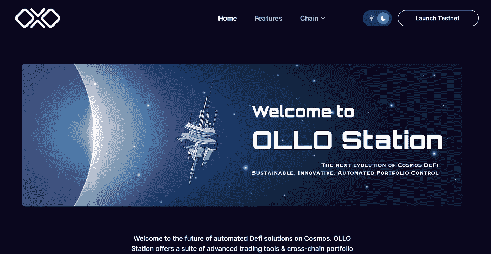

项目社区:[网站](https://www.ollostation.zone/) | [推特](https://twitter.com/OLLOStation) | [不和](https://discord.com/invite/GxBqZ9mSSm)

# 11.雷诺网络

LENO 是 Juno 网络上的一个完全分散的非托管流动性协议，允许用户轻松地借出、借入其加密资产并赚取利息。存款人向协议提供流动性，以便获得被动收入，并使用存款资产作为抵押品来借入其他受支持的资产。

Leno Network 不仅是一个借贷平台，它还为 Juno 生态系统提供广泛的服务。

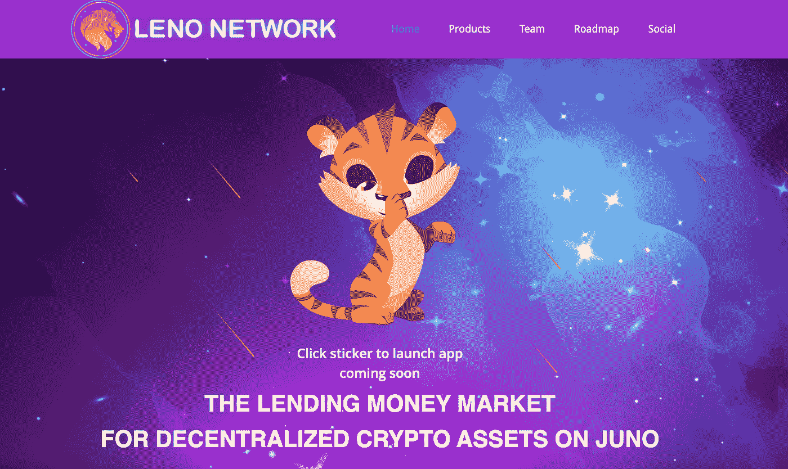

项目社区:[网站](https://lenonetwork.io/) | [推特](https://twitter.com/LenoNetwork) | [媒体](https://lenonetwork.medium.com/) | [不和](https://discord.com/invite/RCFnsSAC9h)

# 12.硒网络

Selenian Protocol 向其用户提供一系列 IBC DeFi 原语，旨在通过释放整个 IBC 生态系统的资本效率来最大化他们的回报。该协议使用户能够最大限度地提高利用其锁定的数字资产的效率和简单性。

我们的目标是在 IBC 生态系统中创建最方便用户使用的数字资产管理平台，专注于链间通信。为了实现这一点，Selenian 协议构建了一个基于 Cosmwasm 的 DeFi 堆栈，该堆栈最初包括赌注衍生品和基于赌注衍生品的抵押债务头寸(CDP ),以便为秘密网络和 IBC 生态系统创建一个安全、稳定的硬币。

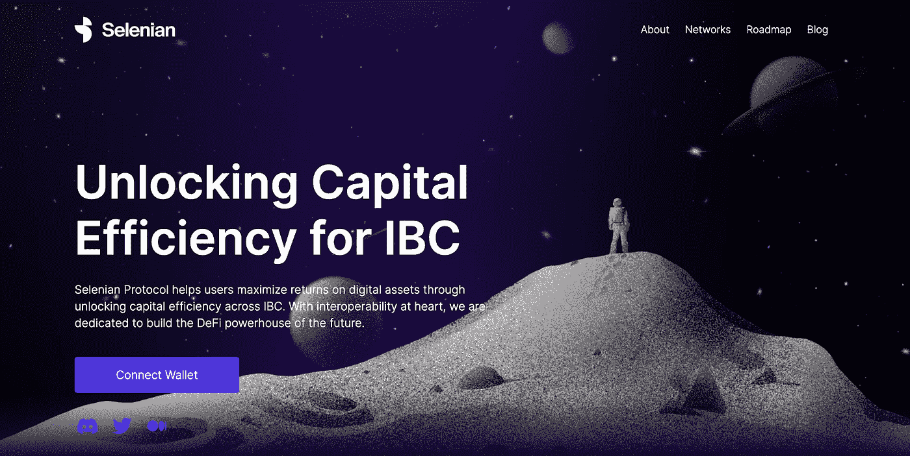

项目社区:[网站](https://selenian.network/) | [推特](https://twitter.com/SelenianNetwork) | [媒体](https://selenian.medium.com/) | [不和](https://discord.com/invite/PrUdPENRqk)

# 13.暴雪金融

暴雪金融是一个未来的平衡器，就像秘密网络上的 AMM 一样，将为用户提供有竞争力的价格，有吸引力和功能丰富的交易体验，以及可持续和零通胀的利益相关者增长计划。

一个类似于称为 Blizzard.finance 的平衡器的 DEX(去中心化交换)在秘密网络上运行。它的开发重点是:

*   为贸易商提供有竞争力的价格。
*   促进没有通货膨胀的增长模式，为交易者、有限合伙人和流动利益相关者提供长期、可持续的收益。
*   给所有消费者一个简单优雅的交易体验，同时给需要的用户提供复杂的工具。

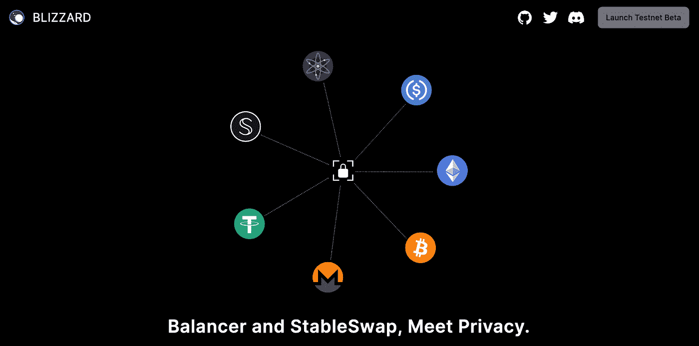

项目社区:[网站](https://blizzard.finance/) | [推特](https://twitter.com/BlizzardFin) | [不和](https://discord.com/invite/4y725JBfEw)

# 14.梅卡特克

Mekatek 正在为链间市场构建第一个最大总价值(MAV)市场。Mekatek 正在为链间未来开发一个开放的区块空间市场，该市场将能够表达广泛的偏好，并确保价值链中所有参与者的费用分配。

Mekatek 支持 MEV 守恒假说，根据该假说，MEV 存在于许多安全模型的交叉点上，既不能被创建也不能被破坏。让它变得透明，让人们选择如何传递价值是最好的行动方案。

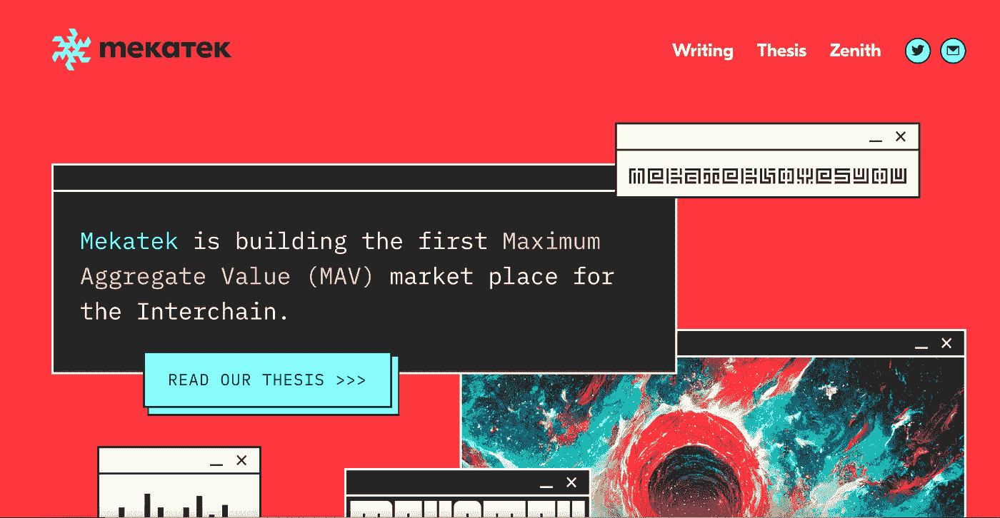

项目社区:[网站](https://meka.tech/) | [推特](https://twitter.com/meka_t3k)

# 15.薄膜

Membrane 是一个基于 Cosmos 的附属、杠杆和借用引擎，强调模块化和协议间的兼容性。它为用户提供了广泛的产品，包括杠杆收益农业，保证金交易，广义对冲，贷款和永久农业。

膜可以与整个宇宙生态系统中的 dex 集成，以给所述 dex 带来边际可用性，从而扩展膜 TVL。Membrane 的目标是在 2022 年 9 月推出，具有这份初步文件中概述的功能，但该网站尚未推出，甚至尚未公开。

项目社区:[Twitter](https://twitter.com/MembraneFinance)|[Medium](/@membranefinance)

# 结论

未来 Cosmos 生态系统的工作将集中在 Defi 堆栈上，特别是有助于提高流动性的 liquid staking，以及有助于提高 Cosmos 系统的可扩展性、可组合性和安全性的基础设施堆栈。

以上项目列表仅作为参考资料提供；它不构成投资建议。Beehive Research 将研究并告知社区更多潜在的项目。

🚀在[渗透](https://wallet.keplr.app/chains/osmosis?modal=validator&chain=osmosis-1&validator_address=osmovaloper1pz8wre7clpym5cz9ufpt6nvcayvspqqh7yw4y7&referral=true) 🧪 l [埃夫莫斯](https://wallet.keplr.app/chains/evmos?modal=validator&chain=evmos_9001-2&validator_address=evmosvaloper1nfx47fqnqpcarqwt7qn4fk0llc57vvh3wgg35c&referral=true)用蜂箱支撑并打桩🚀| [医疗集团](https://www.mintscan.io/medibloc/validators/panaceavaloper1tppl0m9tqpy04vdmhxk7gya90zfftj94vkyn2t) | [里松](https://www.mintscan.io/rizon/validators/rizonvaloper1gyrrvup6x3g732uhxq9x0qd4lyjjcs62j0kdhf) | [玛洛](https://t.me/beehive_maro) | [宝珠](https://staking.orbs.network/) ⭐️

**蜂巢研究**

[Linktree](https://linktr.ee/validatorbeehive)l[Global](https://t.me/Beehive_Global)l[Korea](https://t.me/ttcteamjna)l[Vietnam](https://t.me/Beehive_VN)l[Medium](/@beehive.validator)

> 加入 Coinmonks [电报频道](https://t.me/coincodecap)和 [Youtube 频道](https://www.youtube.com/c/coinmonks/videos)了解加密交易和投资

# 另外，阅读

*   [加密交易机器人](/coinmonks/crypto-trading-bot-c2ffce8acb2a) | [概率评估](https://coincodecap.com/probit-review)
*   [隐料斗替代品](/coinmonks/cryptohopper-alternatives-d67287b16d27) | [HitBTC 审查](/coinmonks/hitbtc-review-c5143c5d53c2)
*   [CBET 评论](https://coincodecap.com/cbet-casino-review) | [库科恩 vs 比特币基地](https://coincodecap.com/kucoin-vs-coinbase)
*   [折 App 回顾](https://coincodecap.com/fold-app-review) | [库币交易机器人](/coinmonks/kucoin-trading-bot-automate-your-trades-8cf0ca2138e0)
*   [如何匿名购买比特币](https://coincodecap.com/buy-bitcoin-anonymously) | [比特币现金钱包](https://coincodecap.com/bitcoin-cash-wallets)