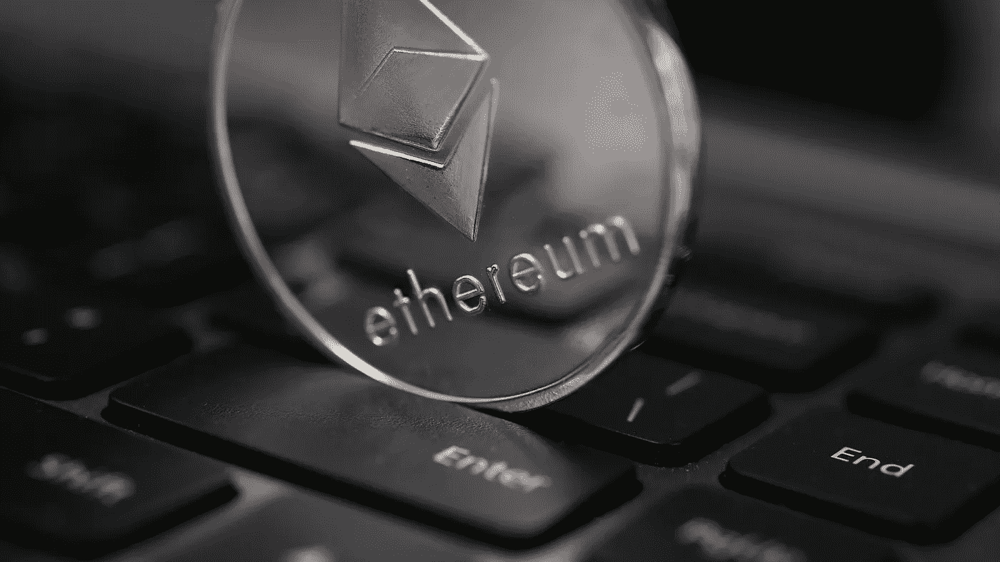
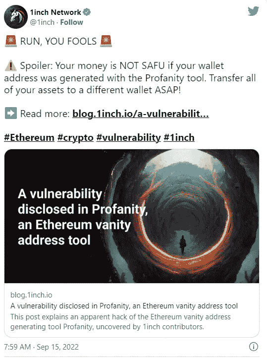
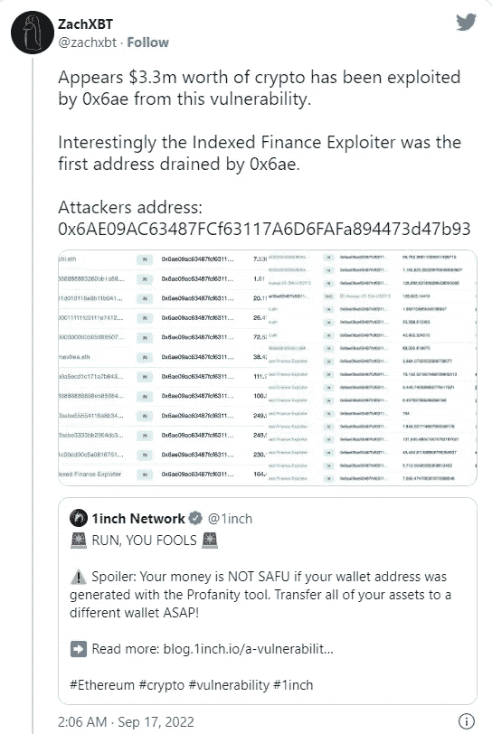
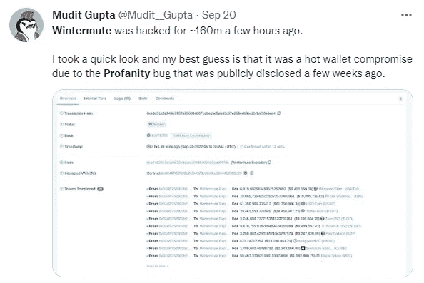
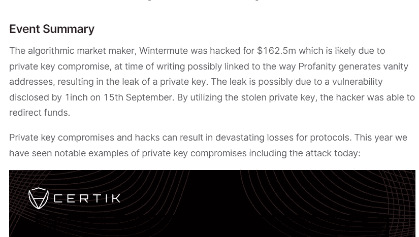
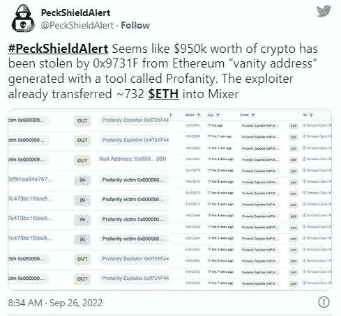
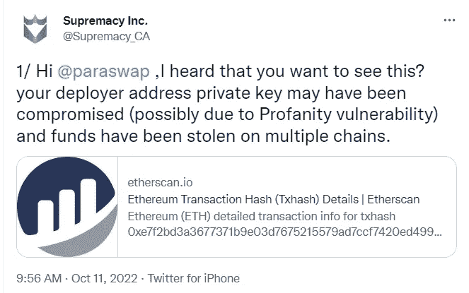
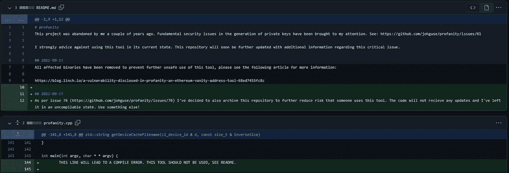
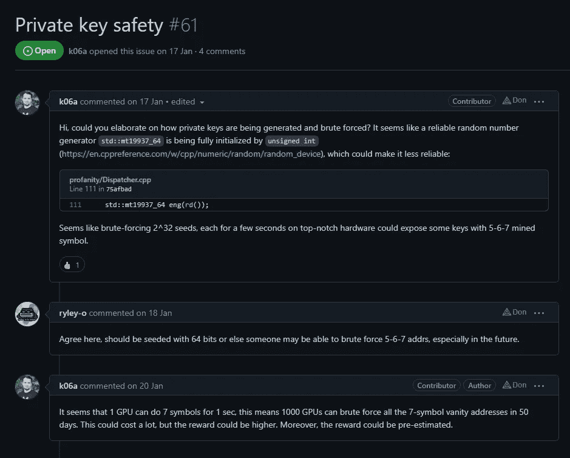
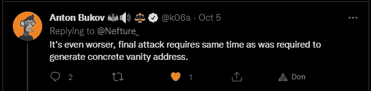

# 以太坊地址被黑三周损失 1.68 亿美元，你可能是下一个。

> 原文：<https://medium.com/coinmonks/168m-lost-in-3-weeks-to-an-ethereum-address-hack-you-could-be-next-5c1410bb0af2?source=collection_archive---------10----------------------->

尽管 DeFi/DEX aggregator[1 inch Network](https://medium.com/u/2c9a654f35d?source=post_page-----5c1410bb0af2--------------------------------)&区块链侦探 zachxbt 在 3 周前就发出了警报，但人们仍然持有他们制作的亵渎性以太坊虚荣心地址&它正在耗尽他们的钱包。

大约损失了 1 . 68 亿美元。这可能只是开始。

对正在发生的事情的全面解密:

# 《丛林奇兵》

> *首先，如果你不熟悉虚拟地址，它们是以太坊地址，看起来不像是难以辨认的数字或字母序列，而是由人们创造的一些部分(通常是前缀和/或后缀)来包含他们的名字或他们选择的任何东西。*

1.  **9 月 15 日**

2.**9 月 17 日**Zach xbt([Zach xbt](https://medium.com/u/abc63bd6b00f?source=post_page-----5c1410bb0af2--------------------------------)调查显示**价值 330 万美元**的密码因亵渎被盗

3.**9 月 20 日**温特穆特输给了黑客**1.625 亿美元**。 [CertiK](https://medium.com/u/48cc71597f8a?source=post_page-----5c1410bb0af2--------------------------------)

[source](https://www.certik.com/resources/blog/uGiY0j3hwOzQOMcDPGoz9-wintermute-hack)

4.**9 月 26 日**近**100 万美元因被 [PeckShield](https://medium.com/u/76bcf8c698ec?source=post_page-----5c1410bb0af2--------------------------------) 亵渎而被额外盗走**

****

**5.**10 月 11 日**QANX Bridge([qan platform](https://medium.com/u/bd98ca52a886?source=post_page-----5c1410bb0af2--------------------------------))遭受**116 万美元因亵渎虚空地址漏洞造成的损失****

 ****[## QANX Bridge wallet 披露分析[持续更新]

### 原帖:2022 年 10 月 11 日最后更新:2022 年 10 月 12 日

medium.com](/qanplatform/qanx-bridge-wallet-disclosure-analysis-continuously-updated-724121bbbf9a)**** 

****6.**10 月 11 日**supreme Inc .([supreme 官方](https://medium.com/u/db4e23425b80?source=post_page-----5c1410bb0af2--------------------------------) ) [披露【ParaSwap 的部署者钱包因一次恶意攻击而受损，目前**我们不知道损失了多少**](https://twitter.com/Supremacy_CA/status/1579742626961850368)****

********

****总共损失了近 1.68 亿美元，而且这还没有结束。****

****每一个仍在亵渎地址上有资金的人都可能成为下一个受害者。****

****原因如下:****

# ****固有的脆弱性****

****在发现**创建**私钥**的基本安全问题**后，亵渎开发者几年前放弃了这个项目:****

**简而言之，为了产生它们，他们只有有限的可能种子值。**

**使得它们极易受到暴力攻击。**

****

**[source](https://github.com/johguse/profanity/commit/186b9b27ab3e24a1899f648adcabcbf0e5f3131e)**

**Inch 的联合创始人 Anton Bukov 在一月份首次假设，在 50 天内**一组 1000 个图形处理器理论上可以**暴力破解**(~揭开)由亵渎产生的每个 7 字符虚荣心地址的私钥。****

********

****[source](https://github.com/johguse/profanity/issues/61)****

****实际上比那更糟:****

********

****9 月 30 日， [Amber Group](https://medium.com/u/a75c44287d9f?source=post_page-----5c1410bb0af2--------------------------------) 用简单的硬件展示了价值 1 . 62 亿美元的 Wintermute hack 有多快多容易，用一台 16GB 内存的 **Macbook** M1 复制了它。****

****他们总共花了不到 60 个小时。****

**** [## 利用亵渎的漏洞

### 2022 年 9 月 20 日，一条推文指出 Wintermute 被黑了约 1 . 6 亿美元。一天后，在一个后续的推文中…

medium.com](/amber-group/exploiting-the-profanity-flaw-e986576de7ab)**** 

****所以，正如 1inch 所说**“跑吧，你们这些傻瓜！”**并告诉你的朋友、家人和你参与的 DeFi 协议也这样做！****

# ****关于我们:****

> *****ne future 是一家* ***WEB3 网络安全公司*******用我们的*** [***元掩码扩展***](https://www.nefture.com/)**和*****让品牌通过【接入 WEB3********
> 
> ********我们专注于* ***【区块链】技术*** *让您的项目成真* *和* ***网络安全*** *让您的 web3 之旅完全安全:从构建智能合同、审计、创建网站、Dapps、不和谐审计和保护，……到安全漏洞调查和管理！********
> 
> *******【https://agency.nefture.com/】[*和我们一起开始你的 web3 之旅*](https://agency.nefture.com/)*******
> 
> *********跟我们团队订个电话:****[*https://nefture.calendesk.net/*](https://nefture.calendesk.net/)*******

> ******交易新手？试试[加密交易机器人](/coinmonks/crypto-trading-bot-c2ffce8acb2a)或[复制交易](/coinmonks/top-10-crypto-copy-trading-platforms-for-beginners-d0c37c7d698c)******