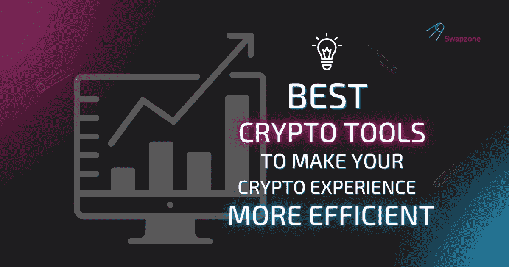

# 18 款最佳加密工具，让您的加密之旅更精彩

> 原文：<https://medium.com/coinmonks/18-best-crypto-tools-available-now-to-make-your-crypto-journey-better-af905451006e?source=collection_archive---------25----------------------->

在加密行业取得成功需要承诺、专注和极大的耐心。像所有其他行业一样，有赢家和输家。虽然有些人已经掌握了密码市场的交易艺术，但其他人几乎无法生存。加密市场是不断变化的，所以不管你是专家还是新手，使用加密工具是驾驭市场的最佳方式。

**加密工具**是一些平台和服务，可以帮助您监控加密市场，用有价值的资产构建您的投资组合，管理您的资产等等。你为投资或交易旅程选择的加密工具可能决定你整个投资组合的成败。

在每个投资者旅程的某个时刻，他们可能会使用至少一个加密工具。随着加密应用的增加，对加密工具的需求也将增加，因为新的硬币将被开发出来。投资者可以在投资新硬币之前使用加密工具对其进行监控。加密工具也可以用来追踪其他更成熟的硬币。

在本文中，您将了解业内最好的加密工具。这些工具中的每一个都有独特的功能，这使得它们在加密领域取得成功是必不可少的。因此，无论你是想监控、管理、盈利、建设还是跟踪市场，总有一款工具适合你。

# 加密 API

对加密市场进行计时几乎是不可能的，但是加密 API 增加了你成功的机会。加密 API 通过将复杂的加密数据转换成易于阅读、理解和操作的信息来帮助交易者和投资者。有了来自 API 的数据，你可以创建一个成功几率很高的交易策略。API 工具与加密市场交互，产生有价值的信息，您可以使用这些信息来了解市场。

这个工具为交易者提供了一份详细的市场状态报告，以及其中值得注意的趋势。API 跟踪特定硬币和一般加密市场的价格变化。它还为用户提供了详细的历史数据，他们可以使用这些数据来计划下一步行动。

一些加密 API 适用于各种加密货币，而另一些则仅适用于特定的加密货币。您选择的加密 API 应该符合您的目标，因为每个 API 都是为特定目的而构建的。

下面是一些业界流行的加密 APIs

*   [**Swapzone 加密交换 API:**](https://swapzone.io/partners/exchange-api) 为任何加密服务、app 或网站提供充分的加密交换服务的一体化解决方案。
*   CoinAPI : CoinAPI 提供快速、可访问、可靠的加密市场数据。
*   这个免费的平台展示实时数据，你可以在做任何投资前查看。从加密图表到价格到市值，以及介于两者之间的一切，CoinGecko 是一个研究加密数据的伟大平台。
*   **Alpha Vantage:** 这个 API 工具提供了不同金融领域的有用数据，包括股票和密码。

加密 API 是一个有价值的工具，应该放在每个投资者的工具箱里。

# 加密推荐程序

一个加密推荐程序是一个工具，让你在网上赚钱的行业。你只需要找到一个有推荐项目的平台，注册，然后把人推荐到这个平台。您将通过您的链接为每个使用该平台的人付费。

**加密转介程序示例:**

*   [**Swapzone 加密附属计划**](http://swapzone.io/partners/referral-program) :允许以加密为中心的流量货币化，并从通过推荐链接持有的每个加密交易中获利。
*   **CEX。IO 比特币推荐计划:**通过这个推荐计划，你可以为每个在 CEX.IO 上交易的人赚钱。
*   **Coinbase.com 比特币基地会员计划:**该计划为新用户在前三个月支付的所有交易费用支付 50%的佣金。
*   **ChangeNOW 推荐计划:**不同的附属工具，从制作高质量的加密和面向交换的内容中获益。

# 加密部件

类似于加密 API，加密小部件提供了关于加密市场的有价值的信息。加密部件向您显示实时加密价格，您可以在购买前查看。拥有关于加密市场的实时信息会使你更容易实施交易策略。

您可以使用加密小工具无缝跟踪您最喜爱的加密货币。当你想知道一枚硬币的价格时，不用每次都去研究，你只需要看看这个小工具就可以了。

加密部件有多种形式。有些可以放在网站上，有些则以手机应用程序的形式出现。插件插件对网站所有者来说很棒，因为它允许他们通过在网站上放置插件来赚钱。当人们访问该网站时，他们会获得有关加密市场的实时数据。

手机应用加密小工具可以直接安装在你的手机上。你可以使用这个应用程序在一天中的任何时间查看加密市场的数据。有了手机应用程序加密工具，你甚至不用打开浏览器就可以追踪硬币的价格。

**加密小部件示例:**

*   **coin market cap Widgets:**coin market cap 是业内最大的加密平台之一。自 2013 年以来，该平台一直在提供有关加密市场的可靠数据。您可以将 CoinMarketCap 小部件添加到您的网站，或使用此小部件访问网站，免费查看有价值的加密信息。
*   **简单的比特币小工具:**这个免费的移动应用小工具是为 Android 设备创建的。它可以让你全天跟踪你最喜欢的加密货币的价格。
*   [**Swapzone 加密交换 Widget:**](https://swapzone.io/partners/exchange-widget) 在 app 或网站中内置交换服务的工具，为加密业务提供额外的收入和服务扩展。

# 加密交换聚合器

加密交易所聚合器是一个平台，它比较其他交易所的价格，然后向用户提供最佳价格。这个工具解决了加密行业的许多问题。例如，大多数投资者很难在集中交易和分散交易之间做出选择。此外，搜索不同的交易所以找到最佳利率是一个繁琐的过程。加密交换聚合器在一个平台上解决了所有这些问题。

通过向用户提供集中和分散交易所的价格，加密交易所聚合器能够大大减少交易者寻找最佳价格的时间。

在任何行业，时间都是金钱，尤其是在加密行业。在寻找好的汇率上浪费的每一秒钟都是市场剧烈变化的一秒钟。你可能已经知道，密码市场非常不稳定。这意味着它是不断变化的，因此交易者需要监控它的变化。花几分钟试图找到最佳汇率的交易者是在浪费时间，很可能是在赔钱。这就是加密交换聚合器的用武之地。有了这个工具，交易者就不需要花时间去寻找最好的价格，因为他们知道他们可以在聚合平台上找到。这使得交易变得容易多了。

加密外汇聚合器还消除了在多个平台上创建新账户以寻找最佳汇率的压力。交易者可以使用这个平台无缝地发现加密空间中的最佳价格。流行的加密交换聚合器包括:

*   [**swap zone**](https://swapzone.io/)——超过 1000 个密码资产的即时交换不需要 KYC 或注册。
*   Unizen
*   1 英寸交换

# 投资组合跟踪器

这个加密工具是伟大的投资者谁想要建立和监控他们的加密投资组合。投资组合跟踪器是一种帮助投资者监控其资产并做出明智决策的工具。

它们是大多数投资者的常用工具，因为它们可以让你充分了解你的投资组合的状态。现在有几种投资组合追踪器，它们都有自己独特的功能。然而，它们都服务于一个目的；帮助你追踪你的投资组合。

投资组合跟踪器允许你查看你的加密资产的总价值，然后你可以用它来精确地计算你的净资产。许多投资者将钱存入 crypto 并不知道他们投资的真实价值，但是有了投资组合跟踪器，你可以随时检查你的资产价值。

你可以在投资组合追踪器中找到的另一个功能是 24 小时投资组合评估，它可以让你看到你的投资组合的价值在过去 24 小时内发生了多大的变化。投资组合追踪器还允许你监控投资组合中每个硬币的表现。这样，如果你的投资组合表现不佳，你就能找出影响它的原因。

这里有几个流行的投资组合跟踪工具，你可以试试:

*   这是一个免费的基于网络的投资组合跟踪平台，由于其经济性和易用性，是投资者的普遍选择。Cointracking 与许多交易所兼容，这意味着它可以很容易地与您选择的交易所集成。
*   [投资组合](https://blockfolio.com/) **:** 这是业内最大的投资组合追踪器之一。该平台只在手机上可用，可以用来跟踪你的投资组合，阅读加密新闻，等等。Blockfolio 也是一个非常安全和完全免费的投资组合跟踪器。

# 钱包

你的钱包是最重要的加密工具。它是你资产的仓库，所以你必须确保它是安全的。您存储硬币的位置决定了您的加密之旅将会有多顺利。加密钱包是存储您的密码的银行。当你为你的加密货币选择钱包时，你为你的法定货币选择银行所付出的努力也应该被应用。如果你错误地选择了一个不安全的钱包，你的加密资产将遭受后果。不安全的钱包容易受到黑客的攻击。这些黑客可以一举窃取你钱包里的所有资金，所以你的钱包一定很安全。如果你没有选择正确的钱包，每一个加密工具都变得无关紧要。你可以使用所有你想要的聚合器、小部件和 API，但是如果你的钱包不安全，你可能会浪费你的时间。

以下是一些可靠的加密钱包:

*   [Guarda Wallet:](https://guarda.com/) 一个安全的加密钱包，具有所有必要的加密操作能力:可以下注、交换、赚取和购买数以千计的加密资产。钱包支持 40 多种主要的区块链和所有领先协议的令牌。
*   [NOWwallet:](https://walletnow.app/) 这款基于手机的非托管加密钱包也是一款全功能解决方案，允许你存储、购买、出售和持有加密数据。NOWwallet 不会收集任何个人数据，并保证隐私和安全。
*   [Metamask:](https://metamask.io/) 这是一个存放加密货币的绝佳钱包。它是可靠的、易于使用的和可访问的。Metamask 的缺点也是它的优点。该平台允许您存储任何您想要的 ERC20 令牌，但不存储建立在其他区块链上的密码。这意味着你不能在 Metamask 上存储比特币之类的硬币。
*   Exodus: Exodus 在其平台上支持多种加密资产。它可靠、高效且易于使用。
*   [莱杰 Nano S](https://www.ledger.com/) **:** 这个免费的硬件钱包正是你需要的，可以让你完全免受黑客攻击。钱包仍然与利息分离，使得黑客无法访问它。

在选择了一个可靠的加密钱包之后，接下来的事情就是尽你所能来保护它。你可以通过不公开机密信息来做到这一点，比如你的私钥。你是唯一应该知道你的私人钥匙的人。

上面列出的加密工具对任何想开始或改进他们的加密投资策略并提高他们交易的整体胜率的人来说都是完美的。

> 交易新手？尝试[加密交易机器人](/coinmonks/crypto-trading-bot-c2ffce8acb2a)或[复制交易](/coinmonks/top-10-crypto-copy-trading-platforms-for-beginners-d0c37c7d698c)