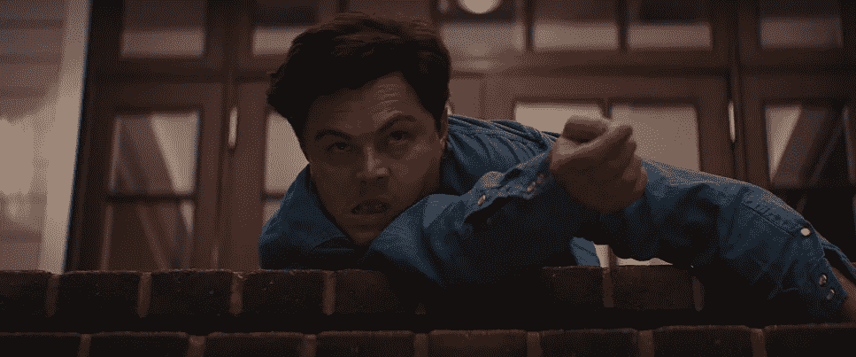
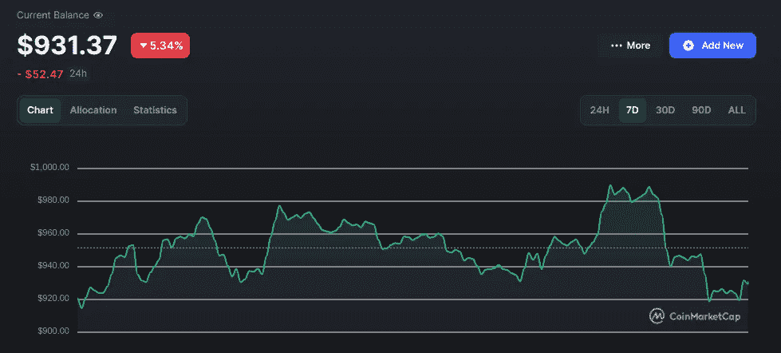
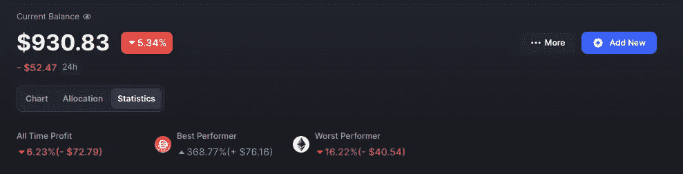
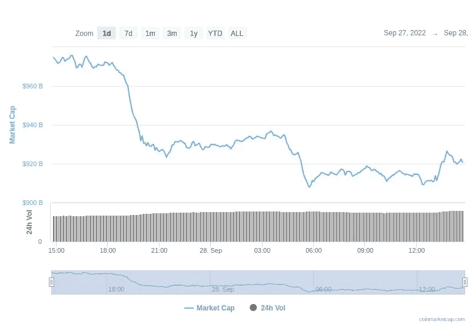
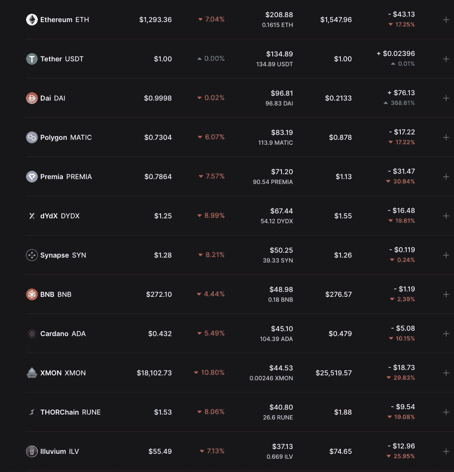
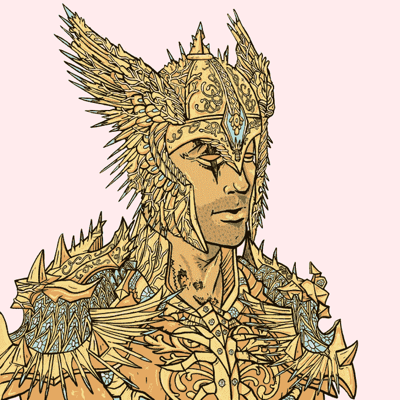
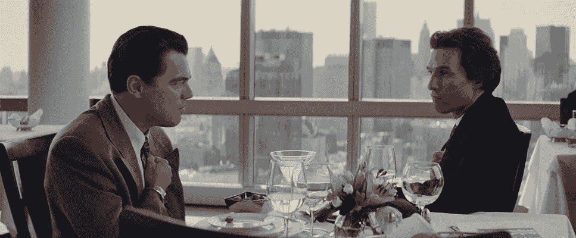

# 从 1k 美元到 10 美元的加密挑战:投资组合更新周#3 |赛特熊结束

> 原文：<https://medium.com/coinmonks/1k-to-10-crypto-challenge-portfolio-update-week-3-end-of-septem-bear-e2abcb865d74?source=collection_archive---------0----------------------->

嘿大家好，

第三周更新时间到了。通过加密投资将 1000 美元变成 10000 美元的旅程进行了近一个月，我们有了一个糟糕的开始。

Weekly portfolio chart

DAI represent the profits from the Ethereum put

血腥的九月，可以说是 crypto 历史上最糟糕的一个月，即将结束，你不能说它没有达到预期。这是又一个 f-d 上升的一周，从事情的发展来看，还会有更多的事情发生。经济一塌糊涂，一切都指向全球衰退，货币大幅贬值，通货膨胀对大多数国家来说仍然过高。

在这种情况下，你可以想象挑战并没有那么大。在我写这篇文章的时候，一切都在流血，我现在是负 7%,我做的每一笔投资都是亏损的。这比听起来容易。按照目前加密市场的运行方式(所有东西都一起涨一起跌)，几乎任何硬币组合都会得到类似的结果。查看过去 24 小时的全球加密市值(所有加密的总市值)(下图)。无论如何，我也有失败的时候，我不怕承认。

# 快速回顾一下我们是如何来到这里的

## 高估了合并对普通加密市场的影响。

我相信这样的看涨事件会给市场带来某种积极的情绪。这至少会消除一些恐惧，让我可以在风险较小的情况下投资低市值股票，如果不能创造积极的势头的话。

## **渴望以太坊生态系统币因为我怕错过一个好的切入点**

我之前解释过这一点，但基本上我认为大多数高市值股票目前都被低估了。让合并硬币与众不同并在当时值得投资的是，合并可能是一种催化剂。其余的加密市场可能会停留在这些水平很长一段时间(由于目前的市场状态)，所以我可以放弃购买机会，因为它们很可能在未来再次出现。另一方面，合并硬币(如 ETH 和 Polygon)可能会看到合并后的反弹，这将推动它们达到更高的价格，并在整个熊市中保持在这些水平附近。

换句话说，我认为以太坊有可能在 2000 美元左右运行，Polygon 有可能在熊市的剩余时间在 1 美元左右运行，就像他们一直在 1300 美元和 0.8 美元左右运行一样。

这并不是最理想的结果，但我并不太在意。我在我认为公平的价格水平上购买了 ETH 和 MATIC 的合适尺寸。

## 在明显不是时候的时候，过度倾向于低帽

像 Premia，XMON，Synapse，dYdX，Thorchain 和 Illuvium 这样的头寸在市场下跌时会大量抛售。我原本预计宏观经济会稍微好转，而不是稍微恶化(指 CPI 数据)，主要是因为能源价格下降。我错了。看起来没有多大区别的东西可能会对低市值股票产生巨大影响，这正是发生的事情。

## 没有获利

挑战的第一周，Premia 接近+100%。Synapse 也有大约+50%的份额。我没有获利，而是一直拿着包，现在两个包都出现了赤字。不要误会我的意思，他们是非常可靠的项目，我认为他们有 10 倍以上的潜力，但我认为在这种市场条件下这 10 倍会到来是愚蠢的。

## 救世主:以太坊合并前的 put

我买了一个以太坊看跌期权，回报率为 369%，净利润为 75 美元，让我在这场挑战中活了下来。上周讲了这个剧[。](/p/79ddce083cbd)

# 投资组合

以下是投资组合的当前状态以及我们目前所处的位置:

让我们一个一个地检查每枚硬币:

## 以太坊和多边形

我刚才说的合并令牌。我相信我买了他们两个的好价格点，即使我现在严重亏损。事实上，在我看来，他们已经定价出了大部分的合并收益，这使得他们比他们的对手更被低估。我拿着。

## 溢价

到目前为止，这个挑战的主角，一个真实的兴衰故事。这是我投资组合中最低限额的硬币之一，因为我实际上使用过他们的平台，我相信他们有着惊人的潜力。你永远不会知道低上限，但我相信我得到了一个公平的价格点，所以我持有并等待项目增长。

## dYdX

有时候很容易觉得一个令牌不能再低了。如果你看基本面指标，dYdX 一直是顶级 DeFi 项目之一，但他们的交易处于历史低点。我很想保留它，但我在不久的将来看不到任何真正的催化剂，他们的象征经济学很烂。他们将在不久的将来的某个时候在宇宙上移动到他们自己的链，但是首先他们在二月有一个象征性的解锁。因此，在它变得看涨之前，它可能会变得看跌。我可能只是想尽可能在本周卖出最好的价格。

## 突触

我所有投资中表现最好的。他们还在建设，我还在坚持

## BNB

没什么特别的，我最常用它作为一个“指数”硬币。不反对卖掉它以获得更好的机会

## 卡尔达诺

Vasil Hard Fork 很成功，我看到 Cardano 在 Twitter 上越来越流行(尤其是 Cardano NFTs)。人们开始意识到它的技术优于以太，特别是最近的集中化问题。它仍然缺乏网络效应，这是我一直关注的。我持有，如果我看到增长，我会购买更多，或者进行生态系统投资。

## XMON

SUDO 空投游戏仍然是现场直播。本周我会更多地关注 Sudoswap，然后再做决定。如果像我相信的那样，有一个被低估的空投机会，我会买得更多。

## Thorchain 和 Illuvium

仍然是伟大的项目，但可以换成在短期内有更积极催化剂的代币。可能会卖出去。

## 230 美元现金

我本周没有采取任何行动，因为我觉得市场风险太大。我对自己的现金数额很满意，尽管我希望有一次期权交易能让我至少拿到 300 美元。如果我看到有价值的东西，我会扣动扳机。主要关注永久期货的看跌或做空。现在是积累时间，现金是我投资组合中最重要的资产。

# 那么下一步是什么？

随着全球经济陷入混乱，衰退的可能性与日俱增，看起来我们可能会在很长一段时间内处于熊市。所以我打算这么做:

*   我们正处于良好的购买水平，我们可能会达到甚至更高的水平。我将开始在我认为最被低估的项目中进行 DCA，直到我的大部分现金被配置完毕

我主要是看以太坊，可能是卡尔达诺，可能是 ATOM(我一会儿会讲到)，Solana，可能还有 Polygon。在我看来，坚固的第 1 层和第 2 层是最安全的赌注，并且将会持续很长时间(至少在我们达到重要的采用点之前)

*   **对于我打算长期持有的项目，如果我对自己的切入点感到满意，我会开始利用他们的 DeFi 能力来赚取收益。这也将帮助我探索项目生态系统中的机会，并熟悉网络**

主要是指我上面提到的硬币，我想在积累的同时最大限度地提高回报，并直接体验生态系统。例如，我从未真正使用过 ADA 生态系统。我没有探索过宇宙或波尔卡多特的可能性。我对索拉纳的经验有限。所有这一切都将改变。我将成为这些平台上的活跃用户，在这里测试一些东西并报告我的印象。

*   **寻找因市场条件而低于公允价值交易的廉价机会。我希望购买在熊市期间抛售的公用事业币，使利用公用事业的成本更低。让我举两个例子来解释我的意思:**

Seedify.fund 是一个为投资者提供平台的平台，允许他们投资 IGO(初始游戏发行)。这意味着你可以成为区块链博彩项目的早期投资者，这些项目还没有面向大众。你需要持有一定数量的种子代币才能进入。第一级要求你持有至少 250 英镑，而第二级要求你持有至少 1000 英镑。那么，这种访问当时要花多少钱，现在又要花多少钱呢？ATHs 的第 1 层为 3750 美元，现在为 500 美元，ATHs 的第 2 层为 15000 美元，现在为 2000 美元。同样的机会更便宜，只是因为令牌掉了。

另一个例子是我经常提到的 **Sudoswap** airdrop。1 XMON → x 数量的 SUDO，但 XMON 越便宜，我参与空投的成本就越低，机会就变得越有利可图。

# 我希望进入的项目

## 当然是 ATOM

他们更新了他们的白皮书，并发布了 ATOM 2.0，这是宇宙生态系统的更新版本，以及 ATOM 令牌的新的和改进的令牌组学和实用程序。这真是一个令人着迷的计划。我在上一篇文章中提到过我喜欢 Cosmos，但没有接触过 ATOM，因为它的效用有限，而且令牌学不好。现在情况不同了，Cosmos 可能会提供加密行业中最独特的价值主张之一。我本来打算做一个分解，但几乎每个人都有，所以我只是要链接我在这个主题上找到的[最好的](https://twitter.com/youssef_amrani/status/1574773735999012866) [资源](https://twitter.com/TheDeFinvestor/status/1569360750107570176)(3 个链接，三个伟大的线程)。

## 可能是灰尘

这是一个你们大多数人都不知道的象征。这是德戈斯 NFT 生态系统的本土标志。DeGods 是 NFT 排名第一的索拉纳项目，也是世界排名前五的项目。他们目前正致力于发布他们的第三个系列，名为 y00ts，这已经是有史以来最热门的 NFT 系列之一。唯一剩下的事情就是展示艺术。我不是很喜欢 NFT 亲民党的收藏，但 DeGods 是整个 NFT 空间中我非常看好的一个项目。由于购买 DeGod 是不可能的(底价是 345 索尔，按目前的价格大约是 1 万美元)，购买灰尘是接触这个项目的唯一途径。灰尘有一些独特的表征和效用，如果 y00ts 和 DeGods 保持健康(我敢打赌他们会的)，应该会有很大的帮助

A DeadGod. Objectively one of the best arts in the NFT game

# 本周的计划

最后，由于市场条件迫使我更多地转向价值投资，我将深入研究加密基本面分析，并学习如何最大限度地利用令牌终端和 block explorers 等工具。当然，我会围绕我发现的任何有趣的东西创作内容。

不管怎样，今天的节目就到这里了。

过去几周市场对我们来说特别艰难，我预计短期内情况会保持不变。

别担心。这是寻找机会并为即将到来的加密革命做好准备的最佳时机。别搞错了。毫无疑问，加密革命即将到来。这是时间的问题，不是如果的问题。

还怀疑？我可能有些东西会改变你的想法。请继续关注，本周的主题将是为什么最好的日子就在我们面前。

**一如既往，如果你想实时看到我的动作，获得挑战的实时更新，了解我对 crypto 和 web3 的总体想法，并与我互动，请关注我的** [**Twitter**](https://twitter.com/WolfOfWalletSt) **。注意安全，下周见！**

*记住:这不是财务建议。内容纯属娱乐目的。另外，我知道这张图片不是来自华尔街之狼。它只是看起来很酷。*

> 交易新手？尝试[加密交易机器人](/coinmonks/crypto-trading-bot-c2ffce8acb2a)或[复制交易](/coinmonks/top-10-crypto-copy-trading-platforms-for-beginners-d0c37c7d698c)