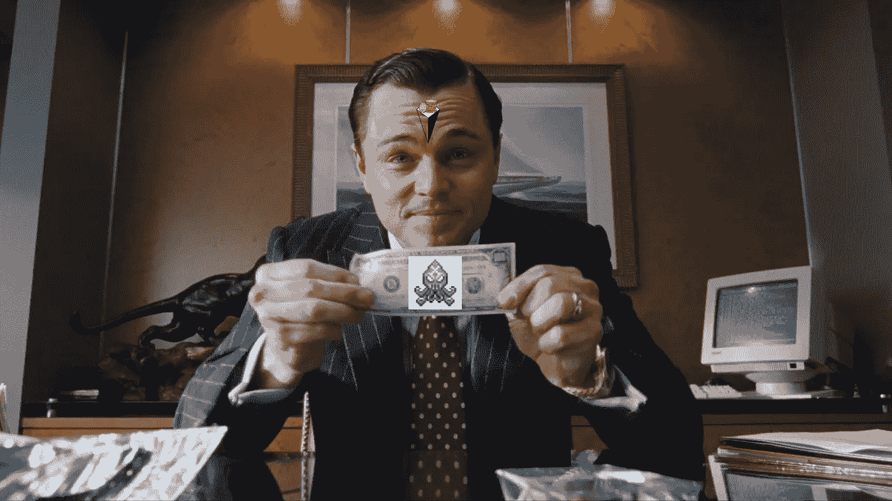
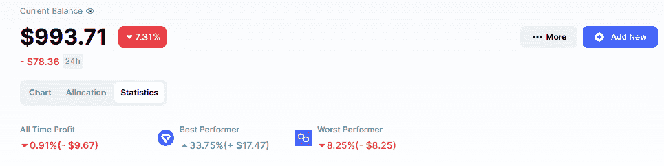
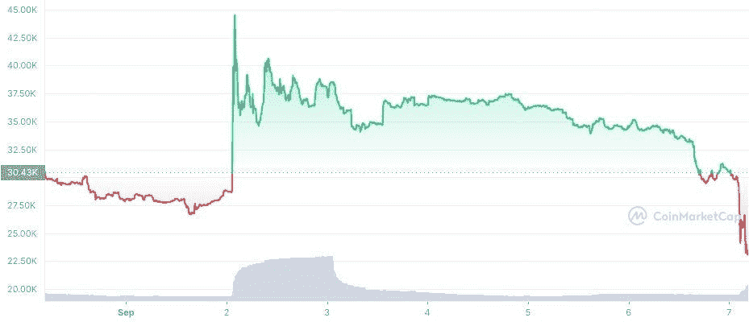
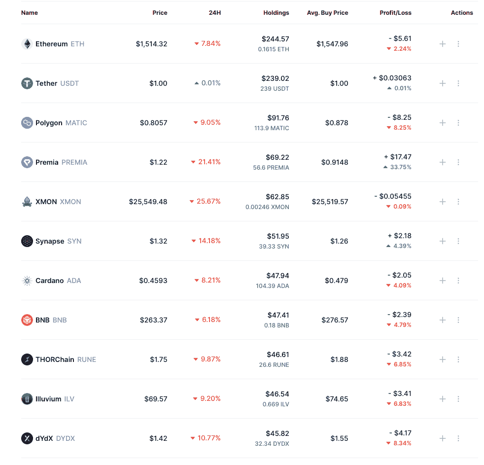

# $1k 至$10k 挑战第 3 天更新:Sudo 游戏

> 原文：<https://medium.com/coinmonks/1k-to-10k-challenge-day-3-update-the-sudo-play-139b293786d2?source=collection_archive---------5----------------------->

*这篇文章是我的$1k 到$10k 挑战赛系列的更新。全系列，走* [*这里*](/@thewolfofwalletstreet) *。*

嘿大家好，

市场现在正遭受重创，之前的所有收益都化为乌有。幸运的是，投资组合仅下跌了 1%左右(这主要归功于过去几天溢价的飙升)。

无论如何，这就是我保留 300 美元现金的原因。现在，我看到了很多有利可图的下跌，但在这种情况下我不想太粗心。但是有一个机会我盯了整整一周，我不能错过。

## Sudoswap 空投

Sudoswap 是一个分散的 NFT 市场，但你可以把它想象成一个 NFT 指数。他们有流动性池和自动做市商，允许用户用即时流动性交易 NFT，就像我们可以用代币交易一样。基本上，他们试图成为 NFTs 的 Uniswap。

现在，我不知道这种模式在行动上会有多成功，但它似乎很有趣。这是一种全新的东西，它试图解决一个真正的问题，并且是潜在的下一个热门领域之一(更多关于它们的信息[在这里](https://www.reddit.com/r/SatoshiStreetBets/comments/x5c25d/1k_to_10k_challenge_how_i_plan_to_play_lowcaps/))。当我提到我想参与 NFTs 基础设施时，我想到了这样的项目。

大约 5 天前，他们宣布，他们将空投$SUDO 令牌持有人的$XMON 令牌和 0xmons NFT 业主。$XMON 在消息宣布后立即上涨，在我看来，它被高估了。我不想买一个泵和倾倒顶部，所以我等待。事实证明这是一个明智的选择。看看$XMON 的 7d 图:

所以当市场开始下跌时，我在 25，000 美元左右抓住了 XMON 的 60 美元。如果市场稳定一点，我可能会再买一些，目的都是为了锁定空投。

这是投资组合的最新外观，让我知道你的想法:

暂时就这样了。祝您愉快，敬请关注。更新即将到来。

*如果你对此感兴趣，请关注我的*[*Twitter*](https://twitter.com/WolfOfWalletSt)*以了解更多挑战的秘密内容和更新。我前几天刚创建的账号，所以我很可能会跟回来(除非你长得像个 bot)。另外，我知道最后一张图片不是来自华尔街之狼。它只是看起来很酷。记住:这不是财务建议。内容纯属娱乐目的。*

> 交易新手？试试[加密交易机器人](/coinmonks/crypto-trading-bot-c2ffce8acb2a)或者[复制交易](/coinmonks/top-10-crypto-copy-trading-platforms-for-beginners-d0c37c7d698c)