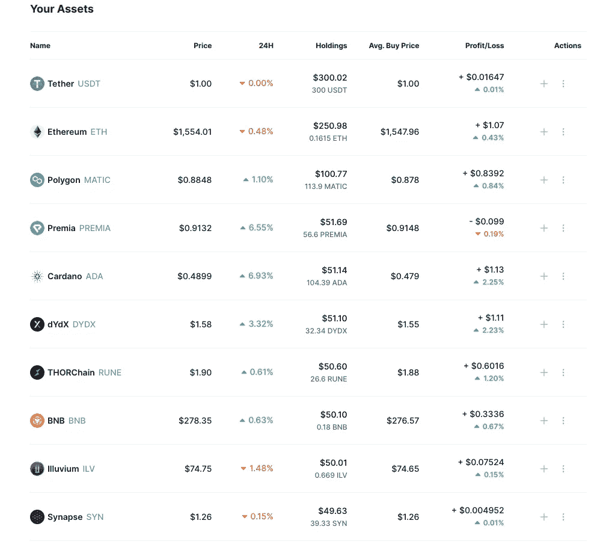

# 1k 至 10k 美元加密挑战:第一天投资组合

> 原文：<https://medium.com/coinmonks/1k-to-10k-crypto-challenge-day-1-portfolio-900a58d32ac?source=collection_archive---------0----------------------->

嘿大家好，

欢迎回来。这是你们期待已久的一天。经过 3 天的策略和分析，是时候把我的钱放到我该说的地方了，冒着在网上被嘲笑的风险。或者把自己塑造成一个神级投资者，让你觉得我比实际上更聪明。今天是我建立 1000 美元加密组合的日子。

对于那些不知道或者不记得的人，我[开始了一个挑战](/coinmonks/how-i-plan-to-make-bank-in-the-crypto-markets-in-2022-c14a2cb9929a)，我试图通过玩加密市场在一年内将初始资本从 1000 美元变成 10000 美元。我决定在社交媒体上记录整个过程。

我应对挑战的策略是这样的:

*   一定比例的资本将以现金形式持有(用于投资和其他机会)
*   蓝筹股将持有一定比例的硬币(全面分析[此处](/coinmonks/the-apples-and-amazons-of-the-crypto-markets-9-blue-chip-coins-to-keep-an-eye-on-in-this-bear-fe33fbb13c81))
*   其余资金将投向我认为在下一轮牛市中有潜力上涨的低市值行业(完整分析[见](/coinmonks/playing-low-caps-how-i-plan-to-gamble-responsibly-e45d79fef0c6))

但在我开始四处扔钱之前，让我们先来看看市场。

# 市场情况

现在是九月。这在历史上意味着密码被破解了。我们已经经历了近一年的熊市，每个人都在寻找底部，也就是我们开始再次上涨的点。这与总体经济状况密切相关。宏观经济推动资金进出资产市场，加密也不例外。极度的印钞导致了疫情泵，极度的通货膨胀导致了大流行后的倾销。因此，如果我们想知道密码市场的方向，我们必须看看总体经济。事情看起来不是很好:

*   对世界大部分地区来说，通货膨胀已经失控。政府将提高利率来对抗它。这使得借贷更加昂贵，随着流入市场的资金减少，像加密这样的风险资产遭受的损失最大。美国通货膨胀似乎在 6 月份达到了 9.1%的峰值(7 月份的 CPI 为 8.5%)，但我们必须看看这是否会在 9 月 13 日公布的 8 月份 CPI 数据中得到证实。8 月份，欧洲通货膨胀率达到创纪录的 9.1%。理想的数字是 2%，所以我们还有很长的路要走。
*   俄乌战争引发危机。天然气价格大幅上涨，这提高了整个供应链的成本。我们还没有看到食品短缺的影响。
*   美联储将开始其量化紧缩政策，这将每天从市场中取出数百万美元。

所以总而言之，

*   政府正在实施损害经济的政策，以便将通货膨胀率降低到理想的水平。考虑到我们离这些水平有多远，预计市场在短期内会遭受更大的损失
*   有一个能源(和食品)危机，冬季即将来临，当需求增加

将这两者加在一起，就不难理解为什么大多数投资者预计会出现全球衰退。这不会让密码市场不受影响。秘密的恐惧和贪婪指数处于极度恐惧之中，这是有充分理由的。

# 拨片

那我该怎么办呢？我将成为一个堕落者，但我将成为一个保守的堕落者。从最初的 1000 美元开始，我将投入:

*   蓝筹股占 45%
*   25%的低注额赌注
*   剩下的(30%)用现金支付

*(在介绍文章中，我说我会保留 35%的现金，但我决定增加一点赌注)*

尽管我长期看好这些价格水平，但我认为没有理由去 FOMO。如果我们着眼于未来 2-3 年，许多硬币似乎被低估了，但我现在并不急于买入。我不认为这些价格是不会持续的杀手级折扣，因为我发现加密市场不太可能开始繁荣，而且永远不会回头，特别是考虑到当前的经济状况。所以在你开始问我为什么不买索拉纳或者为什么不买波尔卡多特之前，我只是告诉你。我不是不相信他们。我并不是认为它们的交易价格不合理(甚至没有折扣)。这是因为我发现很难相信我会因为没有在这些价格上购买而后悔。然而，我很有可能看到这种情况的发生。它们与加密史上最重大的事件有关。

## 合并

终于来了。经过多年的发展，以太坊从工作证明到利益证明的广泛预期的转变正在按计划进行。第一层之王，加密行业最重要的区块链，终于准备好更新它的性能了。与此同时，这也将减少近 90%的销售压力，因为将不再有矿工将出售他们的 Eth 来弥补能源成本。我在蓝筹股帖子([这里](/coinmonks/the-apples-and-amazons-of-the-crypto-markets-9-blue-chip-coins-to-keep-an-eye-on-in-this-bear-fe33fbb13c81))中分析了以太坊，所以我现在不打算深究。

在我看来，这是一个特殊的机会，因为它既有短期潜力，也有长期潜力。正如我所说的，对于很多硬币来说，我相信这些价格从长期来看是便宜的，以太坊也不例外。事实上，这是我在未来 2-3 年最放心持有的资产，因为我相信当主流采用开始发生时，它将成为市场领导者。然而，与其他硬币不同的是，合并会推高 Eth，让我觉得现在不买就像个傻瓜。我可以看到 Polygon 也发生了这种情况，因为我预计它将从合并叙述中受益匪浅。

在过去的几个月里，这两种硬币的表现都优于市场，这使得它们比类似的蓝筹股如 Solana 更危险。作为参考，走向 6 月底意味着索拉纳下跌 16%，以太坊下跌 40%。然而，我愿意玩合并叙事，并承担这些风险。别忘了，我正努力实现 10 倍的回报，所以我不能太保守。

我的赌注:

**$250 在以太坊**

**$100 在多边形上**

## 瓦西里硬叉子

但是卡尔达诺将会有自己的更新。将于 9 月晚些时候推出的(无限延迟的)Vasil Hard Fork 有望改善网络性能并协助 dapp 的开发。我已经谈过卡尔达诺(在蓝筹股的帖子里)，我相信他们很有潜力。这是一个很好的买入价格，因为他们开始真正取得一些进展。

**我在卡达诺身上下了 50 美元**

最后，为了结束我的蓝筹股赌注，**我在 BNB 身上下了 50 美元**。

我从我说过我认为被低估的蓝筹股中挑选了这个，但老实说，我可以选择 BNB、索拉纳、雪崩或波尔卡多特中的任何一个。这些硬币通常一起移动，跟随加密市场的其余部分。所有选择的预期回报是一样的，但我相信 BNB 是一个更安全的选择。其他的有时太不可预测，因为像网络崩溃或戏剧性事件。

## 低注额

这样我就剩下 250 美元分给低收入人群了。我是这么想的:

*   thor chain**50 美元**因为合并后的互操作性会更强
*   **$50 Synapse** 同理。他们在一个项目中结合了许多互操作性解决方案
*   dYdX 中的 50 美元，因为我预计衍生品是 DeFi 中的下一件大事。他们还因为要求你扫描面部的失败宣传噱头而下跌
*   **出于同样的原因，溢价 50 美元。他们是 DeFi 衍生品领域最有前途的参与者之一，市值非常小**
*   **因为他们是目前正在开发中的最有前景的加密游戏项目之一，所以在伊鲁威需要 50 美元。ATH 的价格超过 1800 美元，目前交易价格为 75 美元，我认为这是一个很好的买入机会**

**这些是我现在的动作。**

**总之，第 1 天的投资组合如下所示:**

****

**如果我在以下某个方面看到机会，我也准备好扣动扳机:**

*   **既然硝基更新是实时的，生态系统就在仲裁上运行**
*   **Vasil Hard Fork 之后，生态系统在 Cardano 上运行**
*   **氦-索拉纳伙伴关系**
*   **合并后，DeFi 在 Ethereum(如 Aave 和 Lido)演出**

## **期待混乱**

**根据最近的估计，合并预计将在 9 月 13 日进行。那是 CPI 数据发布的同一天。除此之外，对 Ethereum 来说，开放利率处于历史最高水平。这意味着有太多的钱进入未来的合同，交易者被充分利用。两个方向的价格变动都会造成挤压，使价格进一步飙升。这将是有趣的一天。**

# **结尾部分**

**今天就到这里。这比预期的要长，但我必须确保涵盖所有影响我决定的事情。让我知道你对我的选择有什么看法。感谢您的阅读并继续关注。更新很快就会到来。**

****

***如果你觉得有趣，一定要在【T4 *推特* *上关注我，获取更多关于挑战的加密内容和更新。我几天前刚刚创建了这个帐户，所以我可能会继续(除非你看起来像个机器人)。另外，我知道最后一张照片不是《华尔街之狼》。它看起来很酷。记住:这不是财务建议。内容纯粹是为了娱乐。****

> **交易新手？试试[密码交易机器人](/coinmonks/crypto-trading-bot-c2ffce8acb2a)或者[拷贝交易](/coinmonks/top-10-crypto-copy-trading-platforms-for-beginners-d0c37c7d698c)**