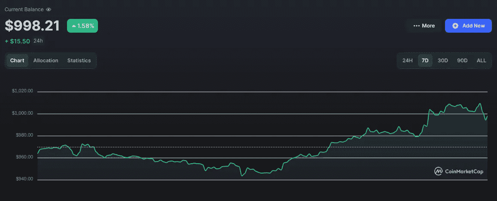
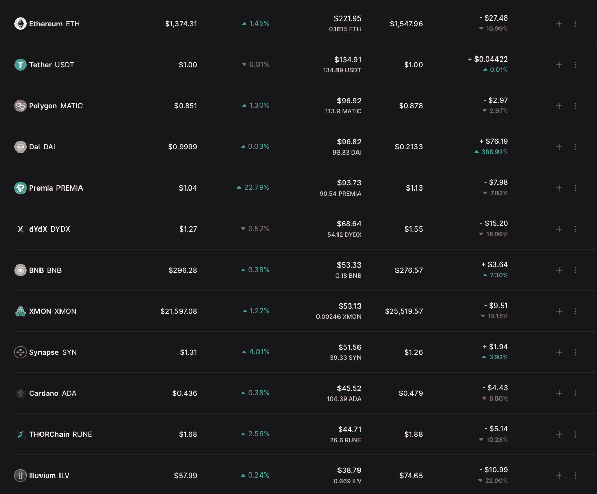
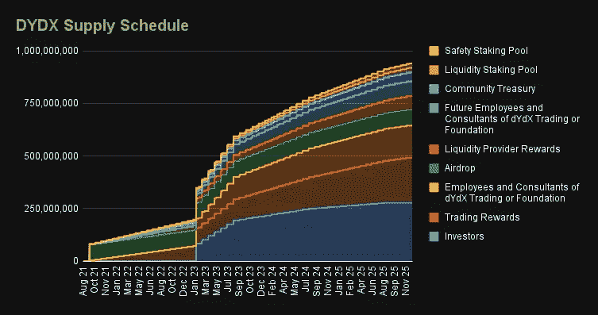
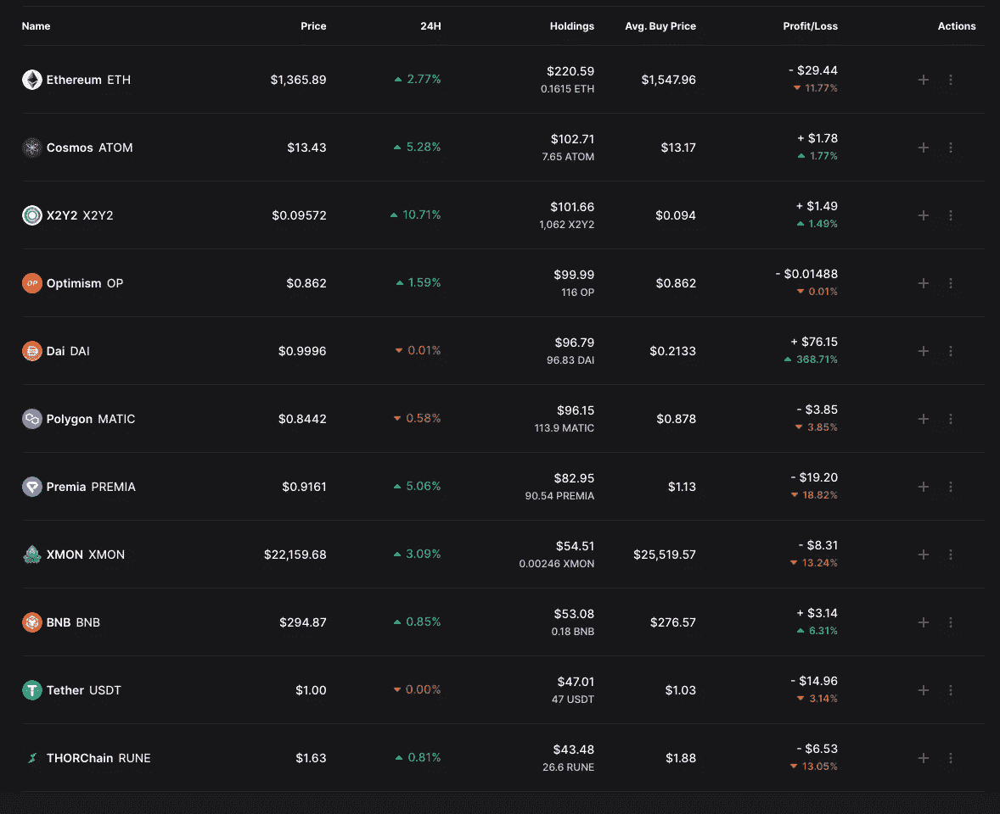

# 1k 至 10k 美元加密挑战周#4:大规模投资组合变化

> 原文：<https://medium.com/coinmonks/1k-to-10k-crypto-challenge-week-4-massive-portfolio-changes-6bafb07c7f61?source=collection_archive---------0----------------------->

嘿大家好，

更新时间到了。Uptober 终于来了！

那我是在用现金洗澡吗？

**是的！**

在我的梦里。事实是，我们仍然下降了大约 0.2%。

但是总体市场情绪发生了微妙的变化**。像是告诉我们好日子就要来了。**

或者至少是这种感觉。因为事实上事情看起来并没有那么好。

# 市场和短期预测

有传言称，银行正在倒闭，欧洲正在分崩离析，全球大部分地区的通胀仍处于历史高位，联合国正在恳求美联储停止加息。甚至有传言说，印钞机将很快重新打开，因为外币像狗屎硬币一样下跌。

但对当前金融体系的失望导致了 crypto 的诞生。也许人们会对银行和政府如此愤怒，以至于他们会寻找替代方案。随着英镑的崩溃，我们已经看到英国的比特币流入量激增。也许“大脱钩”并不遥远。

**大概不是**。至少可以说，通过押注加密来交易全球金融崩溃是一种非正统的举措。像这样的事件不太可能让密码市场不受影响。

在目前阶段，**密码主要是一个技术驱动和创新驱动的行业**。当经济停滞时，这些东西就不会很好地发挥作用。

那么所有这些意味着什么呢？这意味着**下一次 CPI 报告和下一次 FOMC 会议格外重要**。

老实说，**我预计通胀数据会很火爆。我预计市场会再次下跌。但也许这将把我们引向不可避免的底部，从那里我可以更舒服地开始行动。**

在过去的几周里，我发现了很多好机会，但我现在太害怕了，不敢冒险。尤其是上个月的事情之后。最好等通胀数据出来后，再考虑更长远的问题。

然而，让我感觉稍微舒服一点的是，我看到了大量非常有吸引力的价格，而不觉得我在试图抓住一把落下的刀。

例如，我提到在 ATOM 2.0 之后，Cosmos 是我在整个行业中最有信心的赌注之一。在本月触及 16.9 美元的高点和 12.03 美元的低点后，Cosmos 目前的交易价格为 13 美元。因此，我终于可以在不觉得自己出价过高、也不觉得自己在试图对抗市场势头的情况下买入了。在我看来，13 美元对 ATOM 来说是一个很好的切入点，这是我进入后会购买和下注的硬币之一。

但在我们检查任何新举措之前，让我们看看当前的投资组合表现如何。

# 投资组合

DAI represents the ETH put I profited from 2 weeks ago

大多数硬币仍处于亏损状态，Premia 在过去 24 小时内的涨幅为+22%。让我们一个一个地检查所有的硬币:

## 以太币

这周我不会乱动我的联邦理工学院股份。我认为它很有可能永远不会再低于 1000 美元，而且这是我持有的最高限额硬币。我不认为现在全力以赴是明智的，尽管 BTC 在 10 月份的表现历史性地超过了以太坊，但我也不认为现在进入比特币是有意义的。我并不完全反对它，但是，所以如果你看到我为 BTC 翻转一些 ETH，不要感到惊讶。

## 马蒂奇

Polygon 经历了非常稳定的一周，过去 7 天上涨了 12%。由于这是一个我认为是长期的项目(这是 ETH、ATOM 和 BNB，如果你读过我的熊市指南[你知道我在说什么的话】,而且它不再是一个合并游戏，我有两个选择:](/@thewolfofwalletstreet/how-to-actually-take-advantage-of-the-bear-market-part-2-the-4-coins-that-make-the-most-sense-e519cb56f076)

*   **现在就在币安投资大约 19%的 APY**
*   **现在就卖出，在 CPI 数据出来后试着抄底**

经过深思熟虑后，我认为第二个选择是愚蠢的。

所以我把我的 113 MATIC 押上，决定如果我想用这个硬币玩 Michael Burry，我可以在 CPI 数字附近做空 MATIC，然后用利润买更多。

***与币安在东部时间 113 Matic。4 月 19%***

## 溢价

拿着。很明显。在这一点上，Premia 在这里可能只是为了娱乐。玩笑归玩笑，这是一个非常可靠的项目，我正在等待他们将于本月某个时候发布的 V3 更新。

## dYdX

销售。我在这步棋上花了很大力气，试图买个底。尽管我很喜欢 dYdX v4 计划(在 Cosmos 中建立独立的连锁店，成为最大的分散式期货交易所)，但我不认为它会很快实现。我确实预计很快会发生的是，当市场意识到由于代币解锁，1 月份的流通供应量基本上翻了一番时，就会抛售/做空代币。

## BNB

上周我就想卖掉它，但 BNB 是典型的熊市硬币。将举行

## XMON

Sudoswap 这个月的表现一直超过竞争对手，所以我打算[双倍下注空投](/coinmonks/1k-to-10k-challenge-day-3-update-the-sudo-play-139b293786d2)。

## 突触

这是一个很好的表现，但我将退出我的立场，进入其他机会。

## 卡尔达诺

由于 Vasil Hard Fork 现在已经完成，所以这一选择只有从长期角度来看才有意义。我相信愿景和技术，我在我的主要投资组合中押了一些 Cardano，但这不是我迎接这个挑战所需要的。我在卖。

## 索查恩

我想保持在跨链领域的敞口，所以自从我卖掉 Synapse 后，我就一直持有。在我看来，这是一个相对安全的长期赌注，因为它是未来需求非常高的产品的市场领导者。本周我会更深入地研究这个项目，弄清楚锁定奖励令牌是否有意义

## 淀积层

在这出戏里我也很努力。我相信这个项目长期，但也许这不是最好的方式来保持暴露在加密游戏部门。也许我会掷硬币来选择蓝筹游戏币，如 Gala、分散式游戏或沙盒游戏

# 动作

## 出售

***以 68 美元(-18.09%)卖出 58.12 dYdX***

***以 51.96 美元卖出 39.3 SYN(+3.9%)***

***以 55 美元的价格卖出 104 台 ADA(-8.86%)***

***以 38.79 美元的价格卖出 0.669 ILV(-22%)***

**销售现金总额:213.75 美元**

**可用现金总额:443.75 美元**

## 购买

首先也是最重要的一点，我会在自动售货机的 **X2Y2，**中购买并下注 100 美元。为什么？我已经为此写了一整篇文章，你应该在这里阅读。

事实是，在我发帖的时候，X2Y2 几乎处于历史低点，自从我发帖以来，它已经上涨了 12%，这让我有点害怕在这里投入大量资金，但请记住，这是一个收益率游戏。我有点希望我 3 天前扣动扳机，而不是等待挑战更新，但无论如何。我相信我的分析，并且仍然认为这是目前加密领域最不对称的赌注。

**我也会买 100 美元的**乐观**。我在第 2 层的牌上加倍下注，理由很充分。TVL 在这些协议中一直处于领先地位，在资本流入方面，它们一直优于 Cardano 和 Avalanche 等替代层。**

*****以 0.862 美元买入 100 美元的 OP(116 OP)*****

**所以我们还剩 243 美元现金。从那以后，我会用 100 美元去买我新喜欢的硬币，ATOM。我也想赌一把。我谈到了我是如何将凌动与瑞士联邦理工学院、BNB 和 MATIC 放在同一个级别的，我相信它们将是有利可图的投资。我会和币安在疯狂 est 赌一笔钱。120 天 35.86%的 APR，用剩下的去玩宇宙生态系统。**

*****以 13.17 美元(7.65 ATOM)买入了 100 美元的 ATOM。与币安在东部时间 5 原子。*4 月 35.86%****

****剩余现金总额= 143 美元。****

**这个月我感觉特别堕落。**

**我将期待在下一次下潜时将这额外的 43 美元花在 XMON 上。正如我所说的，我加倍下注 SUDO 空投。**

**剩下的 100 美元将用来保护我不受损失。我决定，只要我认为市场有很大的可能会抛售，我就用这笔资金购买看跌期权和期货，而不是为了安全起见，把资金放在现金中以避免抛售。**

****因此，我基本上是通过加大赌博来对冲风险。r/wallstreetbets 会感到自豪。****

**所以在所有的移动之后，更新的投资组合看起来像这样:**

****

**Updated Tether to include the liquidation losses from the perpetual future 2 weeks ago**

# **其他机会**

**这些是我一直关注的事情，可能会在几天后发表分析**

## **链环**

**在更新了令牌组学之后，这有可能成为我的高信念赌注领域**

## **总督**

**是的认真 Doge。埃隆正在收购 Twitter，所以如果他决定以某种方式将硬币整合到平台中，这件事可能会发生。**

****

## **IMX**

**更长期的举措，因为他们在 11 月 5 日有一个象征性的解锁。也许我能为一个可靠的项目找到疯狂的折扣**

## **灰尘**

**我以前说过我想接触 DeGods 生态系统，特别是 y00t reveal 即将到来。在我作出任何决定之前，我必须看一看它的象征经济学**

## **令牌化的蓝筹 NFT**

**我越深入 NFT 拉比会堂，就越明白我们在 2021 年看到的繁荣只是开始。NFT 空间将会存在，像 Cryptopunks 这样的 OG 收藏在未来会非常有价值。KuCoin 提供了一个购买 1/1000000 的 NFT 的选项，比如 Cryptopunks，Bored Apes 等。他们实际上买下了 NFT，并对其进行了符号化。这是一个不用倾家荡产就能曝光的好方法**

**我只有这些了。我推迟了两天更新，因为我想确保我已经做了适当的研究来采取行动。这可能是迄今为止该系列中最精彩的帖子。让我知道你对我的举动有什么看法。**

**在接下来的日子里，期待更多关于熊市指南系列的帖子，以及我已经工作了这么久的备受期待的 NFTs 帖子。**

****一如既往，如果你想实时看到我的动作，获得挑战的实时更新，或者与我讨论 crypto 和 web3，请关注我的**[**Twitter**](https://twitter.com/WolfOfWalletSt)**。注意安全，下周见！****

****

**记住:这不是财务建议。内容纯属娱乐目的。另外，我知道这张图片不是来自华尔街之狼。它只是看起来很酷。**

> **交易新手？试试[密码交易机器人](/coinmonks/crypto-trading-bot-c2ffce8acb2a)或者[复制交易](/coinmonks/top-10-crypto-copy-trading-platforms-for-beginners-d0c37c7d698c)**