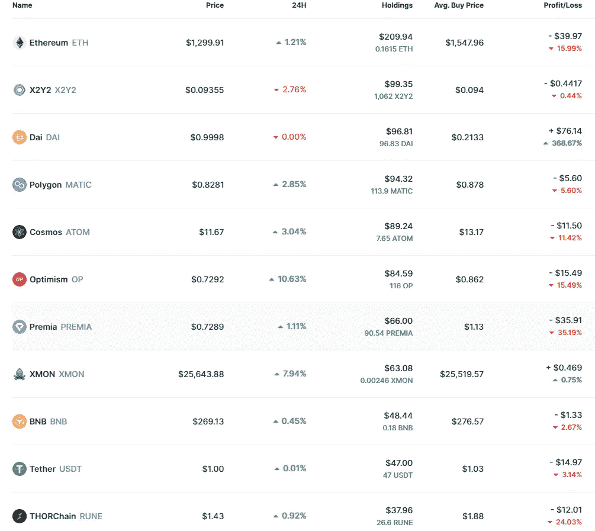

# $1k 到$10k 加密挑战赛第 6 周:我搞砸了

> 原文：<https://medium.com/coinmonks/1k-to-10k-crypto-challenge-week-6-i-f-cked-up-16af0d08aad7?source=collection_archive---------1----------------------->

嘿大家好

现在是第 5 次每周更新的时间了，但奇怪的是我们已经在第 6 周了。那是因为我上周搞砸了，我忙着写我的 [web3 帖子](/coinmonks/the-future-of-the-internet-is-not-what-you-think-1c4d71fdd43)(我已经工作了大约一个月)和研究 NFTs，以至于我没有时间来发布第 5 周的更新。

可悲的是，这不是我上周唯一的失误。

[还记得](/coinmonks/1k-to-10k-crypto-challenge-week-4-massive-portfolio-changes-6bafb07c7f61)我说过我会把我的大部分高信心选股押上，而不是试图狙击底部，我只是用期货对冲短期下跌？

好吧，你猜怎么着。我太沉迷于 web3 和 NFT 的研究，以至于跟不上市场。

所以，当我必须在做空和什么都不做之间做出选择的时候，我选择了后者。我为此付出了代价。不可避免的倾倒来了，现在我曝光过度。吸取教训。

然而，老实说，这并没有困扰我太多。全球经济正在遭受打击，我现在已经接受了这一事实，即我们很可能会比我预期的更长时间地停留在这些水平上。所以 5%的降幅对我来说并不重要。无论如何，大部分损失将被赌注回报抵消。

脱离市场的另一件事是，我可以暂时抛开图表和词汇学，从更广阔的角度来看待 web3 的未来。我明白 NFT 不仅仅是猴子的图片，我深深陷入了维塔利克对[去中心化社会](https://papers.ssrn.com/sol3/papers.cfm?abstract_id=4105763)的未来愿景。我现在觉得自己对整个行业有了更深刻的理解，这将有助于我未来的投资决策。总的来说，我对这项技术的未来感到前所未有的兴奋。

但是足够了，我会确保在以后的帖子中涵盖所有内容。现在，让我们看看市场上发生了什么。

# 市场

让我澄清一些事情。我已经厌倦了谈论通胀和宏观经济，但这是当前形势迫使我为了参与市场而不得不做的事情。

所以让我们来谈谈同样的事情。

欧洲完蛋了，尤其是英国。货币正在下跌，因为欧洲有通货膨胀问题，并且加息已经太迟。最重要的是，随着俄乌战争的持续以及俄罗斯摧毁了用于满足能源需求的北溪管道，欧洲面临着(巨大的)食品和能源问题。随着美元作为世界储备货币的地位越来越强，有可能看到其他货币继续贬值。总会有人求助于密码(尤其是比特币)来保护他们的购买力(就像他们对黄金和其他商品所做的那样)，但我发现这种可能性非常非常小。

美联储正在稳步提高利率，并将在今年剩余时间内继续这样做。他们提到目标是 2%的年通胀率。

那么我们离那个目标有多近呢？

没那么近。

CPI 环比上涨 0.4%(这意味着商品比一个月前贵了 0.4%)。

这个数字已经令人担忧，因为如果价格继续以这个速度增长，那么我们将远离 2%的目标，而接近 5%的年通胀率。

然而，更令人担忧的是，CPI 严重偏向于能源，而能源可能会产生误导。能源成本不太可能在这个水平上持续到冬天。

因此，如果能源是误导性的，那么其他东西呢？

自上月以来，核心 CPI 上涨了 0.6%，该指数衡量商品通胀，但不太重视食品和能源。这意味着通货膨胀可能还没有见顶。

好消息是，房地产市场似乎已经降温了一点，但总的来说，我预计未来还会有更多的痛苦。

然而，宏是否会继续以同样的方式影响加密市场是值得怀疑的。有可能我们谈论的大部分东西已经被价格消化了，加密将开始从总体经济中分离，至少在一定程度上。

## 那么这里的策略是什么？

我将继续对我的高信念选股下注，并寻找做空机会，以避免短期下跌。我不打算卖出，尤其是当我看到我选择的股票在不断上涨，它们的基本面价值也在上升，即使市场目前对此没有反应。

# 投资组合

正如你所看到的，以太坊现在是投资组合中表现最差的，而代表以太坊看跌期权合并前的戴是我自挑战开始以来迄今为止做得最好的一次。总体而言，我下跌了约 6.3%。

由于当前的宏观环境，自从我购买后，大部分硬币都下跌了。我不打算在 atm 上有任何举动。当 NFT 市场行业显示出向 0%版税转变的迹象时，$XMON 和$X2Y2 在这一周表现出色，但此后都有所降温。

请记住，$X2Y2 是一个产量游戏，$XMON 是一个空投游戏，所以我并不真正关心他们目前的价格。

Polygon 和 ATOM 继续押注币安，ETH 显示出通缩迹象，乐观情绪持续升温。

Premia 仍然没有推出 v3，我开始有点担心了。

最后，ThorChain 和 BNB 仍然是我长期持有的投资组合，尽管我将在本周通过赌注/LP 农场更多地利用它们。

# 评估上次更新的移动

上次更新是自发布以来最精彩的一次。我一共走了 7 步棋，4 次卖出，3 次买入(不算下注的一步棋)。让我们看看他们有多成功:

## 购买

在购买方面，我们可以很容易地看到上述投资组合的进展。自从我购买以来，乐观指数下跌了 15%，ATOM 下跌了 12%，X2Y2 下跌了约 3%。花在这些硬币上的总共 300 美元现在是 269.67 美元，或者如果我们包括赌注奖励的话是 272.12 美元。总体**下降了 9.29%** 。

## 卖

在销售方面，我们有以下数据:

**以 1.70 美元的价格出售 dYdX，现在价格为 1.44 -15.3%**

**以 1.32 美元的价格出售 Synapse，现在的价格为 1.01 美元**

**以 0.43 美元的价格出售了卡达诺，现在的价格为 0.34 -20.93%**

**以 57.98 美元的价格出售 Illuvium，现在的价格为 52.45 -9.53%**

总的来说，如果我没有进行这些销售，**我将遭受-17.61%的损失**(以 213.75 美元的价格出售这些硬币，现在它们的价值为 176.1 美元)。

所以事后看来，这些都是明智之举。

# 投资组合亮点:乐观

我在两周前买了乐观，作为我以太坊第二层赌注的一部分。自那以后，它跟随加密市场的其余部分下跌了约 15%。

然而，乐观主义作为一个项目的价值不断上升。TVL 一直在稳步增长，就市值而言，他们只是竞争对手(二层和替代一层)的一小部分。昨天，他们发布了他们的 [OP stack vision](https://optimism.mirror.xyz/fLk5UGjZDiXFuvQh6R_HscMQuuY9ABYNF7PI76-qJYs) 博客文章，并更新了他们的路线图。老实说，我还没有时间深入研究它，但乍一看，它似乎有点像他们版本的 Tendermint。

乐观主义需要我进行更深入的研究，特别是在它们的令牌组学和生态系统使用方面。幸运的是，他们有一种游戏化的方式，通过分发学习和获得的 NFT 来介绍用户到他们的本地 dapps，以完成特定的链上任务。

期待本周有更多关于乐观生态系统的信息，在我看来，这是业内最有前途的项目之一。

# 机会

## 链环

我在上一次更新中提到了 Chainlink，在深入研究之后，我相信它可以成为我的一个高信念长期游戏之一。然而，在我买进之前，我需要对他们的竞争对手进行更广泛的研究。

## 阿尔格兰德和国际足联世界杯

随着世界杯的临近，我密切关注着阿尔格兰德·区块链。如果你不知道，Algorand 已经与国际足联合作推出了 FIFA+，这是一个 NFT 市场，用于交易比赛的官方 gifs 图像。我可以看到这成为新的 NBA 最佳投篮，但我对两件事持怀疑态度:

*   随着 NFT 交易量的大幅下降和加密市场的深度下跌，对任何类型的数字收藏品的巨大需求的预期是合理的吗？
*   即使 FIFA NFTs 突然关闭，这将影响 ALGO 的价格吗？

然而，阿尔格兰德是一个好项目，目前交易价格合理。然而，如果不是因为国际足联的合作，我甚至不会考虑进入另一层。

一个额外的堕落游戏是投资国家队球迷代币，但我需要做广泛的研究，并在做出这样的举动之前计算出游戏的风险/回报。

## 空投

Aptos 的推出是一场灾难，但人们仍然在空投中取得了 4 位数的收入。鉴于目前的市场状况，空投可能是最大的机会，有许多项目需要关注。Miles Deutcher 的这篇文章解释了如何为行业内最热门的空投做准备。我会深入调查此事，并在 Twitter 上分享我的进展。

不考虑空投，DeSoc 的论文让我对零知识技术整体上非常感兴趣。因此，在不久的将来，我的部分研究将集中在以此为基础的项目上，包括 zkSync(他最近与 Uniswap V3 进行了集成)。

北极熊会在这里呆下去，现在，它的目标似乎是生存。随着全球经济看起来像现在这样糟糕，市场可能会抛售更多，或者至少在这些水平上停滞很长时间。我会坚持我的策略，抓住我看到的任何机会。

我们无法控制牛市何时到来，只能等待。毫无疑问，我们正朝着一个更光明的未来前进，无论我们需要多长时间才能到达那里。

在那之前，我会管理我的头寸，投资知识。我建议你也这样做。

感谢阅读，更多加密内容，请务必在 [Twitter](https://twitter.com/WolfOfWalletSt) 上与我联系(DMs 开放)。注意安全，下周见！

*Remember: this is NOT financial advice. Content is purely for entertainment purposes. Also, I know that this image is not from the Wolf of Wall Street. It just looks cool as an outro.*

> 交易新手？试试[密码交易机器人](/coinmonks/crypto-trading-bot-c2ffce8acb2a)或[复制交易](/coinmonks/top-10-crypto-copy-trading-platforms-for-beginners-d0c37c7d698c)