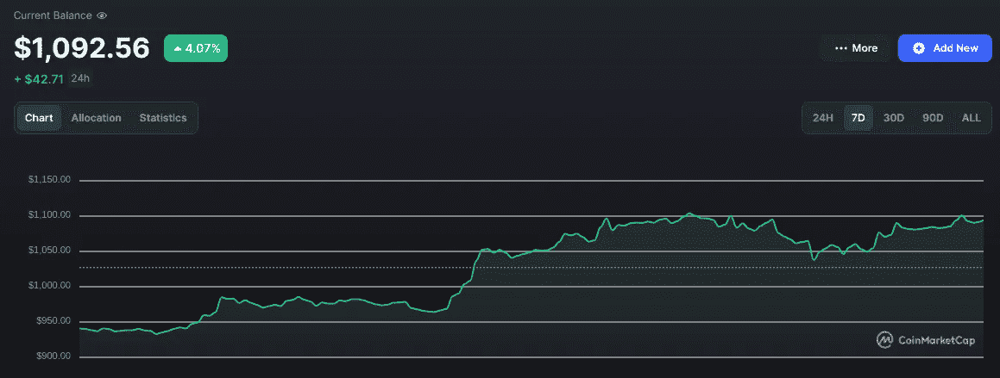

# $1k 到$10k 加密挑战赛第 7 周:我们赢了！

> 原文：<https://medium.com/coinmonks/1k-to-10k-crypto-challenge-week-7-were-winning-2c484c990cf5?source=collection_archive---------2----------------------->

嘿大家好，

感觉过了好久，我们终于有了一个绿色的一周。

加密市场在周二和周三大幅上涨，我们现在已经超过了 1000 美元大关，并获得了一些不错的收益。

那么，是什么推动了这一突如其来、出人意料的泵呢？

这主要是由于短暂的挤压。空头过于积极地做空加密市场，当事情不像预期的那样发展时(线上升而不是下降)，他们匆忙回补他们的头寸，将价格推得更高。

其他组合也在发挥作用；Reddit 的 NFTs 成了抛物线，Elon 收购了 Twitter，别忘了，10 月历来是 crypto 的好月份。

# 市场

随着市场再次充满贪婪和乐观，保持现实是件好事。不到一周前，我们还在谈论全球经济有多糟糕，以及很快进入牛市的可能性有多大。

自那以来，除了市场情绪之外，一切都没有改变。众所周知，加密市场拥有金鱼的记忆力和两岁儿童的注意力。**不要得意忘形**。

就宏观而言，这是目前推动市场的主要因素，我们没有任何特别积极的消息。核心 PCE 指数今天公布(这是美联储最喜欢的通胀指标),正如预期的一样；通货膨胀看起来仍然强劲，但没有我们想象的那么强。

然而，仍然有一些乐观的情况需要考虑。

首先，脱钩的可能性总是存在的，这意味着 crypto 将停止跟随传统市场，对美联储的决定反应不那么激烈。依我看可能性极小。

其次，有一种情况是，美联储在短期内转向，以便在美国即将到来的选举之前传播经济中的积极因素。这可能引发短期牛市，但会使长期情况变得更糟。

即使这看起来不合理，如果发生这样的事情也不要感到惊讶。只要金钱和国家联系在一起，政治就会控制经济。

第三，一些人声称，全球经济的崩溃已经反映在价格中，我们已经触底，我们将停留在这里或非常缓慢地向上移动。我不太支持这个理论；风险市场(尤其是秘密市场)往往反应迅速，因此我很难相信负面消息不会引发进一步下跌。

***那么我怎么看？***

我相信这只是一个救济集会。加密是不稳定的，我们肯定会在短期内的某个时候看到突然的反弹。

但正如我之前所说，自上周以来，一切都没有改变。我预测熊市至少会延续到 2023 年的头几个月，因为经济存在重大问题。这个问题并没有突然消失，因为 DOGE 泵 20%。

因此，在短期内，我认为市场不会进一步上涨。

事实上，我认为回到以前的水平比另一次反弹更有可能。除非美联储周三宣布令人惊讶的转向(这将实现第二种情况)，否则我认为我们至少会等到下一份 CPI 报告。

# 投资组合

Tether represent liquidation on the ETH long future. DAI represents the pre-Merge Ethereum put

从上周的-6.5%到现在的+9.3%，这就是在全面下跌的同时抓住反弹的美妙之处。虽然+93 美元并不令人印象深刻，但鉴于目前的情况，我不得不说我对自己相当满意。

在过去的几个月里，我花了无数的时间做研究，我觉得这给了我优势。这种优势现在很小，但在下一轮牛市中会很大。**乐观主义戏剧就是一个很好的例子。**

大约 3 周前，我亏本卖掉了我的卡达诺，买了 100 美元的乐观。我相信(现在仍然相信)以太坊 L2 在未来会远远胜过 L1。不到一个月后，Cardano 的价格为 0.40 美元(我以 0.43 美元卖出)，乐观指数为 1.12 美元(以 0.86 美元买入)。

**多边形**和**以太坊**，我从这个挑战开始以来信念最高的选择也领先市场。不管短期内下跌多少，他们最终肯定会赢。

因此，我孤注一掷，在币安赚到了 13.9%的 APY，并继续抓紧时间。

溢价也随着市场其他部分上涨，但正如预期的那样，波动性更大。它现在总体上是绿色的。

**BNB** 和**阿童木**，另外两个高信念选秀权，也有他们自己的高跟鞋，虽然没有以太坊硬币那么引人注目。原子停留在币安约 30%的 APY 赌注。

XMON 和 **X2Y2** 大部分保持在相同的水平，这是一件好事(记住我希望第一个用于 SUDO 空投，第二个用于产生产量)。

和 **ThorChain** 仍然是更大的损失百分比。尽管如此，这仍然是一个非常必要且被低估的协议。

# 移动

考虑到我预计本周市场不会继续上涨，用期权或期货来补仓是明智的。

最初我在考虑另一个以太坊，但最终决定反对。

以太坊仍然是整个加密空间中最可靠的选择，更新的令牌组学可能从现在开始积极影响价格。

以太坊自合并以来一直在萎缩，我们还没有真正看到抛售压力减轻的结果。如果在危机期间，ETH 成为比其他任何东西都更好的象征，我不会感到惊讶。

那么，如果我不做空 ETH，我要做空什么呢？

我试图在宇宙、乐观和多边形之间做出选择。

所以我是这样想的:

*   ATOM 2.0 白皮书似乎有一些目前在 Cosmos 社区中讨论的弱点。结果这个提议并不像我想象的那么天才。然而，ATOM 在价格方面表现得有点奇怪。
*   当市场下跌时，多边形和乐观情绪通常会显著下降。
*   其余的代币是我投资组合的一小部分(其中一些甚至不能用于期货交易)。

所以在考虑了一会儿之后，我决定选择本周取得+58%成绩的乐观派。在我看来，这使得它更有可能冷却下来，回落到更理性的水平。

但是，OP 的上限比 MATIC 低，这使得它更不可预测。

**我计划以 1.15 美元做空乐观，币安的保证金为 12 倍，抵押 30 美元。**

这意味着我可以做空 360 美元的 OP，但如果价格升至 1.24 美元以上(+8.33%)，我就会被平仓，失去 30 美元的抵押品。

## 又一个错误

但后来我意识到我是一个白痴，而不是 30 美元的抵押品，我把 30 美元的 OP 金额。所以我基本上押了 2.5 美元。当我在做这个动作半小时后检查我的头寸时，OP 是 1.12 美元，我已经上涨了 25%，这意味着我赚了惊人的 0.63 美元。**干得好，本来可以在不到一个小时内赚到 70 美元，但我不知怎么又把它搞砸了。**

所以我决定改为短多边形。与最初的乐观计划条款相同(现在风险/回报更高)，30 美元抵押品，12 倍利润。进场价格为 0.939 美元，平仓价格为 1 美元。

我总共花了 30 美元打赌炒作的反弹会冷却下来。

尽管如此，我认为这部戏让我处于一个双赢的局面。

如果下周加密市场继续上涨，我可能会被清算，损失 30 美元，但连续两个绿色周将改变市场情绪，并最终带来更大的利润。

无论如何，我对财务越来越技术性，这可能会很累。让我们来看看我通过本周的研究学到了什么，以及可能的机会。

# 每周研究和机会

## L2 论文

在深入研究了第二层领域，了解了上卷技术，并与流行的 L2 生态系统进行了互动之后，我现在比以往任何时候都更加乐观。在接下来的几天里，我会发一个关于他们的完整帖子，但是作为一个总结:

*   **就**而言，L2 将优于替代 L1
*   **L2s 将比 L1s 更有价值、更有用**
*   **乐观主义是一项伟大的工程，它的象征目前没有多大用处**
*   **L2 有合法的商业模式，可以产生收入**
*   在我看来，从投资的角度来看，Arbitrum 比乐观主义略胜一筹(这就是为什么空投很重要)
*   **在接下来的 2-3 年里，ZK-罗博项目将成为加密领域最有价值的标志之一**

## 真实产量协议

因为我预计熊市将持续(至少)几个月，所以参与通过分享收益来产生收益的项目是有意义的。X2Y2 是一部好剧，但也有其他机会。

像 GMX 和 GNS 这样的 DeFi 永久协议就是一些很好的例子，尽管它们的令牌在过去几个月里已经有了显著的增长。

## 分散的社交媒体

这是一个我特别感兴趣的加密领域，我可能会在接下来的几周内深入研究。目前，从象征性投资的角度来看，唯一有希望的项目似乎是 DeSo。

然而，我最感兴趣的协议是 Lens，尽管它没有令牌。

## 探索生态系统

本周，我花了大量时间尝试不同的加密生态系统。我玩了乐观，Arbitrum，宇宙和卡尔达诺。我将在这些方面发表完整的帖子，但我的主要收获是:

*   乐观生态系统主要由控制以太坊生态系统的项目控制
*   Arbitrum 也有很多 ETH 项目，但也有一些原创项目(GMX)
*   宇宙是一个非常深的生态系统，需要大量的研究
*   卡尔达诺拥有区块链最好的技术，但它的生态系统缺乏创新，它的 dapps 看起来/感觉起来很奇怪

## 卖空令牌解锁

我主要着眼于下周的 IMX 令牌解锁和几个月后的 dYdX 令牌解锁，但这将引起大规模的供应冲击。

IMX has massive token unlocks next Saturday

这两个都可能是很好的做空策略，可以让我快速赚钱。

再次置身于绿色之中感觉棒极了。

每当市场运行时，你都能感觉到加密社区的能量在变化。但是我们不要被乐观蒙蔽了双眼。

经济仍处于崩溃之中。

我比任何人都喜欢高跟鞋，但它们不会改变我的策略。我会坚持不懈地研究，寻找机会，承担适当的风险。我会继续只通过逻辑和数据来操作。

因此，当我目前享受这种兴奋时，我也确保管理我的期望并相应地行动。我知道从长远来看这是值得的。

**感谢阅读，更多密码内容、市场分析和 web3 对话，可以通过** [**Twitter**](https://twitter.com/WolfOfWalletSt) **与我联系(DMs 开放)。注意安全，下周见！**

Remember: this is NOT financial advice. Content is purely for entertainment purposes. Also, I know that this image is not from the Wolf of Wall Street. It just looks cool as an outro.

> 交易新手？试试[加密交易机器人](/coinmonks/crypto-trading-bot-c2ffce8acb2a)或者[复制交易](/coinmonks/top-10-crypto-copy-trading-platforms-for-beginners-d0c37c7d698c)