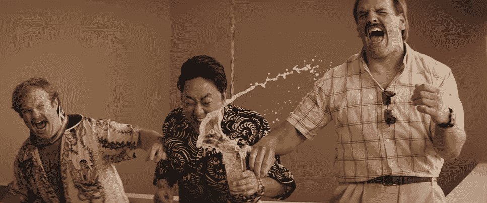
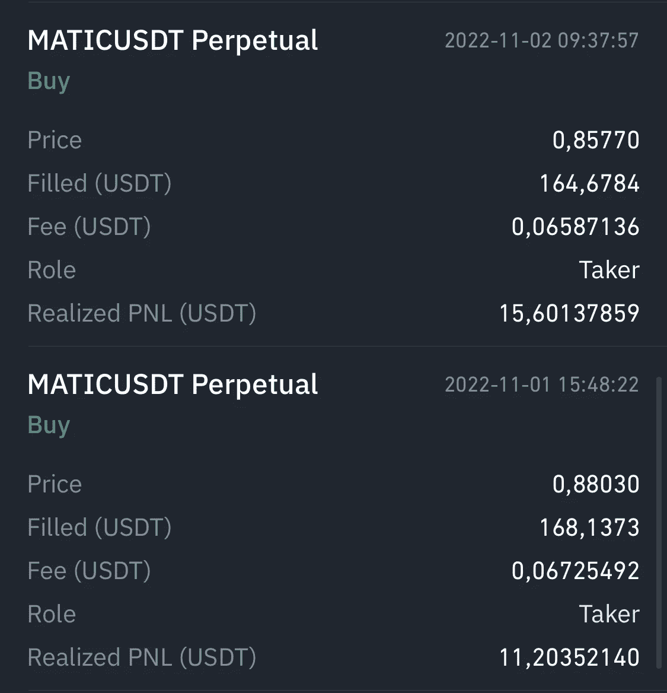
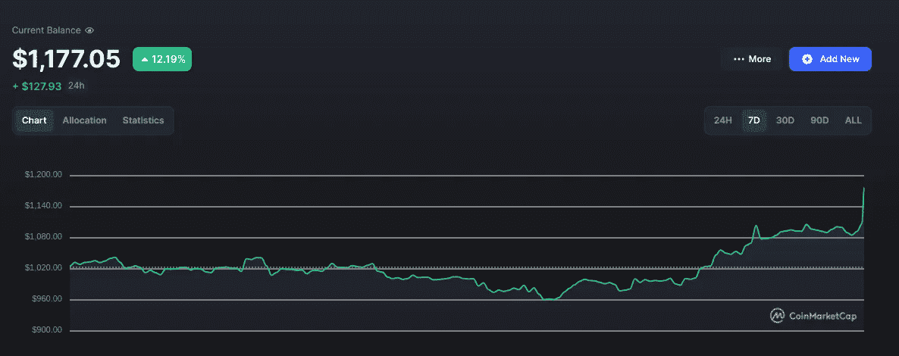
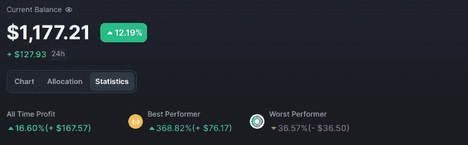
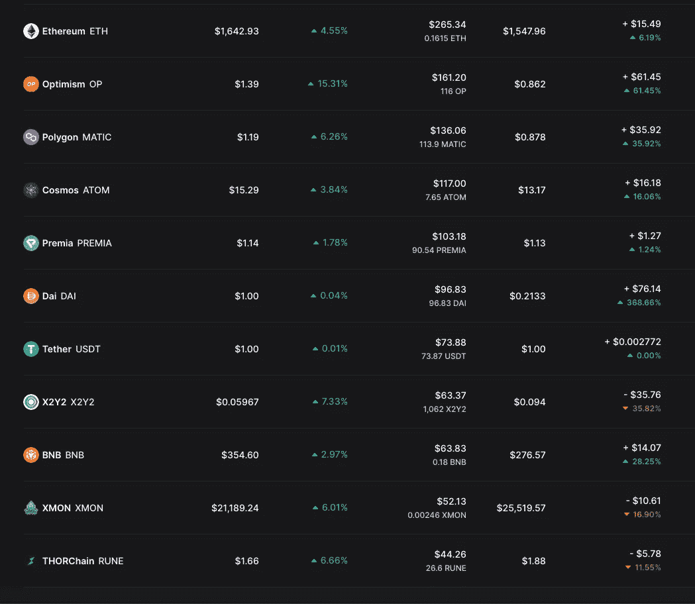
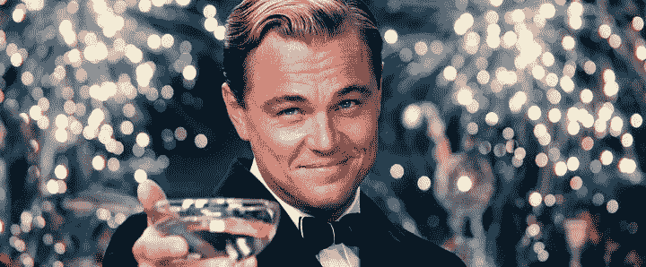

# $1k 到$10k 加密挑战周#8:牛市氛围

> 原文：<https://medium.com/coinmonks/1k-to-10k-crypto-challenge-week-8-bull-market-vibes-f51c3f239224?source=collection_archive---------3----------------------->

嘿大家好。是时候更新#8 了。

这个星期给了我们所有我们喜欢的关于加密市场的东西。FOMC 会议与我们预期的差不多，美联储将利率提高了 75 个基点，杰罗姆·鲍威尔暗示，只要需要，他们将保持鹰派立场。如果这破坏了经济，那么，他们只会印更多的钱来平衡。

crypto 对此有何反应？

它没有。或者至少看起来是这样。会后没有明显的价格变动，包括我在内的所有人都认为一切都已经反映在价格中了。但是没有。

几个小时后，市场开始缓慢但稳定地下跌。随着我的投资组合价值接近开始的 1000 美元，我们上周庆祝的几乎所有收益都消失了。

但请记住:这不是普通的市场。这是密码。我们在过去几个月的熊市中看到的并不是典型的秘密行为。密码是关于易变、混乱和兴奋的。我们需要一个提醒。

不知从哪里开始，市场开始疯狂上涨。我的意思是牛市类型的疯狂。这两天的上涨是挑战开始以来我们看到的最大的一次，我们现在坐在+16%的位置，这是我们有史以来最大的涨幅。我他妈的爱这个地方。

但这意味着什么呢？

老实说，我不确定。让我们看看市场，试着找出答案。

# 市场

上周以来没什么大新闻。随着美联储宣布他们将继续加息，并不担心破坏经济(因为如果他们这样做，他们可以印更多的钞票)，你可以说事情看起来比以前更悲观。

但这就是全球经济。

Web3 本身也发布了一些重大消息。

*   首先，Instagram 正在 NFTs 上全押。用户很快就可以直接从 Instagram 应用程序中创建、铸造、购买和销售 NFT。他们本质上正在成为一个 NFT 市场。这对于主流采用来说意义重大。对于其他 NFT 市场来说，这并不太好，但我们稍后会谈到这一点。NFTs 将在多边形上，图像将使用 Arweave 存储。自公告发布以来，这两个标志都变成了抛物线。
*   此外，埃隆马斯克收购了 Twitter，币安显然在其中拥有 5 亿美元的股份。很快就能在 Twitter 上看到一些加密功能。
*   最后，一些主要银行(包括 JP 摩根)完成了它们的第一笔 DeFi 交易，以尝试一种象征性的日元和新加坡元。

**总的来说，就业务采用而言，这是强劲的一周，crypto 对有点悲观的宏观新闻的宣传使得脱钩论越来越强。**

然而，我们不要忘乎所以。CPI 报告将于本周四公布，如果通胀高于预期，我们很可能会再次看到极度恐惧，市场将跌至 9 月份的水平。

老实说，我不认为反弹会持续下去。在我看来，为了实现这一点，我们需要看到通胀率大幅下降，而这个月不太可能出现这种情况(除非出于政治原因，这些数据被篡改)。

所以我要用我上周用过的策略:用永续期货在保证金上做空热钱。这样我可以保护自己免受短期下跌的影响，同时保持整体多头。

# 评价上周的戏剧

上周，我最初选择了乐观，但后来改变了主意，转而选择了多边形。这是一次成功。尽管反弹至 1.20 美元，但 MATIC 首先跌至 0.84 美元。如果你还记得的话，我在 0.93 美元时建立了我的空头头寸。我以 0.88 美元的价格拿走了一半的利润，剩下的是 0.857 美元。总体收益超过 26.8 美元。

一天后，MATIC 开始下跌，现在是 1.20 美元。在我谈论我下一步要做什么之前，让我们先看看投资组合的其余部分。

# 投资组合

DAI represent the Ethereum put on Premia. Portfolio shows $10 more because of the way I entered the MATIC profits

正如你可以看到的，本周几乎所有事情都进展顺利。我的大多数硬币现在都是绿色的，我表现最好的是以太坊 2 层(多边形，乐观主义)。正如我在最近的帖子中所说，L2 代币将在未来吃掉所有的“以太坊杀手”。牢牢抓住。

以太坊，BNB 和宇宙(高信念的选择)也开始上升。当然是拿着。

我们的小盘股 Premia 和 Thorchain 本周表现不错，但整体表现不佳。仍然保持着他们的潜力。

X2Y2 本周使劲甩。这有两个原因:

*   最大的 X2Y2 鲸鱼卖掉了他们所有的股份。X2Y2 的流动性总体来说并不是很好，这使得价格进一步下跌
*   Instagram 现在是 NFT 市场的竞争对手，尽管不是直接竞争，因为他们在 Polygon 上

然而，这是一部屈服剧。我不打算出售，只要我们没有看到任何进一步的抛售，它仍然有可能成为一个长期有利可图的

XMON 也因为 Instagram NFT 市场的叙述而被抛弃。请记住，XMON 与 Sudoswap 市场直接相关，因为 XMON 持有者在不久的将来将有资格获得 SUDO 空投。

# 移动

现在，在事情冷却之前，我不会碰市场。

一旦发生这种情况，我将做空多边形或乐观情绪作为对冲。这两者最近都呈抛物线状(这是理所当然的)，但如果整体市场受到冲击，我不认为它们会完好无损。所以，就像上周一样，我基本上是在对冲普遍的市场下跌，在我看来，这是非常可能的。

我可能会在未来两天内建仓。我会在推特上发布这个剧本，所以如果你想知道我会做什么，什么时候和我联系。

我还将寻找更多的空投，这是在 crypto 中最容易赚钱的方式(尤其是在熊市中)。我已经尝试完成了 LayerZero、Sui 和 Sei 等项目的所有必要任务。我期望找到更多的机会，尤其是在 Arbitrum、Cosmos 和乐观主义生态系统中。

这可能是我最后一周在这种格式上做挑战更新。从现在开始，我将把更新的内容分成不同的部分，分别发布。虽然自由流动的长帖子写起来更有趣，但它变得太长了，容易吓到人。

我也会在我的推特上做一些改变。我目前正在开发一个系统，它将把我的 Twitter 平台变成一个我真正提供价值并与人们联系的地方，而不是一个我随机发布我的想法(或提供挑战更新)的公共笔记本。

不管怎样，今天到此为止。注意安全，下周见！

Remember: this is NOT financial advice. Content is purely for entertainment purposes. Also, I know that this image is not from the Wolf of Wall Street. It just looks cool as an outro.

**感谢阅读，更多密码内容、市场分析和 web3 对话，可以通过**[**Twitter**](https://twitter.com/WolfOfWalletSt)**(DMs 开放)与我联系**

> 交易新手？尝试[加密交易机器人](/coinmonks/crypto-trading-bot-c2ffce8acb2a)或[复制交易](/coinmonks/top-10-crypto-copy-trading-platforms-for-beginners-d0c37c7d698c)