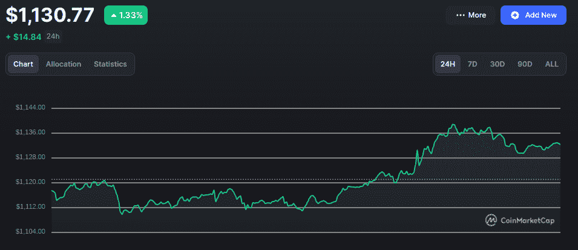
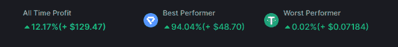
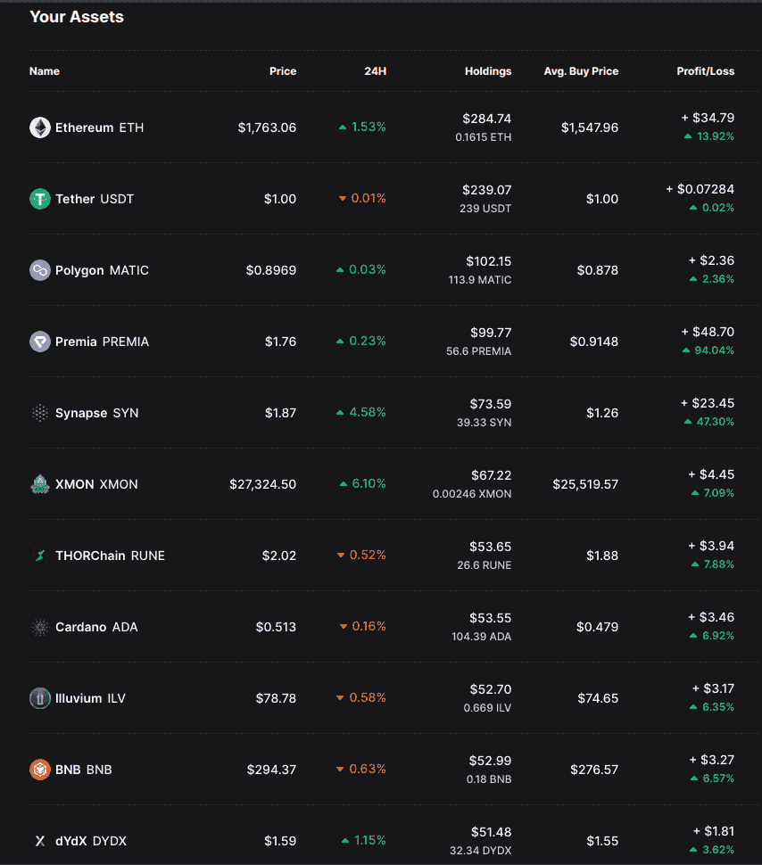
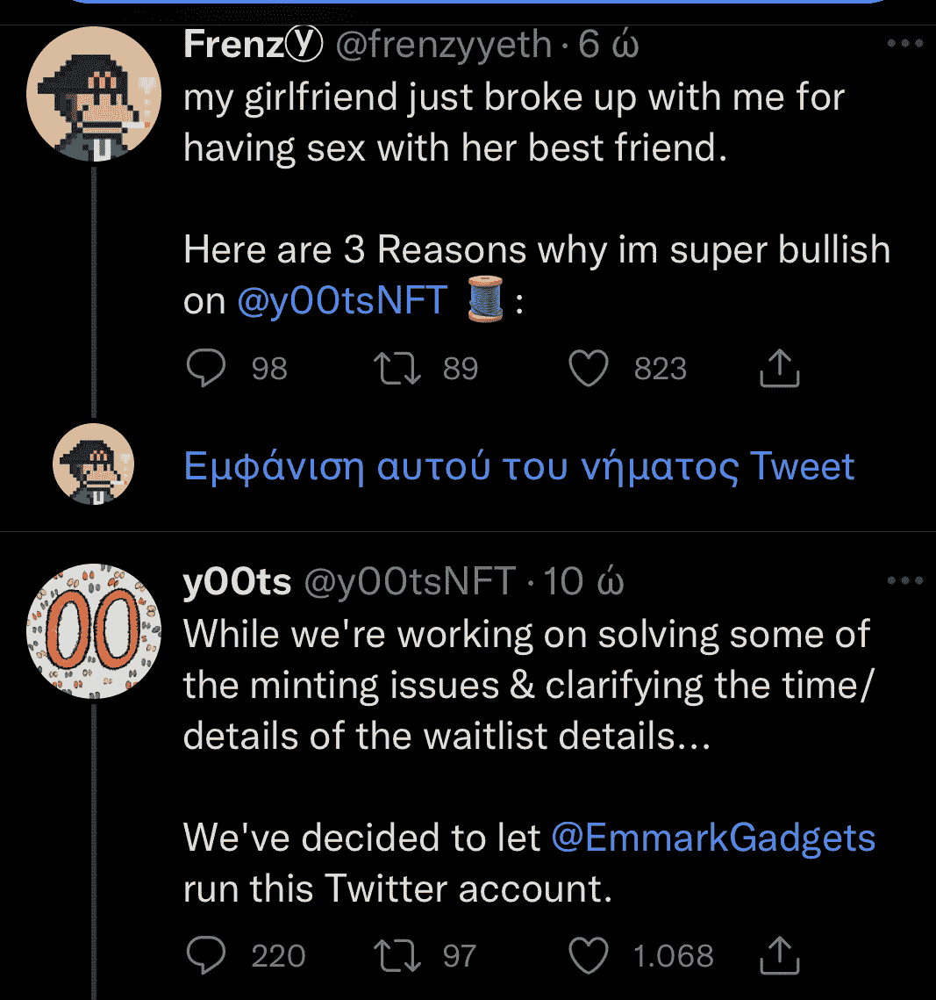
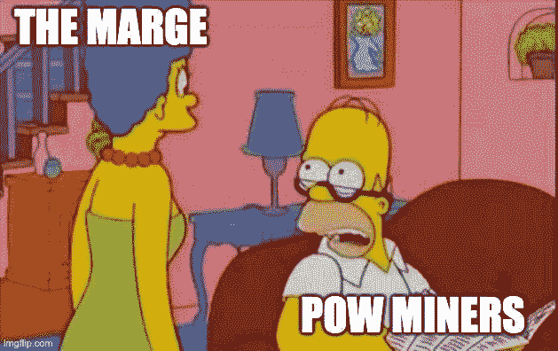

# 一千到一万美元的加密挑战:每周更新#1

> 原文：<https://medium.com/coinmonks/1k-to-10k-crypto-challenge-weekly-update-1-107f53a632cc?source=collection_archive---------0----------------------->

嘿大家好，

欢迎回来。从我开始$1k 到$10k 的挑战到现在已经一周了，这意味着是第一次每周更新的时候了。让我们来看看。

# 市场

自上周以来，加密市场总体上处于上升趋势，以太坊上涨了近 14%，比特币上涨了 8%，其余 alt 平均上涨了约 5-6%。所有这一切都发生在周三在 June's bottoms 的短暂停留之后，这让每个人都湿了裤子。幸运的是，市场迅速反弹，本周以绿色收盘。这是底部吗？我不确定。这篇 Reddit 帖子提供了一些关于这方面的很好的信息。看一看。尽管我不做助教，但获得不同的视角还是很有用的。

无论如何，我对这种下降有着复杂的感情。一方面，我预计价格会跌至 18k 美元。我们已经在 2 万美元左右徘徊了太长时间，鉴于目前的市场状况，我们肯定会很快再次测试底部水平。所以我一直在等待着那个秋天，为它做准备，说实话，我很害怕它。嗯，坠落发生了，我幸存了下来，但我不确定它只会从这里向上。另外，我没有足够的时间在这些底部买入更多。不过，我确实走了一步，我稍后会谈到。我的眼睛一如既往地盯着宏观数据，我预计本周 CPI 报告发布后，情况会有所好转。

本周发生的最随机的事情就是露娜的回归。Luna Classic 这个月几乎攀升了 330%，正式再次进入前 30 名。Luna 2.0 也在上涨，本周涨幅为 258%。这完全没有意义，但这就是加密市场的魅力所在。也许当人们在评论中试图让我购买 LUNC 时，我应该听听(jk 我不做 memecoins)。

无论如何，让我们看看投资组合。

# 投资组合

本周我一共涨了 12.06%。考虑到我们仍处于熊市，考虑到我还有 240 美元现金，第一周还不错。每一枚硬币都以绿色结束了这一周(甚至 USDT lol)。如果我们排除现金，我的密码持有量本周实现了 17%的增长。这样的表现很大程度上可以归功于两个硬币:Premia 和 Synapse。

Premia 本周绝对表现出色，投资回报率为 94.04%，Synapse 以 44.4%位居第二。有点后悔没有投入更多的硬币，但正如我在以前的帖子中所说，这是一个不负责任地赌博的奇怪月份。我确实认为他们仍然被低估了。我不打算很快从他们那里取钱。相反，我在考虑买更多，尤其是 Premia。这不是最近的表现偏差。它们是真正伟大的项目。如果你不相信我，去看看 Premia，告诉我你是否找到了一个更好的 DeFi 协议来玩选项。被极度低估了。

至于其他一些选股，BNB、阿达、鲁恩、ILV 和新选股，各自上涨了 6-7%。我看不出有任何理由退出它们，但我正在密切关注 Cardano，因为它在更新时往往表现得很奇怪。MATIC 赚的没有我预期的多，但我会留着它，因为我相信当合并发生时，它会有反应。dYdX 也不是很热门，但它仍然是目前最热门的 DeFi 协议之一，并且在不久的将来有很大的潜力。它仍然致力于在宇宙区块链上迁移到自己的本地链，并且拥有业内最强的一些基础。只要看看他们在[这个](https://tokenterminal.substack.com/p/weekly-fundamentals-e6a?utm_source=email)令牌终端分析中的指标就知道了。

# $XMON 移动

所以在周三，当整个市场都在流血的时候，我采取了行动。我在这里[谈到了它](/me/stats/post/139b293786d2)，但这里有一个快速的 TLDR；NFT 自动做市商 Sudoswap(类似于 NFTs 的 Uniswap)背后的团队证实，他们将向锁定令牌的$XMON 持有者发射$SUDO 空投。消息公布后，XMON 飙升至 45000 美元，但周三又回到 25000 美元，当时我买了 60 美元。它上涨了 6%，但市场的其余部分也是如此。我不认为空投是价格，我期待着一个更大的泵，当更多的细节被释放。

正如我在[热门行业帖子](/p/e45d79fef0c6)中所说，我正在 NFT 市场/基础设施利基市场寻找项目，而 Sudoswap 符合所有条件。它是创新的，它有炒作，它有体积，它有足够的增长空间(特别是因为他们甚至还没有一个令牌)。如果从这里开始下跌，我可能会买入更多的 XMON，并很可能锁定它进行空投，除非我看到一个巨大的炒作泵迫使我套现(至少是我的一部分头寸)。

# 接下来的一周我在寻找什么

*   CPI 发布
*   合并
*   Arbitrum 协议(Arbitrum Odyssey 和潜在生态系统游戏的重启，现在 Nitro 升级已经开始)
*   索拉纳-氦伙伴关系(氦真的会迁移到索拉纳吗？)

# 本周亮点:y00ts 薄荷

DeGods 是所有连锁店中最有价值的 NFT 系列之一，也是 Solana 上排名第一的 NFT 系列的创造者，他们在上发布了他们的 y00ts 项目，仅面向他们社区中的独家白名单成员。造币厂没有按计划进行，不得不推迟几个小时，但项目背后的团队有一个原创的解决方案。当他们在处理技术问题时，他们召集了一个著名的加密推特发帖人团队，并允许他们运行 y00ts 推特账户。这导致该项目更加疯狂，将人们的注意力从延期上转移开，并最终提高了底价。

但是想想这个。一家价值数百万美元的公司的推特在专业的狗屎海报手里。你会爱上加密的。说实在的，灰尘实验室是制造炒作的大师。不幸的是，这些推文现在似乎被删除了，但我幸运地在我的 iPhone 上有一张截图(忽略希腊字母，我们今年将赢得欧洲篮球赛):

# 本周迷因

今天到此为止。我知道最后两个部分与挑战无关，但是因为帖子太长了，我想在最后加入一些娱乐会很好。你知道，只是为了让气氛轻松一点。让我知道你的想法。如果你想确保不会错过任何一条关于挑战的更新，请在 Twitter 上关注我。

一如既往，这绝不是财务建议。内容纯属娱乐目的。祝你一周愉快，敬请关注。更新即将到来。

> 交易新手？试试[密码交易机器人](/coinmonks/crypto-trading-bot-c2ffce8acb2a)或者[复制交易](/coinmonks/top-10-crypto-copy-trading-platforms-for-beginners-d0c37c7d698c)