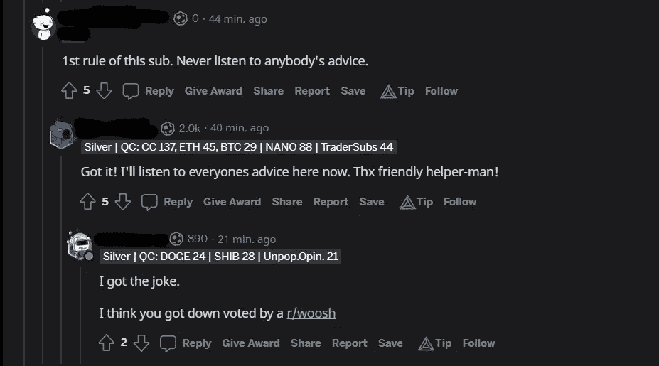
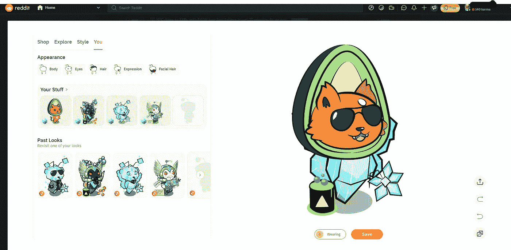

# 第一代 Reddit 收藏版 NFT 头像销售一空

> 原文：<https://medium.com/coinmonks/1st-generation-of-reddit-collectible-nft-avatars-are-selling-out-fast-f0ae9e5d27f6?source=collection_archive---------15----------------------->

Photo by [Rodion Kutsaev](https://unsplash.com/es/@frostroomhead?utm_source=unsplash&utm_medium=referral&utm_content=creditCopyText) on [Unsplash](https://unsplash.com/s/photos/nft?utm_source=unsplash&utm_medium=referral&utm_content=creditCopyText)

就在所有人都认为 NFT 的炒作已经结束的时候，Reddit 宣布在今年 7 月推出他们可收藏的 NFT 头像。

两个月后，他们的收藏头像发布，他们的主要销售很快售罄。

用户可以直接从 Reddit 上购买可收藏的头像，就像普通的 NFT 一样，可以转移到不同的加密钱包中，并在 Openseas 等 NFT 市场上出售。

NFT 最初的定价是 1000 份的头像 10 美元，600 份的头像 25 美元，只有 200 份或更少的头像 50 美元以上。

此外，已经售罄的稀有收藏品 NFT 正在 NFT 二级市场上以溢价交易，通常利润率为 1000%。例如，感官收藏中的 NFT“手”，用户最初以 75 美元购买，在 Opensea 市场上以 0.89 Eth(1353 美元)的价格出售。

Reddit 收藏头像使用多边形区块链来铸造 NFTs，它的汽油费很少。因此，用不到 1 美元的 MATIC，用户已经可以开始在 NFT 市场上出售他们的头像。

购买了可收藏头像的用户可以在社交媒体平台上使用 NFT 作为个人资料图片，通过图片周围的蓝色六边形可以很容易地区分出来。

A screenshot of a comment thread showing users with NFT profile pictures

除了他们的个人资料图片的独特外观，用户还可以混合和匹配他们拥有的每个 NFT 的不同部分来定制他们的头像。

A screenshot of the avatar customization page on desktop

> 交易新手？试试[加密交易机器人](/coinmonks/crypto-trading-bot-c2ffce8acb2a)或者[复制交易](/coinmonks/top-10-crypto-copy-trading-platforms-for-beginners-d0c37c7d698c)