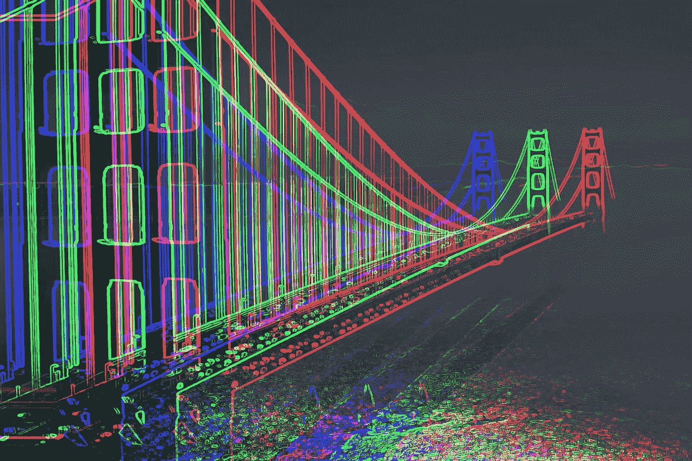

# 到目前为止，2022 年已有 22 亿美元被黑客从 crypto 窃取。

> 原文：<https://medium.com/coinmonks/2-2-billion-have-been-hacked-from-crypto-in-2022-so-far-c390dc20f385?source=collection_archive---------34----------------------->

Being a web3 hacker might be a full-time career move in 2022.

网络虫洞桥在 2 月被攻击，损失 3 . 2 亿美元。

今年 3 月，Ronin Bridge 遭到了价值 6 . 25 亿美元的攻击。

Horizon Bridge 在 6 月遭到了 1 亿美元的攻击。

现在 Nomad 桥被袭击，损失 2 亿美元。

看到什么模式了吗？

历史上一些最疯狂、最大、最可怕的加密黑客都在这些“桥”上。

“根据 Rekt 数据库，在 Q1 2022 年，1 2 亿美元的加密资产被盗，占有史以来被盗资金的 35.8%。

有趣的是，2022 年至少有 80%的丢失资产是从桥梁上被盗走的。"

那么这些桥是做什么用的呢？

我们为什么需要它们？

桥的存在是因为我们需要将资产从一个链转移到另一个链。

随着大老爹以太坊的老去，交易慢了很多，油费也贵了很多。

像 Solana、Avalanche 和 Polygon 这样的新连锁店出现了，并吸引了更多的用户和资金进入生态系统。

在任何健康的生态系统中，用户都希望轻松地在链之间转移资产。

这就是桥梁的用处。

Bridges are necessary for users to move assets from one chain to another easily.

是不是意味着桥梁超级不安全，容易被黑客攻击？

算是吧。

"以太坊的联合创始人维塔利克·布特林认为，跨链网桥天生容易出现安全漏洞。"

就像现实世界中的桥梁一样，它们连接着陆地，方便货物、军队和货物往来，对生态系统的整体健康有着巨大的价值。

类似地，在加密领域，这些桥有助于协议之间的资产转移，并具有很大的价值和流动性。

他们通常没有一个非常强大和完善的安全团队。

桥梁向黑客暴露了更大的表面区域，并且不像它们所促进的区块链那样坚固和安全。

那么，Nomad 是如何突然损失 2 亿美元的呢？

该组织黑进了加密桥 Nomad 高达 2 亿美元。

黑客攻击是通过利用控制桥梁的软件中的一个漏洞进行的。

该漏洞的细节尚未公开，但已知黑客能够获得控制桥操作的私钥。

这使得他们可以进行非法交易，耗尽大桥的储备。

黑客对加密市场造成了重大破坏，因为 Nomad 是连接不同交易所的最大桥梁之一。

真正疯狂的是，一旦人们发现任何人都可以复制这个过程，并从桥上取钱，这是一种疯狂。

The Nomad Bridge hack was literally a free-for-all rampage done to some extent, by normal users.

“与某些网桥攻击不同，在这些攻击中，单个罪犯是整个攻击的幕后黑手，而 Nomad 攻击是免费的。”

“…[Y]你不需要知道坚固性或 Merkle 树或任何类似的东西。你所要做的就是找到一个有效的交易，找到/用你的地址替换对方的地址，然后重新广播，”samczsun 解释道。

黑客的故事读起来总是令人震惊，因为它们看起来太不真实了。

但是人们确实损失了金钱，安全系统也被破坏了。

我真的希望随着时间的推移，所有这些只是让加密变得更强大，并且有一天我们会比黑客更有优势。

因为如果有一件事我可以肯定的话，那就是随着加密世界变得越来越大，越来越辉煌，黑客们也会变得越来越强大。

-

加密黑客会一次比一次更强大更可怕吗？

-

# startups # business # startupx # growth # success # social media # culture # web 3 # strategy # hacks # ronin # horizon # harmony # nomad # bridges # eth # BTC # crypto #黑客#evil

> 交易新手？试试[加密交易机器人](/coinmonks/crypto-trading-bot-c2ffce8acb2a)或者[复制交易](/coinmonks/top-10-crypto-copy-trading-platforms-for-beginners-d0c37c7d698c)