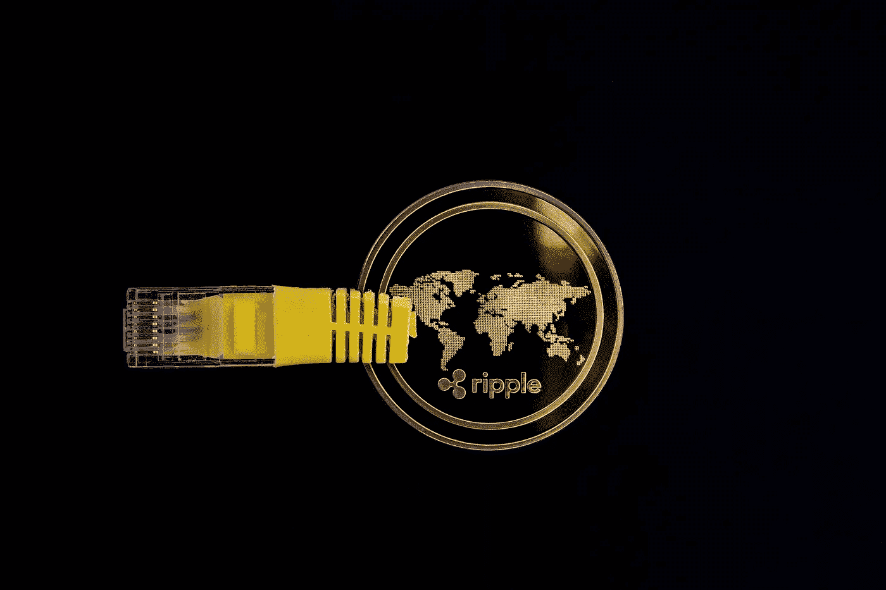

# 2023 年前购买的两种最佳加密货币

> 原文：<https://medium.com/coinmonks/2-best-cryptocurrencies-to-buy-before-2023-803f8eefa84a?source=collection_archive---------22----------------------->

Source photo [Cryptocurrency Money Ripple — Free photo on Pixabay](https://pixabay.com/photos/cryptocurrency-money-ripple-digital-3424779/)

# 阿尔格兰德(ALGO)

Algorand (ALGO)是一个加密货币和区块链平台，在一个两层、分散的网络上运行。由于区块链是开源的，任何人都可以查看代码并对平台进行更改。ALGO (ALGO)的目标是提供一个既可扩展又高效的平台，允许快速执行交易。