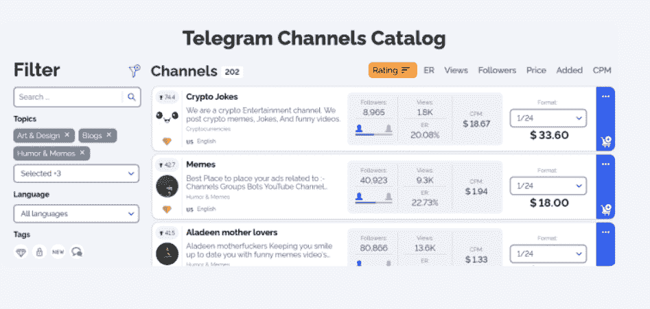
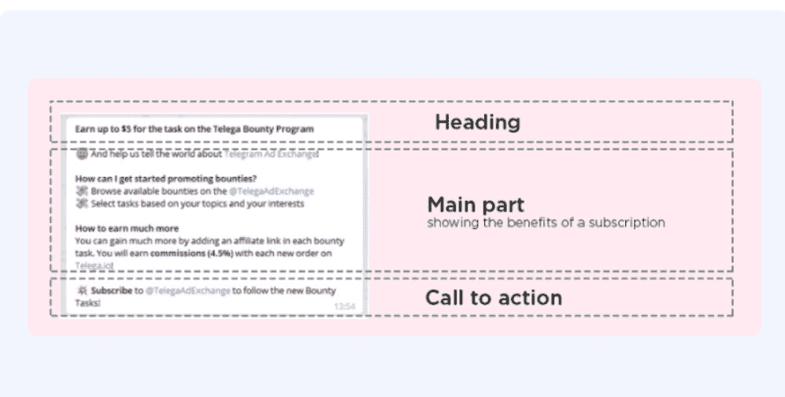
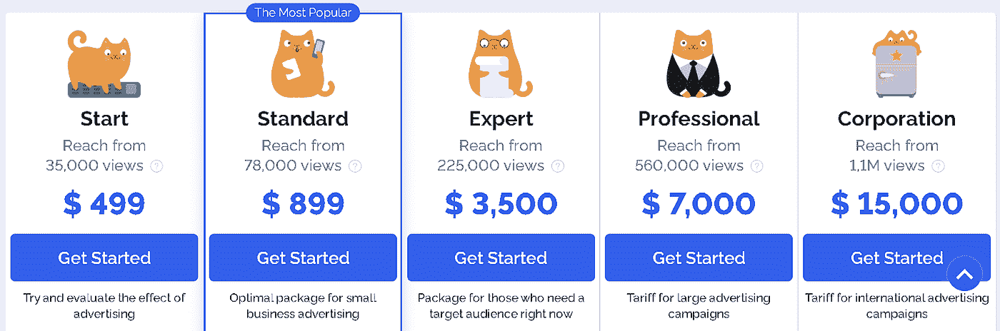
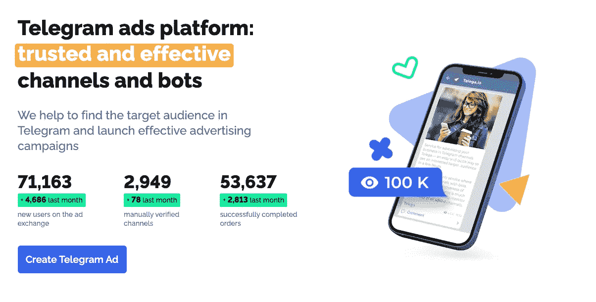

# 2022 年在 Telegram 上做广告的两种最佳方式

> 原文：<https://medium.com/coinmonks/2-best-way-to-run-an-advertisement-on-telegram-2674e7395f82?source=collection_archive---------2----------------------->

## 找到顶级电报频道，创建广告活动并运行它们。

今天我们将讨论如何在不同的电报频道或群组中找到并宣传你的产品或服务。

## 摘要

*   Telegram 提供三种广告方式:手动、 [**、Telega**](https://coincodecap.com/go/telega) 和[Telega 广告平台](https://promote.telegram.org/account)。
*   使用 [**Telega**](https://coincodecap.com/go/telega) 查找具有不同利基的顶级电报频道

## 什么是电报？

于 2013 年推出的 [Telegram](https://telegram.org/) 完全加密的云消息服务，也是 Whatsapp 最著名的替代品。目前在 App Store 社交网络类排名第二。

目前 Telegram messenger 在全球有 5 亿活跃用户。Telegram 在亚洲更为突出，但它在全球的受欢迎程度也在不断提高。

## 在电报上做广告有哪些不同的方式？

*   **手动**:可以贴广告。你必须找到没有电报广告机器人的活跃频道来实现这一点。渠道增长和后期覆盖是主要标准。
*   **交换**:是最便捷的广告方式。交易所有预先调节的频道。渠道所有者提交审核申请；他们检查它，并确定它是否符合他们的目录。该目录增加了大约 30%的所有应用频道。因为它已经收集了活动通道，所以加快了进程。
*   **官方**:这是一个内置的电报广告账号，你必须在里面存入一定的余额才能上手。

***也读作:*** [***十大最佳电报频道学习编码***](https://coincodecap.com/best-telegram-channels-learn-coding)

## 如何找到最好的电报渠道和运行广告？

如果你经营一个电报频道并开始在那里投放广告，你可以注册 Telega 。为了让您的广告在 Telega 频道或 bot 上播放，您可以将其提交给 Telega.io。

这个平台提供了一个工具，Telegram Ad platform，它可以在一对多的公共渠道中创建超过 1000 个订阅者的赞助消息。

此外，它允许您轻松管理您的广告和预算，选择您的广告将显示在哪里，并监控它们的表现。

## 如何在 Telegram 上设置广告活动？

*   接下来，你需要确定你的目标人物角色和市场来接触你的目标受众。
*   **兴趣** : Telegram 不提供地理定位，但是所有频道和机器人都是按话题划分的。
*   **语言**:通过引导语言和兴趣，你可以专注于你的听众。
*   **地理定位**:根据用户的位置对他们进行细分实际上是不可能的。取而代之的是通过城市名的快速生活帮搜索。一些频道所有者在他们的频道标题中使用城市名称。
*   将广告整合到一个频道的内容中，可以让广告更吸引观众。存在三类原生广告:

1 .**广告帖**:广告帖由三个主要部分组成:文字、图片、链接。

2.**本地帖子:**这种类型的帖子将读者的相关信息与赞助商的信息混合在一起。它的好处是，即使赞助商没有被提及，它仍然是有价值的信息。它的教育价值让用户对这种类型更加投入，包括免电报的广告渠道。

3.**转发:**新闻或视频必须首先发布在“母”频道上。这篇文章被其他渠道转载以增加收视率。

*   每个活动的测试预算各不相同。考虑从你愿意承担风险的金额开始。

此外，您可以使用类似 [**Telemetr**](https://telemetr.io/en/channels) 的专门服务来检查电报受众。

## 如何选择电报频道？

[**Telega**](https://coincodecap.com/go/telega) 的服务允许您根据以下两个主要参数选择了解您的目标受众的频道。

*   **订户**:定义为群组/bot/频道成员的当前总数。
*   **参与度(ER)** :参与度(ER)统计显示了与频道内容互动的观众的百分比。

ER 计算如下:总印象数/总订阅数* 100%

***也读作:*** [***电报上的 10 个最佳加密货币僵尸程序【立即获取】***](https://coincodecap.com/telegram-crypto-bots)

## 如何在 Telegram 上创建一个有效的广告帖？

*   如上所述，广告帖子由三部分组成:文本、图像和链接。
*   广告文本还可以进一步细分为 3 个部分:一个吸引人的标题，解释你的产品的好处的主体，以及行动呼吁，这是鼓励用户去检查你的渠道的最后一部分。
*   广告帖子限于一张不超过 5 MB 的图片或 gif。频道所有者不欢迎更多的视觉效果。
*   您可以在帖子中添加多个链接。如果你链接到外部来源，不要忘记添加 UTM 标签。你可以用它来跟踪分析。
*   此外，如果您想推广电报频道，请使用邀请链接。由于它，每个频道或机器人都可以有效地跟踪用户。
*   最近，该平台发布了新的广告形式，包括视频和音频消息。
*   可以使用类似 [Bit.ly](https://bit.ly/) ，Google Analytics 等工具。，这是一项 URL 缩短服务，用户可以通过它来修剪网页链接，并跟踪和分析您的活动表现。
*   此外，这些工具允许您做出数据驱动的决策，并检查内容有机共享的参与度指标。
*   在这些工具的帮助下，你可以通过点击、地理数据和热门推荐渠道来分析与你的受众产生共鸣的内容。

## **Telega** 费用审查

[**Telega**](https://coincodecap.com/go/telega) 广告费用如下:它为其用户呈现了各式各样的套餐。

*   所有的软件包都提供手动选择频道、开发独特的策略和发布广告的通知。
*   随着封装成本的增加，所提供的特征数量也增加。
*   更昂贵的软件包专业和公司，提供详细的报告。

***亦读:*** [***40 个最佳电报频道用于加密、电影、演出、&讲座***](https://coincodecap.com/best-telegram-channels)

## 电报广告平台:费用

*   在[电报广告平台](https://promote.telegram.org/account)中，您可以为活动设定 CPM(每千分之一成本)和广告预算。
*   CPM 或(每千分之一成本)被定义为一千次浏览你的广告的成本。赞助信息的最低 CPM 是€2。
*   你的广告预算是你为特定的赞助信息分配的资金。赞助消息将一直出现，直到达到此预算。
*   你可以根据自己的意愿增加或减少广告预算。

## Telega.io vs Telegram 广告平台

*   它在谷歌或目录中找到想要的频道列表。
*   它确保在频道上寻找欺诈用户。
*   写信给频道所有者询问出版费用。
*   此外，它还向每位业主分别付款。
*   它减轻了制作和发布广告的负担。
*   此外，它将广告发送给每个所有者。
*   最后，它控制每个平台上的广告发布。
*   此外，您还可以收集和分析广告后的指标，这些指标可以帮助您评估您的广告活动有多成功。

***也读作:*** [***十大最佳密码电报组***](https://coincodecap.com/best-crypto-telegram-groups)

## 使用电报广告平台的优势

*   在 Telegram 上，赞助消息被限制在 160 个字符以内，并显示在超过 1000 个订户的大型公共一对多频道中。
*   它确保没有数据被挖掘和分析来显示广告，并且所有观看特定频道的用户看到相同的赞助消息。
*   广告商可以选择频道的语言和近似主题，以及将显示广告的特定频道。
*   此外，用户隐私得到维护，因为它不跟踪基于用户与赞助消息或其他活动的交互而建立的用户简档。

## 结论

我们发现 Telega 是在 Telega 上做广告的最佳平台。它有一个很好的目录，可以根据您的要求搜索电报频道，并自动完成整个广告流程。这使得营销团队可以轻松地在 Telegram 上开展广告活动，并检查其活动的投资回报率。

## 常见问题

**问:什么是电报 app？**

Telegram 是一个著名的即时消息平台，由于其增强的隐私和加密功能以及广泛的群组聊天功能而被广泛使用。

**问:如何删除电报账户？**

您可以按照以下步骤删除电报账户。

1.  打开电报后，请访问网站在浏览器中将其禁用。
2.  输入您的电话号码时，请包括您的国家代码。
3.  输入发送到电报应用程序的代码。
4.  转到以下页面，选择“删除我的帐户”
5.  单击“是，删除我的帐户”以确认您的选择。

**问:电报安全吗？**

是的，Telegram 是一个安全的平台。Telegram 是私有的、加密的、安全的、独立的，这使得它比脸书拥有的数据收集软件 WhatsApp 更有优势。

问:最好的电报渠道有哪些？

你可以在 [**Telega**](https://coincodecap.com/go/telega) 上找到[最佳电报频道](/coinmonks/best-crypto-signals-telegram-5785cdbc4b2b)，他们有一个完整的目录，你可以根据订户进行排序，找到最大的电报频道。

**也读作**

 [## 最佳免费 16 个加密交易机器人(2022 年 11 月)

### 2022 年币安、比特币基地、库币和其他密码交易所的最佳密码交易机器人。Pionex，Bitsgap…

medium.com](/coinmonks/crypto-trading-bot-c2ffce8acb2a)  [## 12 款最佳文案交易应用和平台(免费 2022)

### 复制交易、社交交易、镜像交易——大多数时候都是一样的。随便你怎么称呼它。

medium.com](/coinmonks/top-10-crypto-copy-trading-platforms-for-beginners-d0c37c7d698c) 