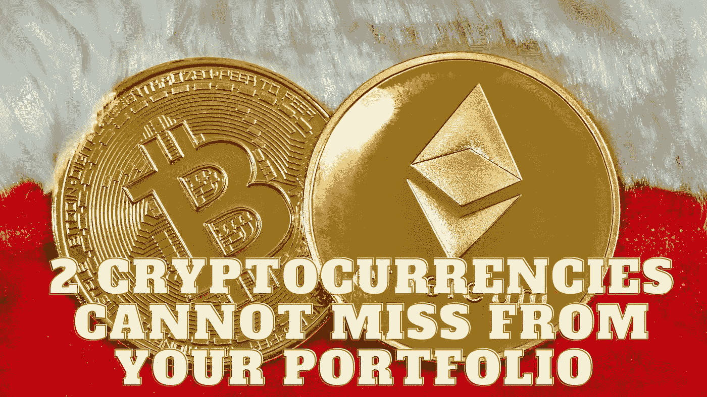

# 您的投资组合中不能缺少 2 种加密货币

> 原文：<https://medium.com/coinmonks/2-cryptocurrencies-cannot-miss-from-your-portfolio-b1c1f5a78f53?source=collection_archive---------29----------------------->

Source photo Unsplash.com

# 以太坊

就市值而言，以太坊仅次于比特币。以太坊区块链和它相关的加密货币同名。虽然比特币擅长作为其令牌的价值存储，但以太坊已被证明是最受欢迎的 dApps 或分散应用程序平台之一。