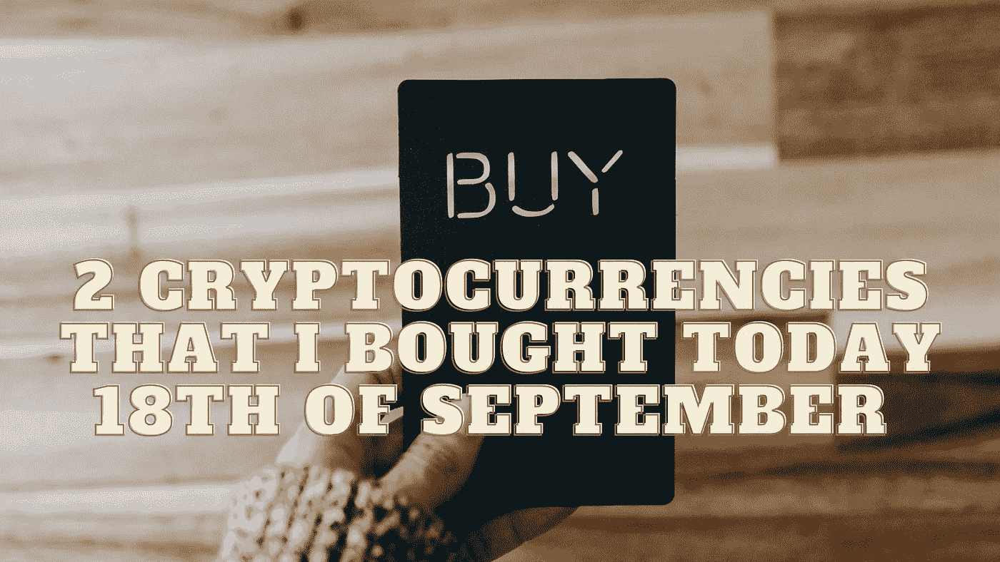

# 我今天 9 月 18 日买的两种加密货币

> 原文：<https://medium.com/coinmonks/2-cryptocurrencies-that-i-bought-today-18th-of-september-23abaff92457?source=collection_archive---------16----------------------->

Source photo Unsplash.com

# 以太坊

第二大数字货币以太币(Ethereum)将成为替代硬币的主宰。从 DeFi 和 dApps 到 NFTs 和元宇宙，各种各样的程序在网络上运行。随着即将到来的以太坊合并，网络将从工作证明转变为利益证明，从而大幅削减能源使用。一旦完成，以太坊…