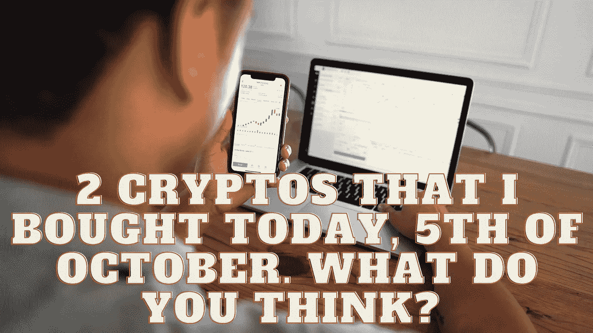

# 今天，10 月 5 日，我买了两个密码。你怎么想呢?

> 原文：<https://medium.com/coinmonks/2-cryptos-that-i-bought-today-5th-of-october-what-do-you-think-2627ca6fdbf7?source=collection_archive---------30----------------------->

Source photo Unsplash.com

# Dogecoin (DOGE)

在所有的迷因货币中，Dogecoin 最受追捧。此外，名人和秘密影响者的支持占了其巨大人气和搜索流量的很大一部分。他们的文章或广播让公众了解了加密货币，这让投资者保持了很高的兴趣。