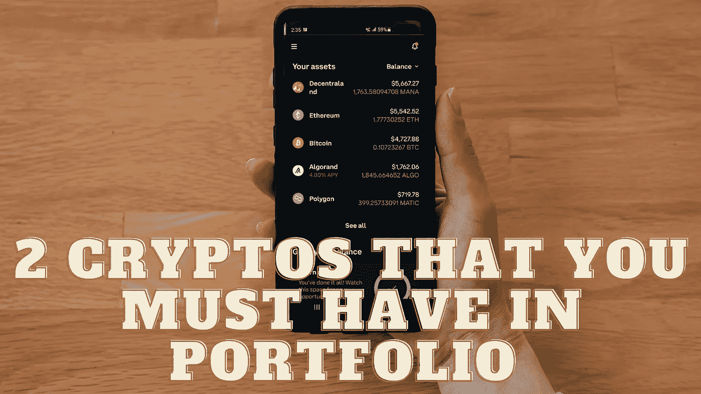

# 2 密码，你必须在投资组合中

> 原文：<https://medium.com/coinmonks/2-cryptos-that-you-must-have-in-portfolio-e978f66142a8?source=collection_archive---------25----------------------->

Source photo Unsplash.com

# 阿尔格兰德(ALGO)

加密货币 Algorand (ALGO)是一个两层分散网络的产品，该网络既是支付系统，也是区块链的基础设施。鉴于它是基于开源的区块链，该平台的协议可以被任何人验证和改进。ALGO (ALGO)的目标是提供一个既可扩展又高效的平台…