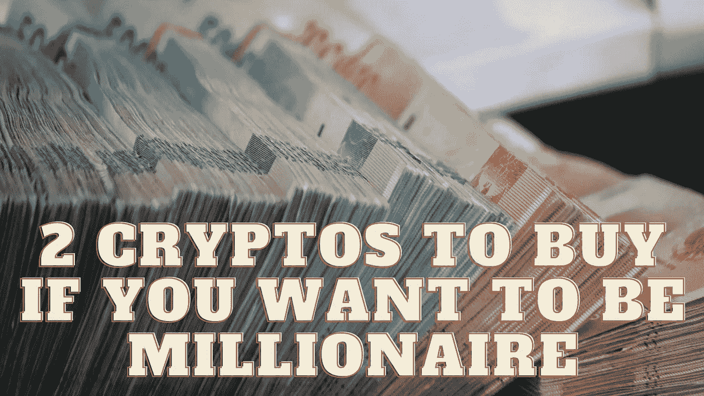

# 如果你想成为百万富翁，买两个密码

> 原文：<https://medium.com/coinmonks/2-cryptos-to-buy-if-you-want-to-be-millionaire-3fa9de7188d6?source=collection_archive---------20----------------------->

Source photo Unsplash.com

# 以太坊

当谈到数字资产的世界时，以太坊无疑是最成功的替代货币。尽管如此，加密货币市场在当前的经济低迷中也遭受了损失。自 11 月份创下 4891.70 美元的历史高点以来，ETH 的价格已下跌逾 60%。这很不幸，但这确实意味着你能以很高的价格买到乙醚，对吧…