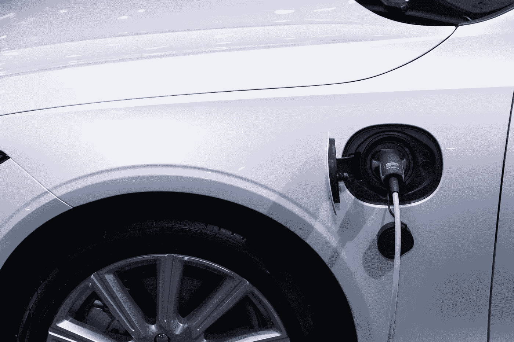

# 2022 年 12 月 14 日，今天买入 2 只电动汽车股票

> 原文：<https://medium.com/coinmonks/2-ev-stocks-to-buy-today-14th-of-december-2022-fa12584ea7b5?source=collection_archive---------25----------------------->

Source photo [White Car Charging · Free Stock Photo (pexels.com)](https://www.pexels.com/photo/white-car-charging-3846205/)

# Nio

谈到电动汽车的广泛使用，专家预测中国将保持其全球领导者的地位。在价格大幅下跌后，NIO(纽约证券交易所代码:Nio)在中国电动汽车公司中脱颖而出，成为一个有趣的选择。

Nio 的出货量增长一直在稳步改善，据该公司报告。尽管困难重重…