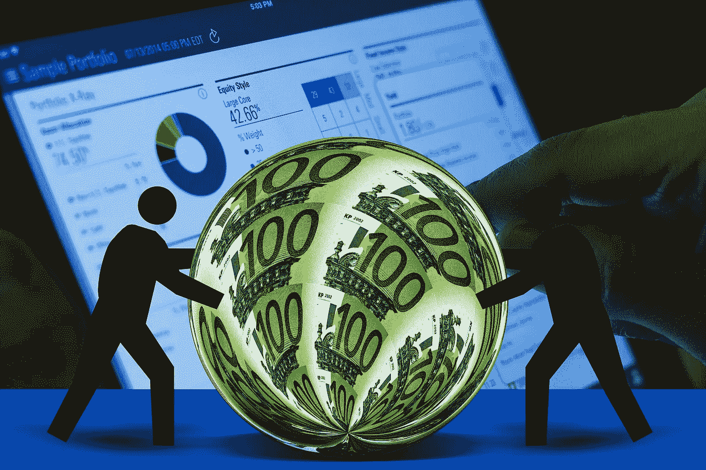

# 投资组合中必须有两只股票

> 原文：<https://medium.com/coinmonks/2-stocks-that-you-must-have-in-portfolio-cf5478c930b6?source=collection_archive---------47----------------------->

Source photo [Euro Seem Currency — Free image on Pixabay](https://pixabay.com/illustrations/euro-seem-currency-ball-bullet-447209/)

# 百事可乐公司

百事公司(NASDAQ:PEP)的股价今年大部分时间都在窄幅波动。考虑到该公司 2022 年第三季度的强劲业绩，该股 2.6%的股息收益率颇具吸引力。

PEP 股票已经盘整了一段时间，但向上突破似乎即将到来。2022 年迄今为止，百事可乐的净销售额增长了 7.7%。在…